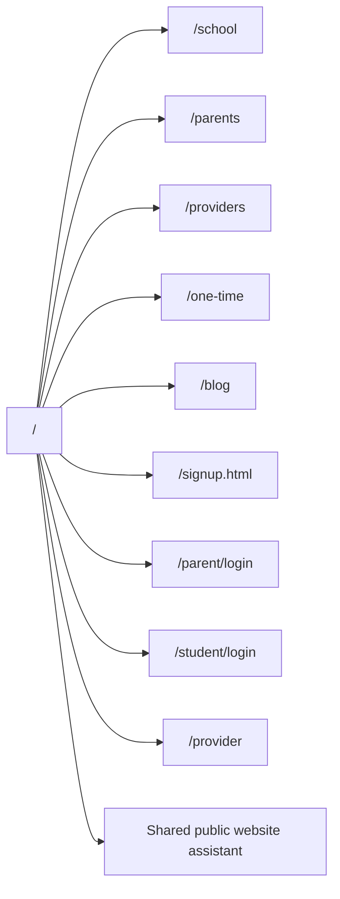
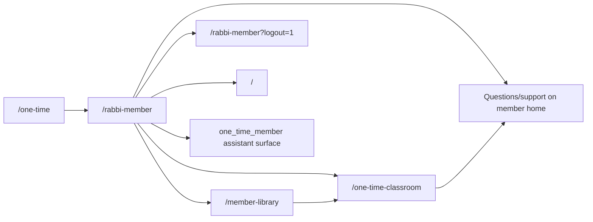
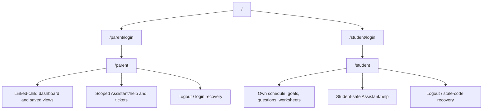
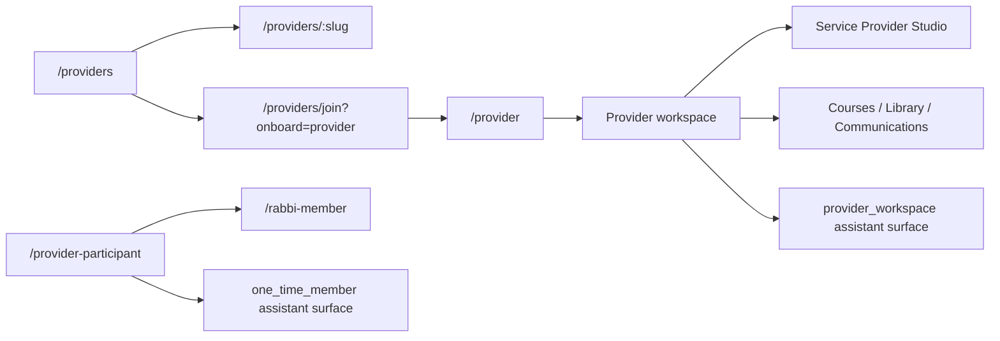
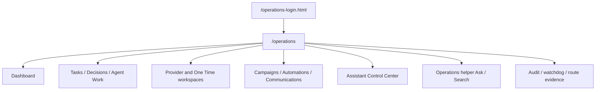

# Page Flow Diagrams

These diagrams summarize the owner-review journeys verified locally in
`docs/owner-review/ROLE-FLOW-QA.md`.

## Public Website

## One Time Member

## Parent And Student

## Provider

## Operations / Super Admin

