# One Time Public UI Audit

Screenshots: 18

## One Time Landing (desktop-1440)

Rating: 9.2/10 - Strong

Route: `https://bneineviimacademy.org/rabbi`

Screenshot: [screenshots/desktop-1440/one-time-landing.jpg](screenshots/desktop-1440/one-time-landing.jpg)

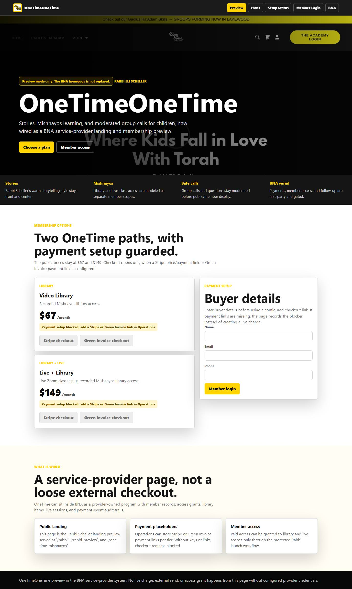

Problems / Observations:
- No major automated layout issue detected in this screenshot.

Optimization Steps:
- Manually review visual density, label clarity, and whether the primary action is obvious.

Visible actions: 4 buttons, 8 links, 4 disabled buttons.

Action sample:
- [disabled] Stripe checkout
- [disabled] Green Invoice checkout
- [disabled] Stripe checkout
- [disabled] Green Invoice checkout

## One Time Member Library (desktop-1440)

Rating: 9.2/10 - Strong

Route: `https://bneineviimacademy.org/member-library`

Screenshot: [screenshots/desktop-1440/one-time-member-library.jpg](screenshots/desktop-1440/one-time-member-library.jpg)

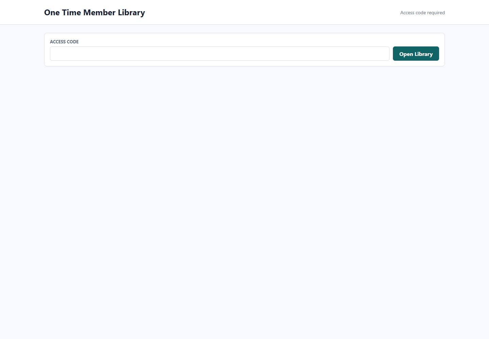

Problems / Observations:
- No major automated layout issue detected in this screenshot.

Optimization Steps:
- Manually review visual density, label clarity, and whether the primary action is obvious.

Visible actions: 1 buttons, 0 links, 0 disabled buttons.

Action sample:
- Open Library

## One Time Classroom (desktop-1440)

Rating: 9.2/10 - Strong

Route: `https://bneineviimacademy.org/one-time-classroom`

Screenshot: [screenshots/desktop-1440/one-time-classroom.jpg](screenshots/desktop-1440/one-time-classroom.jpg)

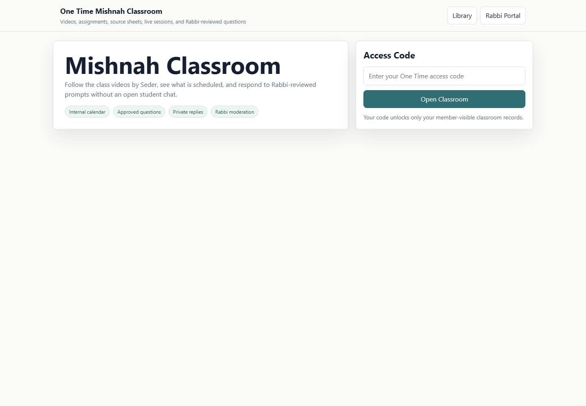

Problems / Observations:
- No major automated layout issue detected in this screenshot.

Optimization Steps:
- Manually review visual density, label clarity, and whether the primary action is obvious.

Visible actions: 3 buttons, 2 links, 0 disabled buttons.

Action sample:
- Library
- Rabbi Portal
- Open Classroom

## One Time Landing (desktop-1024)

Rating: 9.2/10 - Strong

Route: `https://bneineviimacademy.org/rabbi`

Screenshot: [screenshots/desktop-1024/one-time-landing.jpg](screenshots/desktop-1024/one-time-landing.jpg)

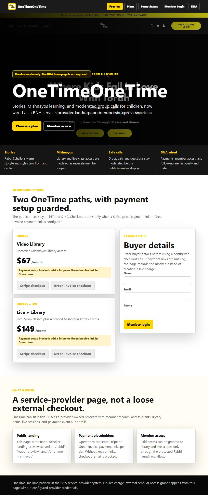

Problems / Observations:
- No major automated layout issue detected in this screenshot.

Optimization Steps:
- Manually review visual density, label clarity, and whether the primary action is obvious.

Visible actions: 4 buttons, 8 links, 4 disabled buttons.

Action sample:
- [disabled] Stripe checkout
- [disabled] Green Invoice checkout
- [disabled] Stripe checkout
- [disabled] Green Invoice checkout

## One Time Member Library (desktop-1024)

Rating: 9.2/10 - Strong

Route: `https://bneineviimacademy.org/member-library`

Screenshot: [screenshots/desktop-1024/one-time-member-library.jpg](screenshots/desktop-1024/one-time-member-library.jpg)

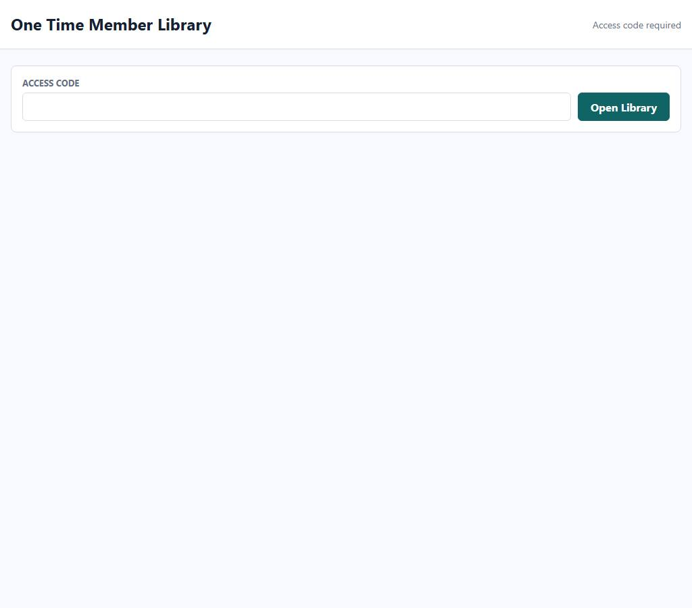

Problems / Observations:
- No major automated layout issue detected in this screenshot.

Optimization Steps:
- Manually review visual density, label clarity, and whether the primary action is obvious.

Visible actions: 1 buttons, 0 links, 0 disabled buttons.

Action sample:
- Open Library

## One Time Classroom (desktop-1024)

Rating: 9.2/10 - Strong

Route: `https://bneineviimacademy.org/one-time-classroom`

Screenshot: [screenshots/desktop-1024/one-time-classroom.jpg](screenshots/desktop-1024/one-time-classroom.jpg)

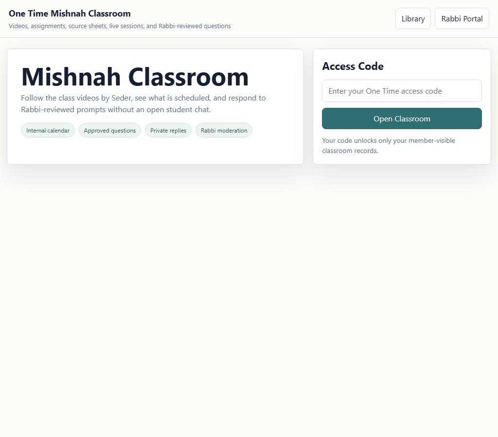

Problems / Observations:
- No major automated layout issue detected in this screenshot.

Optimization Steps:
- Manually review visual density, label clarity, and whether the primary action is obvious.

Visible actions: 3 buttons, 2 links, 0 disabled buttons.

Action sample:
- Library
- Rabbi Portal
- Open Classroom

## One Time Landing (tablet-768)

Rating: 9.2/10 - Strong

Route: `https://bneineviimacademy.org/rabbi`

Screenshot: [screenshots/tablet-768/one-time-landing.jpg](screenshots/tablet-768/one-time-landing.jpg)

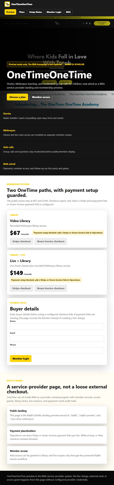

Problems / Observations:
- No major automated layout issue detected in this screenshot.

Optimization Steps:
- Manually review visual density, label clarity, and whether the primary action is obvious.

Visible actions: 4 buttons, 8 links, 4 disabled buttons.

Action sample:
- [disabled] Stripe checkout
- [disabled] Green Invoice checkout
- [disabled] Stripe checkout
- [disabled] Green Invoice checkout

## One Time Member Library (tablet-768)

Rating: 9.2/10 - Strong

Route: `https://bneineviimacademy.org/member-library`

Screenshot: [screenshots/tablet-768/one-time-member-library.jpg](screenshots/tablet-768/one-time-member-library.jpg)

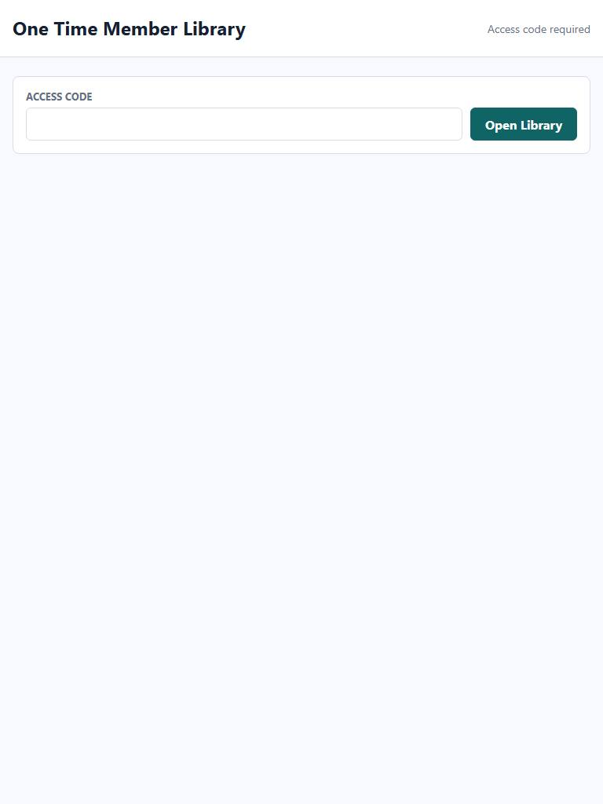

Problems / Observations:
- No major automated layout issue detected in this screenshot.

Optimization Steps:
- Manually review visual density, label clarity, and whether the primary action is obvious.

Visible actions: 1 buttons, 0 links, 0 disabled buttons.

Action sample:
- Open Library

## One Time Classroom (tablet-768)

Rating: 9.2/10 - Strong

Route: `https://bneineviimacademy.org/one-time-classroom`

Screenshot: [screenshots/tablet-768/one-time-classroom.jpg](screenshots/tablet-768/one-time-classroom.jpg)

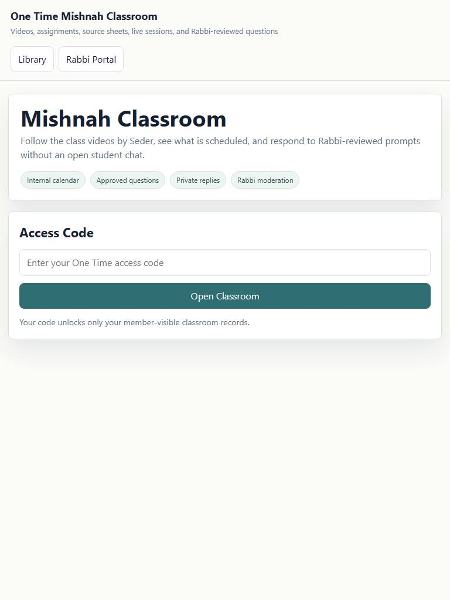

Problems / Observations:
- No major automated layout issue detected in this screenshot.

Optimization Steps:
- Manually review visual density, label clarity, and whether the primary action is obvious.

Visible actions: 3 buttons, 2 links, 0 disabled buttons.

Action sample:
- Library
- Rabbi Portal
- Open Classroom

## One Time Landing (mobile-430)

Rating: 9.2/10 - Strong

Route: `https://bneineviimacademy.org/rabbi`

Screenshot: [screenshots/mobile-430/one-time-landing.jpg](screenshots/mobile-430/one-time-landing.jpg)

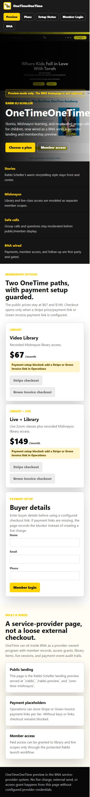

Problems / Observations:
- No major automated layout issue detected in this screenshot.

Optimization Steps:
- Manually review visual density, label clarity, and whether the primary action is obvious.

Visible actions: 4 buttons, 8 links, 4 disabled buttons.

Action sample:
- [disabled] Stripe checkout
- [disabled] Green Invoice checkout
- [disabled] Stripe checkout
- [disabled] Green Invoice checkout

## One Time Member Library (mobile-430)

Rating: 9.2/10 - Strong

Route: `https://bneineviimacademy.org/member-library`

Screenshot: [screenshots/mobile-430/one-time-member-library.jpg](screenshots/mobile-430/one-time-member-library.jpg)

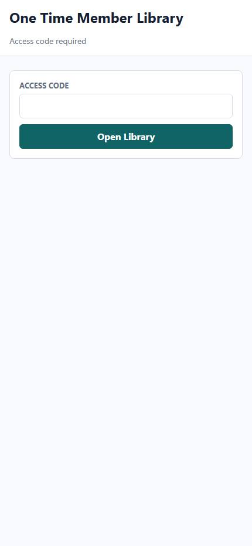

Problems / Observations:
- No major automated layout issue detected in this screenshot.

Optimization Steps:
- Manually review visual density, label clarity, and whether the primary action is obvious.

Visible actions: 1 buttons, 0 links, 0 disabled buttons.

Action sample:
- Open Library

## One Time Classroom (mobile-430)

Rating: 9.2/10 - Strong

Route: `https://bneineviimacademy.org/one-time-classroom`

Screenshot: [screenshots/mobile-430/one-time-classroom.jpg](screenshots/mobile-430/one-time-classroom.jpg)

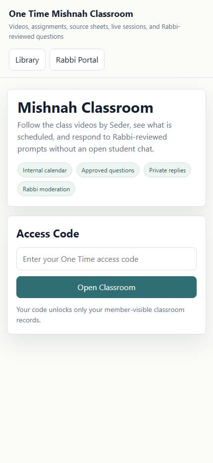

Problems / Observations:
- No major automated layout issue detected in this screenshot.

Optimization Steps:
- Manually review visual density, label clarity, and whether the primary action is obvious.

Visible actions: 3 buttons, 2 links, 0 disabled buttons.

Action sample:
- Library
- Rabbi Portal
- Open Classroom

## One Time Landing (mobile-390)

Rating: 9.2/10 - Strong

Route: `https://bneineviimacademy.org/rabbi`

Screenshot: [screenshots/mobile-390/one-time-landing.jpg](screenshots/mobile-390/one-time-landing.jpg)

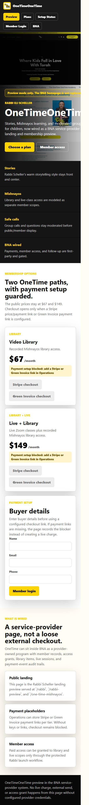

Problems / Observations:
- No major automated layout issue detected in this screenshot.

Optimization Steps:
- Manually review visual density, label clarity, and whether the primary action is obvious.

Visible actions: 4 buttons, 8 links, 4 disabled buttons.

Action sample:
- [disabled] Stripe checkout
- [disabled] Green Invoice checkout
- [disabled] Stripe checkout
- [disabled] Green Invoice checkout

## One Time Member Library (mobile-390)

Rating: 9.2/10 - Strong

Route: `https://bneineviimacademy.org/member-library`

Screenshot: [screenshots/mobile-390/one-time-member-library.jpg](screenshots/mobile-390/one-time-member-library.jpg)

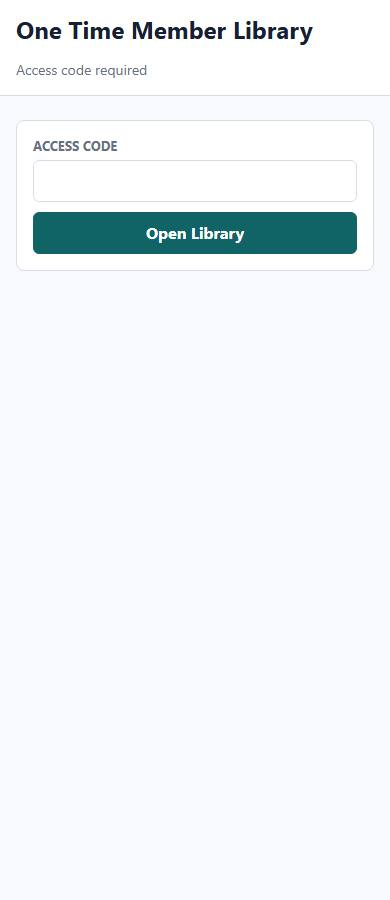

Problems / Observations:
- No major automated layout issue detected in this screenshot.

Optimization Steps:
- Manually review visual density, label clarity, and whether the primary action is obvious.

Visible actions: 1 buttons, 0 links, 0 disabled buttons.

Action sample:
- Open Library

## One Time Classroom (mobile-390)

Rating: 9.2/10 - Strong

Route: `https://bneineviimacademy.org/one-time-classroom`

Screenshot: [screenshots/mobile-390/one-time-classroom.jpg](screenshots/mobile-390/one-time-classroom.jpg)

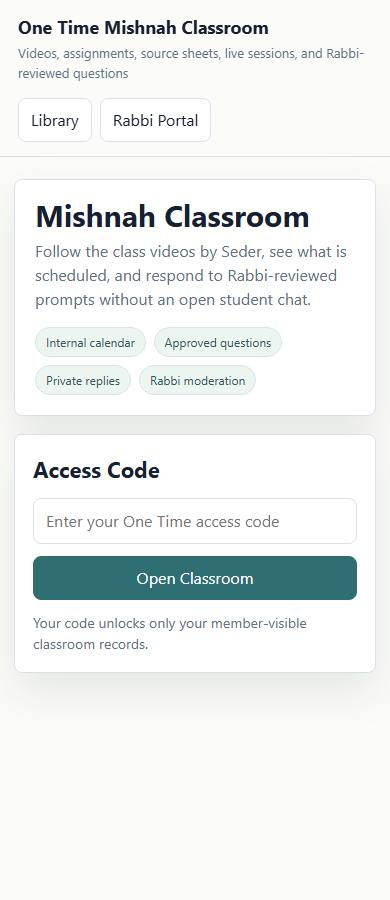

Problems / Observations:
- No major automated layout issue detected in this screenshot.

Optimization Steps:
- Manually review visual density, label clarity, and whether the primary action is obvious.

Visible actions: 3 buttons, 2 links, 0 disabled buttons.

Action sample:
- Library
- Rabbi Portal
- Open Classroom

## One Time Landing (mobile-360)

Rating: 8.8/10 - Strong

Route: `https://bneineviimacademy.org/rabbi`

Screenshot: [screenshots/mobile-360/one-time-landing.jpg](screenshots/mobile-360/one-time-landing.jpg)

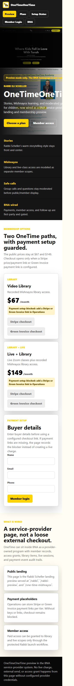

Problems / Observations:
- Slow capture/load path (23.3s).

Optimization Steps:
- Profile the route data loader and defer non-critical API calls.

Visible actions: 0 buttons, 8 links, 0 disabled buttons.

## One Time Member Library (mobile-360)

Rating: 9.2/10 - Strong

Route: `https://bneineviimacademy.org/member-library`

Screenshot: [screenshots/mobile-360/one-time-member-library.jpg](screenshots/mobile-360/one-time-member-library.jpg)

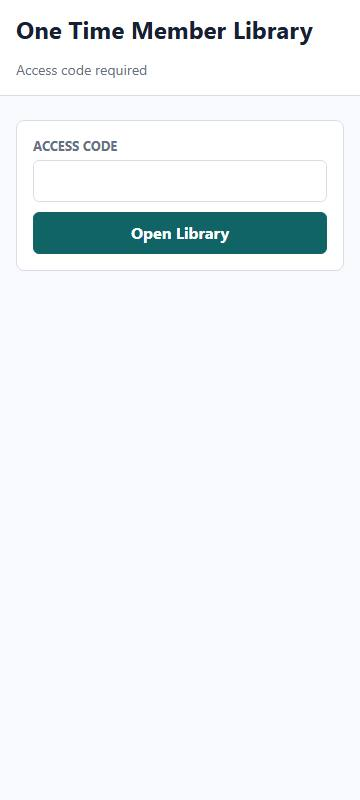

Problems / Observations:
- No major automated layout issue detected in this screenshot.

Optimization Steps:
- Manually review visual density, label clarity, and whether the primary action is obvious.

Visible actions: 1 buttons, 0 links, 0 disabled buttons.

Action sample:
- Open Library

## One Time Classroom (mobile-360)

Rating: 9.2/10 - Strong

Route: `https://bneineviimacademy.org/one-time-classroom`

Screenshot: [screenshots/mobile-360/one-time-classroom.jpg](screenshots/mobile-360/one-time-classroom.jpg)

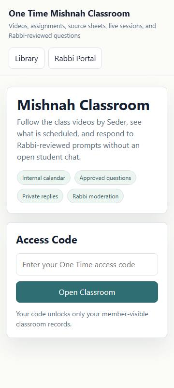

Problems / Observations:
- No major automated layout issue detected in this screenshot.

Optimization Steps:
- Manually review visual density, label clarity, and whether the primary action is obvious.

Visible actions: 3 buttons, 2 links, 0 disabled buttons.

Action sample:
- Library
- Rabbi Portal
- Open Classroom

