# Operations Batch 6 UI Audit

Screenshots: 105

## Operations / Overview (desktop-1440)

Rating: 9.2/10 - Strong

Route: `https://bneineviimacademy.org/operations?workspace=rabbi_sheller_provider&view=dashboard&section=overview`

Screenshot: [screenshots/desktop-1440/operations-overview.jpg](screenshots/desktop-1440/operations-overview.jpg)

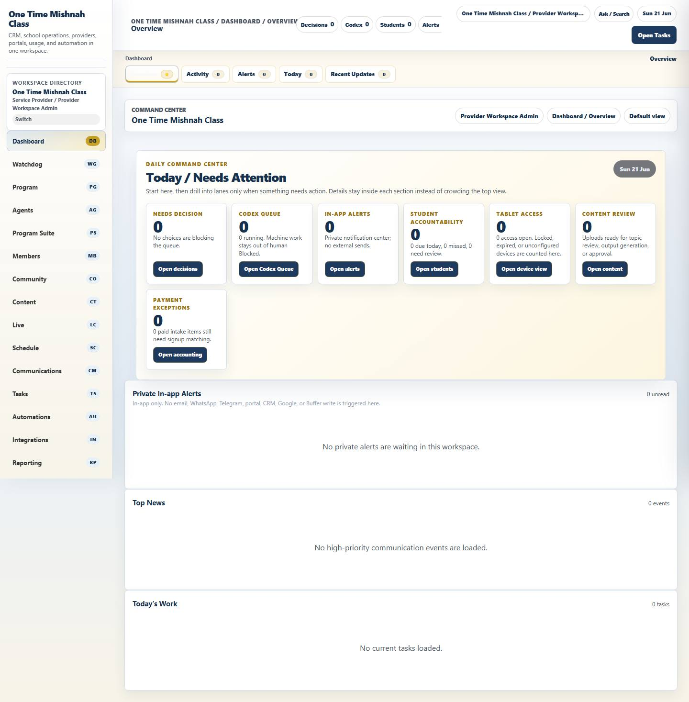

Problems / Observations:
- No major automated layout issue detected in this screenshot.

Optimization Steps:
- Manually review visual density, label clarity, and whether the primary action is obvious.

Visible actions: 48 buttons, 1 links, 0 disabled buttons.

Action sample:
- Super Admin
- School
- Service Provider
- Family
- All Operations Super Admin / Member Super Admin
- BNA School / Member School
- One Time Mishnah Class Service Provider / Member Current
- Dratler Family Family / Member Family
- Open workspace settings
- Dashboard DB
- Watchdog WG
- Program PG
- Agents AG
- Program Suite PS
- Members MB
- Community CO

## Operations / Tasks (desktop-1440)

Rating: 8.5/10 - Strong

Route: `https://bneineviimacademy.org/operations?workspace=rabbi_sheller_provider&view=tasks&section=tasks`

Screenshot: [screenshots/desktop-1440/operations-tasks.jpg](screenshots/desktop-1440/operations-tasks.jpg)

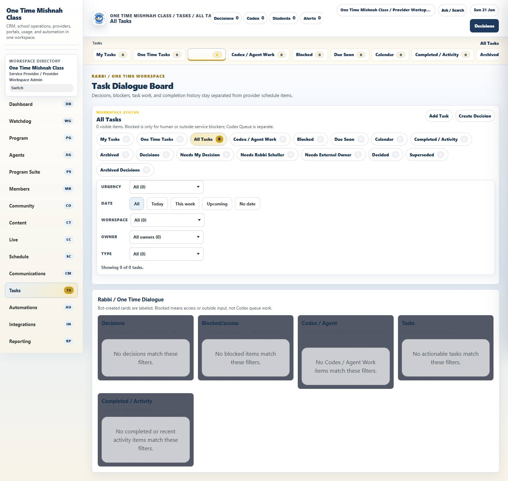

Problems / Observations:
- High visible action count (79) increases decision load.

Optimization Steps:
- Consolidate secondary actions into menus and keep only the page primary action prominent.

Visible actions: 79 buttons, 1 links, 0 disabled buttons.

Action sample:
- Super Admin
- School
- Service Provider
- Family
- All Operations Super Admin / Member Super Admin
- BNA School / Member School
- One Time Mishnah Class Service Provider / Member Current
- Dratler Family Family / Member Family
- Open workspace settings
- Dashboard DB
- Watchdog WG
- Program PG
- Agents AG
- Program Suite PS
- Members MB
- Community CO

## Operations / Decisions (desktop-1440)

Rating: 8.5/10 - Strong

Route: `https://bneineviimacademy.org/operations?workspace=rabbi_sheller_provider&view=tasks&section=decisions`

Screenshot: [screenshots/desktop-1440/operations-decisions.jpg](screenshots/desktop-1440/operations-decisions.jpg)

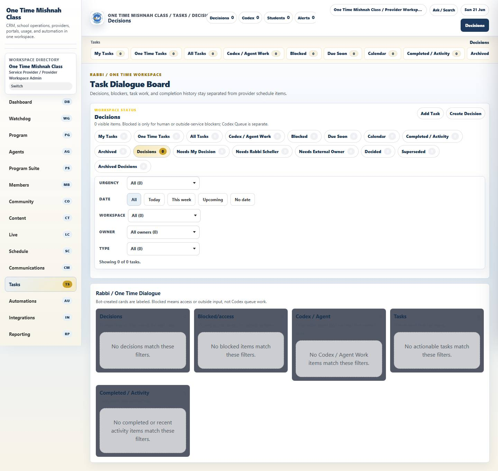

Problems / Observations:
- High visible action count (79) increases decision load.

Optimization Steps:
- Consolidate secondary actions into menus and keep only the page primary action prominent.

Visible actions: 79 buttons, 1 links, 0 disabled buttons.

Action sample:
- Super Admin
- School
- Service Provider
- Family
- All Operations Super Admin / Member Super Admin
- BNA School / Member School
- One Time Mishnah Class Service Provider / Member Current
- Dratler Family Family / Member Family
- Open workspace settings
- Dashboard DB
- Watchdog WG
- Program PG
- Agents AG
- Program Suite PS
- Members MB
- Community CO

## Operations / Contacts and Members (desktop-1440)

Rating: 9.2/10 - Strong

Route: `https://bneineviimacademy.org/operations?workspace=rabbi_sheller_provider&view=contacts&section=participants`

Screenshot: [screenshots/desktop-1440/operations-contacts-members.jpg](screenshots/desktop-1440/operations-contacts-members.jpg)

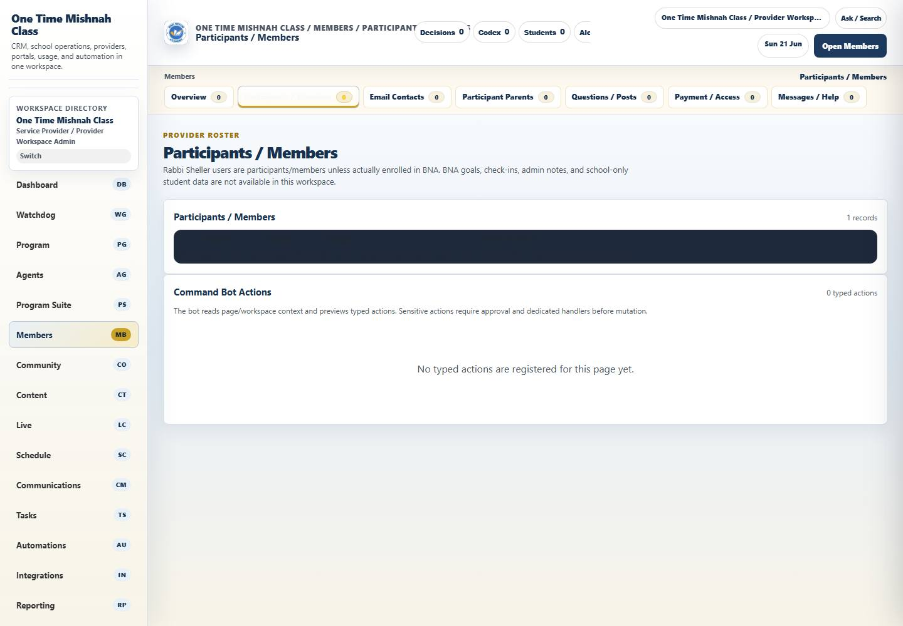

Problems / Observations:
- No major automated layout issue detected in this screenshot.

Optimization Steps:
- Manually review visual density, label clarity, and whether the primary action is obvious.

Visible actions: 43 buttons, 1 links, 0 disabled buttons.

Action sample:
- Super Admin
- School
- Service Provider
- Family
- All Operations Super Admin / Member Super Admin
- BNA School / Member School
- One Time Mishnah Class Service Provider / Member Current
- Dratler Family Family / Member Family
- Open workspace settings
- Dashboard DB
- Watchdog WG
- Program PG
- Agents AG
- Program Suite PS
- Members MB
- Community CO

## Operations / Users (desktop-1440)

Rating: 8.5/10 - Strong

Route: `https://bneineviimacademy.org/operations?workspace=platform&view=admin&section=users`

Screenshot: [screenshots/desktop-1440/operations-users.jpg](screenshots/desktop-1440/operations-users.jpg)

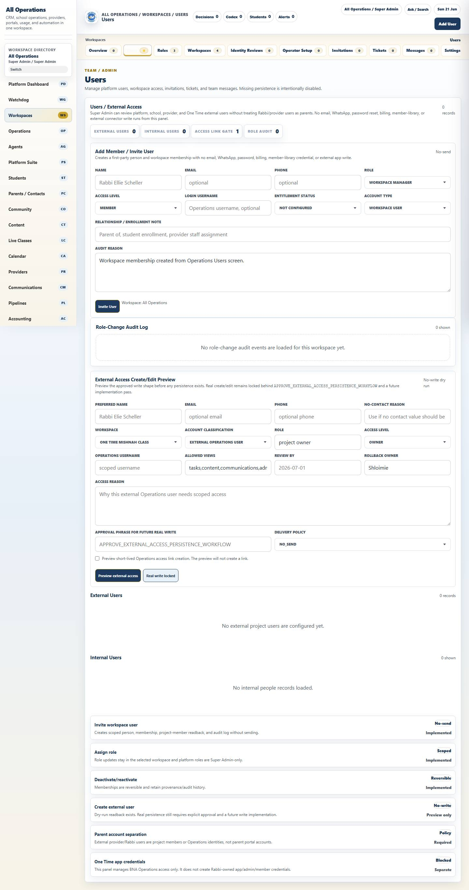

Problems / Observations:
- High visible action count (66) increases decision load.

Optimization Steps:
- Consolidate secondary actions into menus and keep only the page primary action prominent.

Visible actions: 66 buttons, 1 links, 1 disabled buttons.

Action sample:
- Super Admin
- School
- Service Provider
- Family
- All Operations Super Admin / Member Current
- BNA School / Member School
- One Time Mishnah Class Service Provider / Member Service Provider
- Dratler Family Family / Member Family
- Open workspace settings
- Manage workspace directory
- Platform Dashboard PD
- Watchdog WG
- Workspaces WS
- Operations OP
- Agents AG
- Platform Suite PS

## Operations / Communications (desktop-1440)

Rating: 8.5/10 - Strong

Route: `https://bneineviimacademy.org/operations?workspace=rabbi_sheller_provider&view=communications&section=overview`

Screenshot: [screenshots/desktop-1440/operations-communications.jpg](screenshots/desktop-1440/operations-communications.jpg)

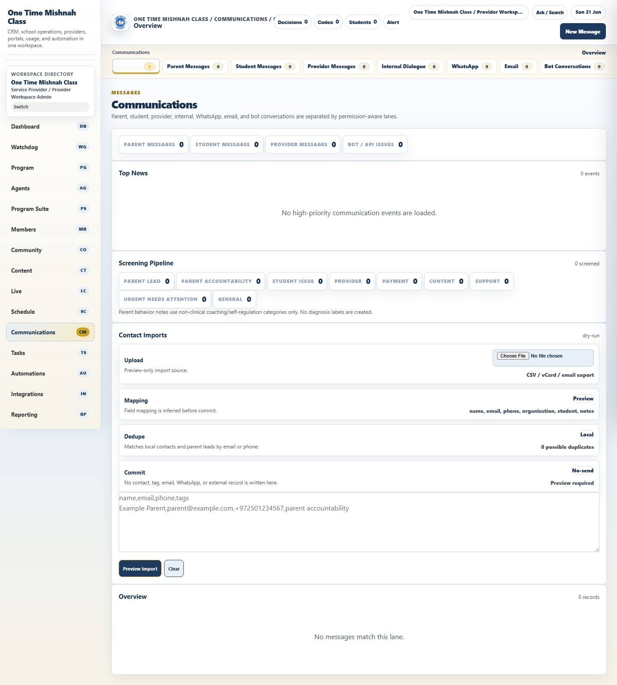

Problems / Observations:
- High visible action count (63) increases decision load.

Optimization Steps:
- Consolidate secondary actions into menus and keep only the page primary action prominent.

Visible actions: 63 buttons, 1 links, 0 disabled buttons.

Action sample:
- Super Admin
- School
- Service Provider
- Family
- All Operations Super Admin / Member Super Admin
- BNA School / Member School
- One Time Mishnah Class Service Provider / Member Current
- Dratler Family Family / Member Family
- Open workspace settings
- Dashboard DB
- Watchdog WG
- Program PG
- Agents AG
- Program Suite PS
- Members MB
- Community CO

## Operations / WhatsApp (desktop-1440)

Rating: 9.2/10 - Strong

Route: `https://bneineviimacademy.org/operations?workspace=rabbi_sheller_provider&view=communications&section=whatsapp`

Screenshot: [screenshots/desktop-1440/operations-whatsapp.jpg](screenshots/desktop-1440/operations-whatsapp.jpg)

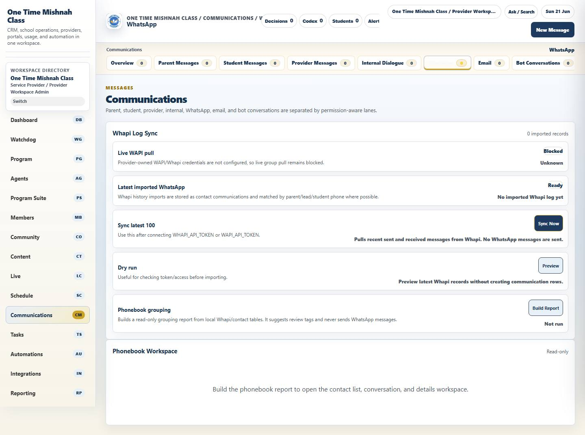

Problems / Observations:
- No major automated layout issue detected in this screenshot.

Optimization Steps:
- Manually review visual density, label clarity, and whether the primary action is obvious.

Visible actions: 51 buttons, 1 links, 0 disabled buttons.

Action sample:
- Super Admin
- School
- Service Provider
- Family
- All Operations Super Admin / Member Super Admin
- BNA School / Member School
- One Time Mishnah Class Service Provider / Member Current
- Dratler Family Family / Member Family
- Open workspace settings
- Dashboard DB
- Watchdog WG
- Program PG
- Agents AG
- Program Suite PS
- Members MB
- Community CO

## Operations / Email (desktop-1440)

Rating: 9.2/10 - Strong

Route: `https://bneineviimacademy.org/operations?workspace=rabbi_sheller_provider&view=communications&section=email`

Screenshot: [screenshots/desktop-1440/operations-email.jpg](screenshots/desktop-1440/operations-email.jpg)

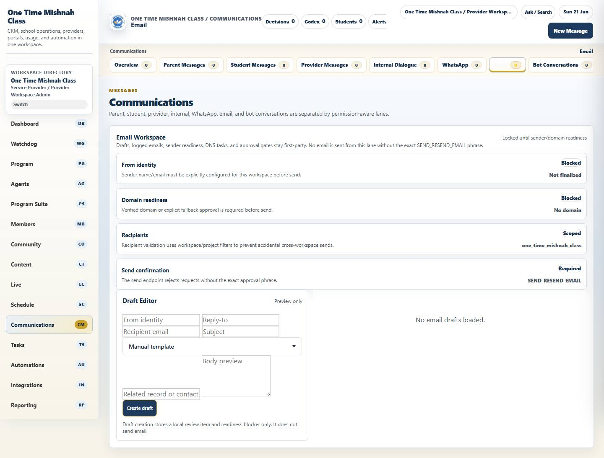

Problems / Observations:
- No major automated layout issue detected in this screenshot.

Optimization Steps:
- Manually review visual density, label clarity, and whether the primary action is obvious.

Visible actions: 50 buttons, 1 links, 0 disabled buttons.

Action sample:
- Super Admin
- School
- Service Provider
- Family
- All Operations Super Admin / Member Super Admin
- BNA School / Member School
- One Time Mishnah Class Service Provider / Member Current
- Dratler Family Family / Member Family
- Open workspace settings
- Dashboard DB
- Watchdog WG
- Program PG
- Agents AG
- Program Suite PS
- Members MB
- Community CO

## Operations / Community (desktop-1440)

Rating: 9.2/10 - Strong

Route: `https://bneineviimacademy.org/operations?workspace=rabbi_sheller_provider&view=community&section=overview`

Screenshot: [screenshots/desktop-1440/operations-community.jpg](screenshots/desktop-1440/operations-community.jpg)

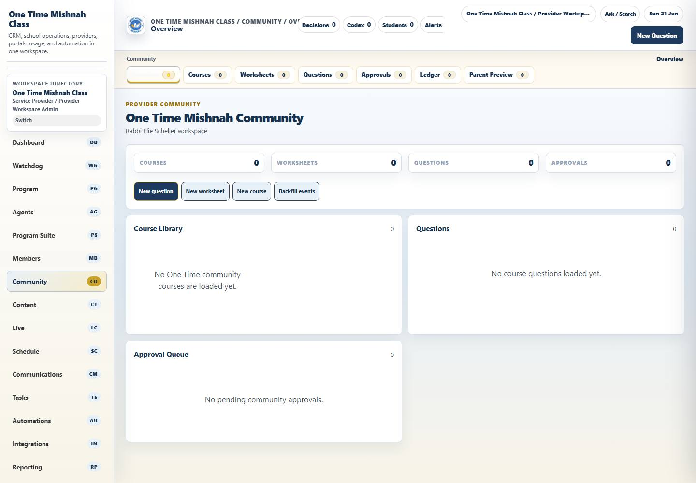

Problems / Observations:
- No major automated layout issue detected in this screenshot.

Optimization Steps:
- Manually review visual density, label clarity, and whether the primary action is obvious.

Visible actions: 51 buttons, 1 links, 0 disabled buttons.

Action sample:
- Super Admin
- School
- Service Provider
- Family
- All Operations Super Admin / Member Super Admin
- BNA School / Member School
- One Time Mishnah Class Service Provider / Member Current
- Dratler Family Family / Member Family
- Open workspace settings
- Dashboard DB
- Watchdog WG
- Program PG
- Agents AG
- Program Suite PS
- Members MB
- Community CO

## Operations / Content (desktop-1440)

Rating: 9.2/10 - Strong

Route: `https://bneineviimacademy.org/operations?workspace=rabbi_sheller_provider&view=content&section=library`

Screenshot: [screenshots/desktop-1440/operations-content.jpg](screenshots/desktop-1440/operations-content.jpg)

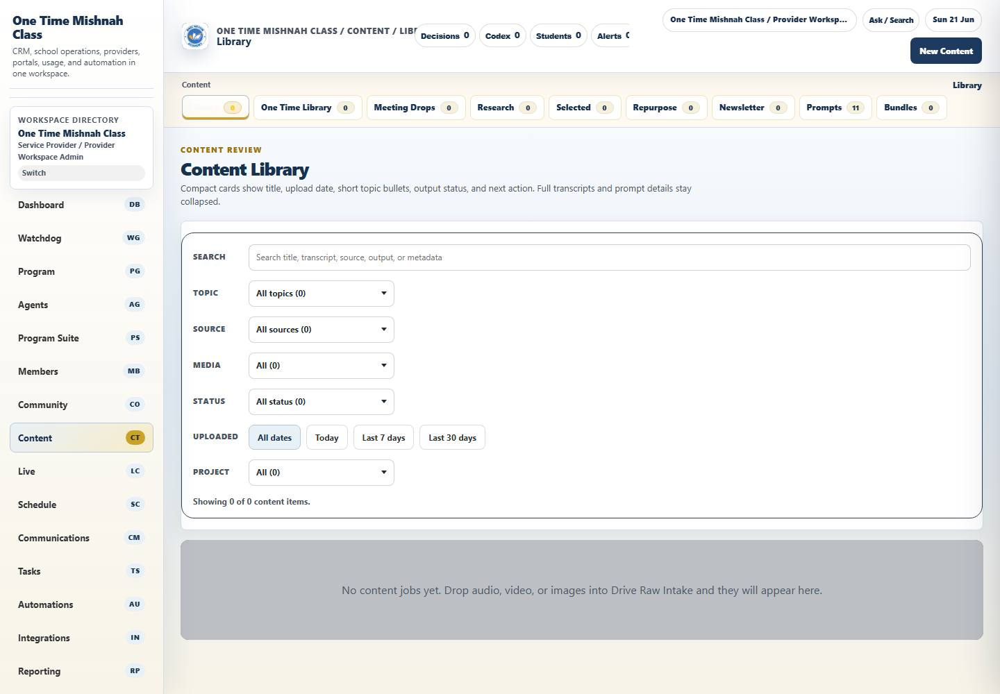

Problems / Observations:
- No major automated layout issue detected in this screenshot.

Optimization Steps:
- Manually review visual density, label clarity, and whether the primary action is obvious.

Visible actions: 54 buttons, 1 links, 0 disabled buttons.

Action sample:
- Super Admin
- School
- Service Provider
- Family
- All Operations Super Admin / Member Super Admin
- BNA School / Member School
- One Time Mishnah Class Service Provider / Member Current
- Dratler Family Family / Member Family
- Open workspace settings
- Dashboard DB
- Watchdog WG
- Program PG
- Agents AG
- Program Suite PS
- Members MB
- Community CO

## Operations / Member Library (desktop-1440)

Rating: 7.9/10 - Good with polish needed

Route: `https://bneineviimacademy.org/operations?workspace=rabbi_sheller_provider&view=content&section=one_time_library`

Screenshot: [screenshots/desktop-1440/operations-member-library.jpg](screenshots/desktop-1440/operations-member-library.jpg)

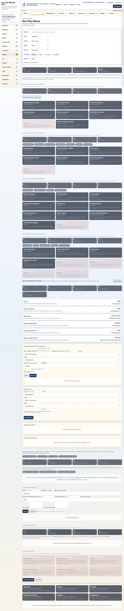

Problems / Observations:
- High visible action count (71) increases decision load.
- High card/panel count (66) can make the UI feel busy.

Optimization Steps:
- Consolidate secondary actions into menus and keep only the page primary action prominent.
- Replace repeated cards with compact lists/tables and reserve cards for real detail surfaces.

Visible actions: 71 buttons, 2 links, 0 disabled buttons.

Action sample:
- Super Admin
- School
- Service Provider
- Family
- All Operations Super Admin / Member Super Admin
- BNA School / Member School
- One Time Mishnah Class Service Provider / Member Current
- Dratler Family Family / Member Family
- Open workspace settings
- Dashboard DB
- Watchdog WG
- Program PG
- Agents AG
- Program Suite PS
- Members MB
- Community CO

## Operations / Classroom (desktop-1440)

Rating: 9.2/10 - Strong

Route: `https://bneineviimacademy.org/operations?workspace=rabbi_sheller_provider&view=content&section=meetings`

Screenshot: [screenshots/desktop-1440/operations-classroom.jpg](screenshots/desktop-1440/operations-classroom.jpg)

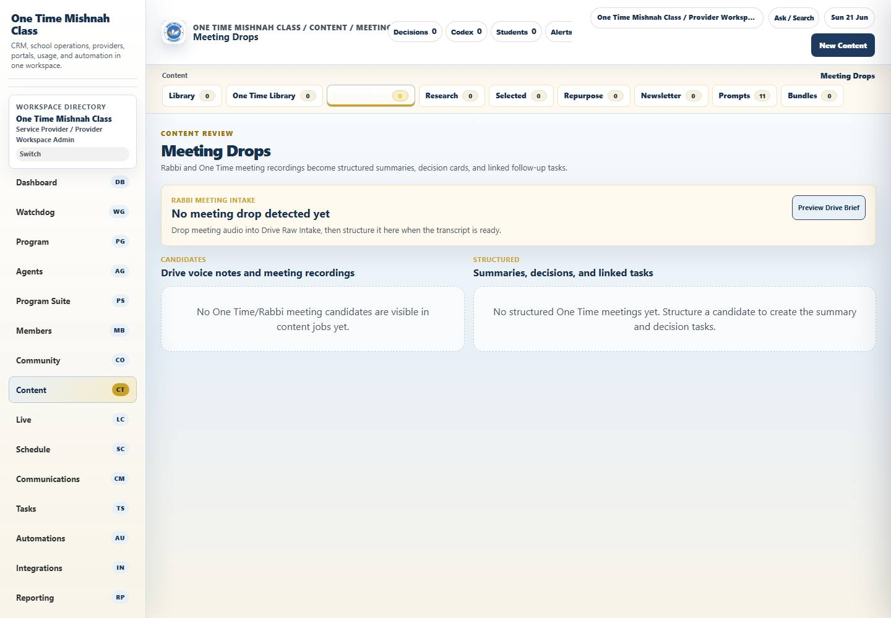

Problems / Observations:
- No major automated layout issue detected in this screenshot.

Optimization Steps:
- Manually review visual density, label clarity, and whether the primary action is obvious.

Visible actions: 46 buttons, 1 links, 0 disabled buttons.

Action sample:
- Super Admin
- School
- Service Provider
- Family
- All Operations Super Admin / Member Super Admin
- BNA School / Member School
- One Time Mishnah Class Service Provider / Member Current
- Dratler Family Family / Member Family
- Open workspace settings
- Dashboard DB
- Watchdog WG
- Program PG
- Agents AG
- Program Suite PS
- Members MB
- Community CO

## Operations / Live Classes (desktop-1440)

Rating: 8.5/10 - Strong

Route: `https://bneineviimacademy.org/operations?workspace=rabbi_sheller_provider&view=live_classes&section=overview`

Screenshot: [screenshots/desktop-1440/operations-live-classes.jpg](screenshots/desktop-1440/operations-live-classes.jpg)

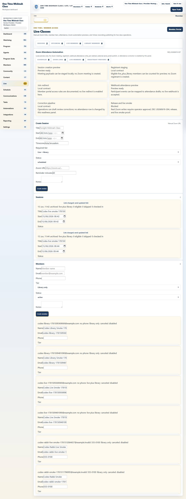

Problems / Observations:
- High visible action count (107) increases decision load.

Optimization Steps:
- Consolidate secondary actions into menus and keep only the page primary action prominent.

Visible actions: 107 buttons, 6 links, 0 disabled buttons.

Action sample:
- Super Admin
- School
- Service Provider
- Family
- All Operations Super Admin / Super Admin / owner Super Admin
- BNA School / School Admin / admin School
- One Time Mishnah Class Service Provider / Provider Owner / owner Current
- Dratler Family Family / Family Owner / owner Family
- Open workspace settings
- Dashboard DB
- Watchdog WG
- Program PG
- Agents AG
- Program Suite PS
- Members MB
- Community CO

## Operations / Schedule (desktop-1440)

Rating: 9.2/10 - Strong

Route: `https://bneineviimacademy.org/operations?workspace=rabbi_sheller_provider&view=service_providers&section=schedule`

Screenshot: [screenshots/desktop-1440/operations-schedule.jpg](screenshots/desktop-1440/operations-schedule.jpg)

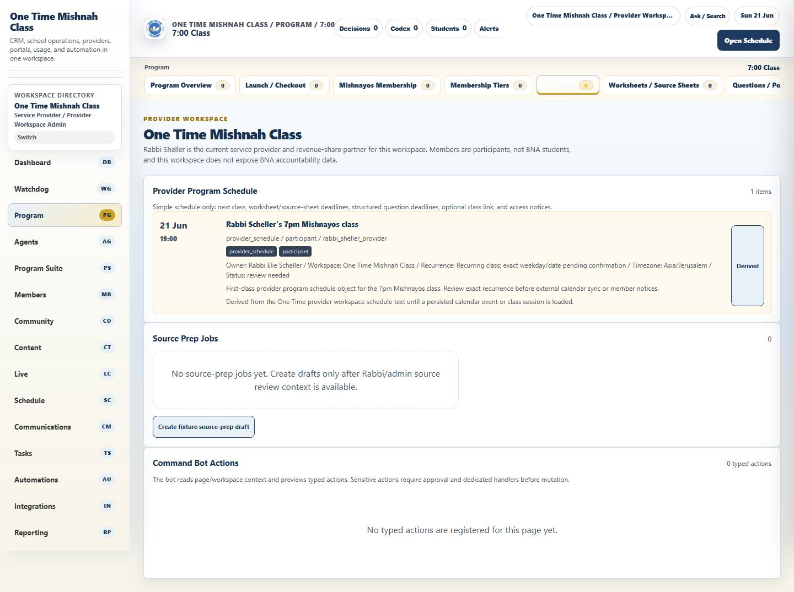

Problems / Observations:
- No major automated layout issue detected in this screenshot.

Optimization Steps:
- Manually review visual density, label clarity, and whether the primary action is obvious.

Visible actions: 47 buttons, 1 links, 1 disabled buttons.

Action sample:
- Super Admin
- School
- Service Provider
- Family
- All Operations Super Admin / Member Super Admin
- BNA School / Member School
- One Time Mishnah Class Service Provider / Member Current
- Dratler Family Family / Member Family
- Open workspace settings
- Dashboard DB
- Watchdog WG
- Program PG
- Agents AG
- Program Suite PS
- Members MB
- Community CO

## Operations / Integrations (desktop-1440)

Rating: 8.5/10 - Strong

Route: `https://bneineviimacademy.org/operations?workspace=rabbi_sheller_provider&view=integrations&section=google`

Screenshot: [screenshots/desktop-1440/operations-integrations.jpg](screenshots/desktop-1440/operations-integrations.jpg)

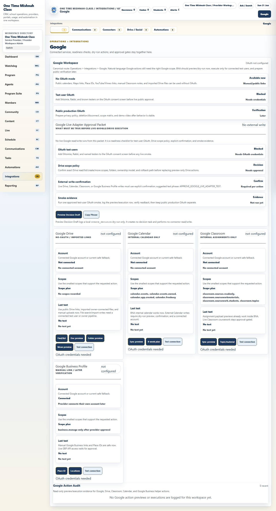

Problems / Observations:
- High visible action count (57) increases decision load.

Optimization Steps:
- Consolidate secondary actions into menus and keep only the page primary action prominent.

Visible actions: 57 buttons, 1 links, 0 disabled buttons.

Action sample:
- Super Admin
- School
- Service Provider
- Family
- All Operations Super Admin / Member Super Admin
- BNA School / Member School
- One Time Mishnah Class Service Provider / Member Current
- Dratler Family Family / Member Family
- Open workspace settings
- Dashboard DB
- Watchdog WG
- Program PG
- Agents AG
- Program Suite PS
- Members MB
- Community CO

## Operations / Settings (desktop-1440)

Rating: 9.2/10 - Strong

Route: `https://bneineviimacademy.org/operations?workspace=rabbi_sheller_provider&view=settings&section=users_access`

Screenshot: [screenshots/desktop-1440/operations-settings.jpg](screenshots/desktop-1440/operations-settings.jpg)

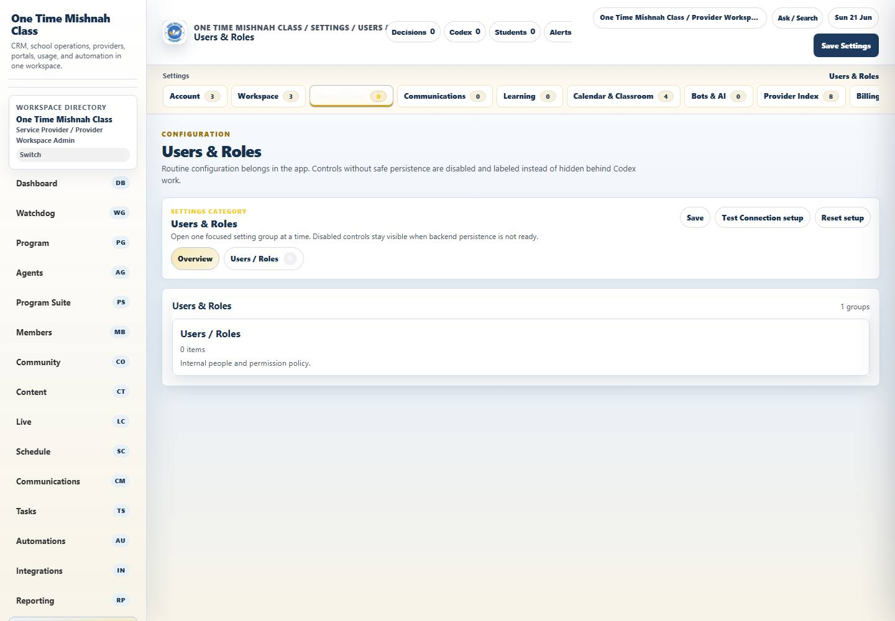

Problems / Observations:
- No major automated layout issue detected in this screenshot.

Optimization Steps:
- Manually review visual density, label clarity, and whether the primary action is obvious.

Visible actions: 53 buttons, 1 links, 0 disabled buttons.

Action sample:
- Super Admin
- School
- Service Provider
- Family
- All Operations Super Admin / Member Super Admin
- BNA School / Member School
- One Time Mishnah Class Service Provider / Member Current
- Dratler Family Family / Member Family
- Open workspace settings
- Dashboard DB
- Watchdog WG
- Program PG
- Agents AG
- Program Suite PS
- Members MB
- Community CO

## Operations / Agents (desktop-1440)

Rating: 9.2/10 - Strong

Route: `https://bneineviimacademy.org/operations?workspace=rabbi_sheller_provider&view=agents&section=ready`

Screenshot: [screenshots/desktop-1440/operations-agents.jpg](screenshots/desktop-1440/operations-agents.jpg)

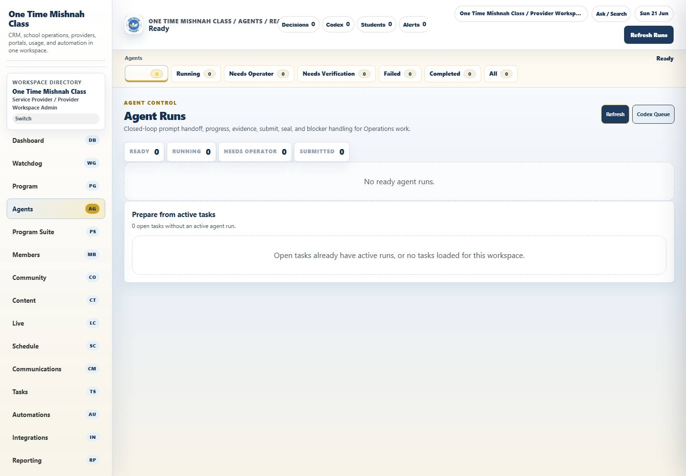

Problems / Observations:
- No major automated layout issue detected in this screenshot.

Optimization Steps:
- Manually review visual density, label clarity, and whether the primary action is obvious.

Visible actions: 49 buttons, 1 links, 0 disabled buttons.

Action sample:
- Super Admin
- School
- Service Provider
- Family
- All Operations Super Admin / Member Super Admin
- BNA School / Member School
- One Time Mishnah Class Service Provider / Member Current
- Dratler Family Family / Member Family
- Open workspace settings
- Dashboard DB
- Watchdog WG
- Program PG
- Agents AG
- Program Suite PS
- Members MB
- Community CO

## Operations / Overview (desktop-1024)

Rating: 9.2/10 - Strong

Route: `https://bneineviimacademy.org/operations?workspace=rabbi_sheller_provider&view=dashboard&section=overview`

Screenshot: [screenshots/desktop-1024/operations-overview.jpg](screenshots/desktop-1024/operations-overview.jpg)

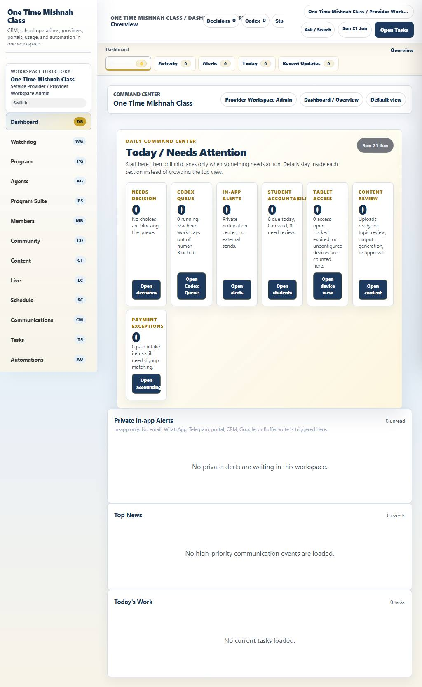

Problems / Observations:
- No major automated layout issue detected in this screenshot.

Optimization Steps:
- Manually review visual density, label clarity, and whether the primary action is obvious.

Visible actions: 48 buttons, 1 links, 0 disabled buttons.

Action sample:
- Super Admin
- School
- Service Provider
- Family
- All Operations Super Admin / Member Super Admin
- BNA School / Member School
- One Time Mishnah Class Service Provider / Member Current
- Dratler Family Family / Member Family
- Open workspace settings
- Dashboard DB
- Watchdog WG
- Program PG
- Agents AG
- Program Suite PS
- Members MB
- Community CO

## Operations / Tasks (desktop-1024)

Rating: 8.5/10 - Strong

Route: `https://bneineviimacademy.org/operations?workspace=rabbi_sheller_provider&view=tasks&section=tasks`

Screenshot: [screenshots/desktop-1024/operations-tasks.jpg](screenshots/desktop-1024/operations-tasks.jpg)

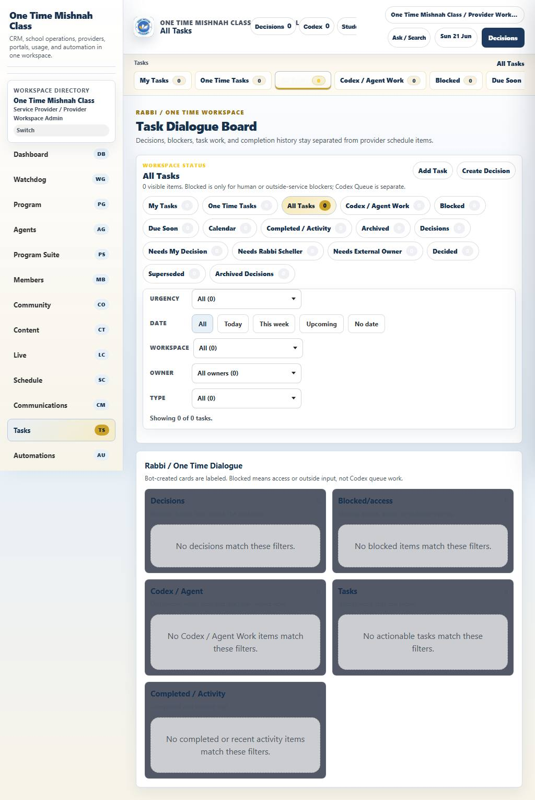

Problems / Observations:
- High visible action count (79) increases decision load.

Optimization Steps:
- Consolidate secondary actions into menus and keep only the page primary action prominent.

Visible actions: 79 buttons, 1 links, 0 disabled buttons.

Action sample:
- Super Admin
- School
- Service Provider
- Family
- All Operations Super Admin / Member Super Admin
- BNA School / Member School
- One Time Mishnah Class Service Provider / Member Current
- Dratler Family Family / Member Family
- Open workspace settings
- Dashboard DB
- Watchdog WG
- Program PG
- Agents AG
- Program Suite PS
- Members MB
- Community CO

## Operations / Decisions (desktop-1024)

Rating: 8.5/10 - Strong

Route: `https://bneineviimacademy.org/operations?workspace=rabbi_sheller_provider&view=tasks&section=decisions`

Screenshot: [screenshots/desktop-1024/operations-decisions.jpg](screenshots/desktop-1024/operations-decisions.jpg)

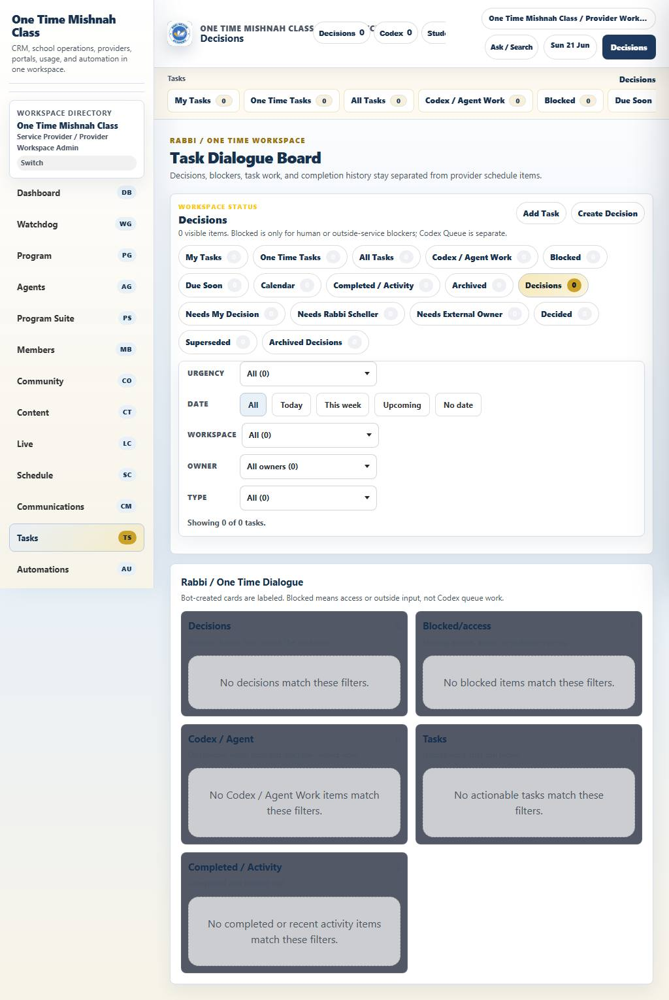

Problems / Observations:
- High visible action count (79) increases decision load.

Optimization Steps:
- Consolidate secondary actions into menus and keep only the page primary action prominent.

Visible actions: 79 buttons, 1 links, 0 disabled buttons.

Action sample:
- Super Admin
- School
- Service Provider
- Family
- All Operations Super Admin / Member Super Admin
- BNA School / Member School
- One Time Mishnah Class Service Provider / Member Current
- Dratler Family Family / Member Family
- Open workspace settings
- Dashboard DB
- Watchdog WG
- Program PG
- Agents AG
- Program Suite PS
- Members MB
- Community CO

## Operations / Contacts and Members (desktop-1024)

Rating: 9.2/10 - Strong

Route: `https://bneineviimacademy.org/operations?workspace=rabbi_sheller_provider&view=contacts&section=participants`

Screenshot: [screenshots/desktop-1024/operations-contacts-members.jpg](screenshots/desktop-1024/operations-contacts-members.jpg)

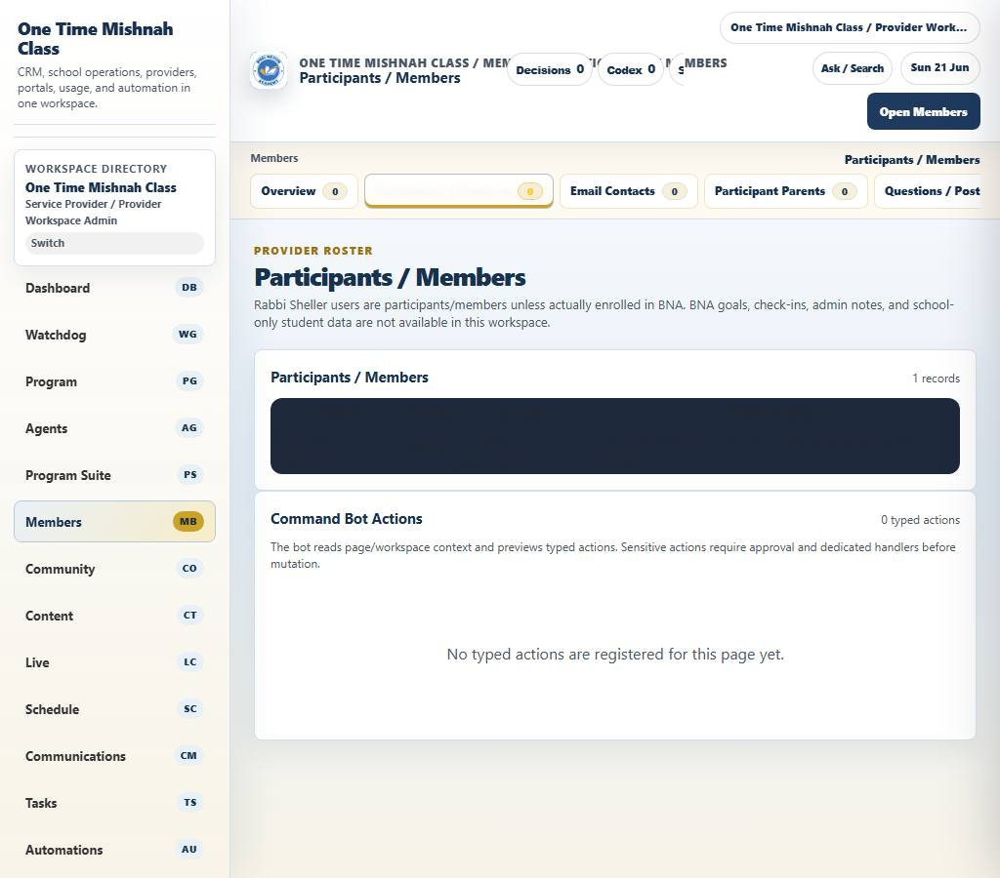

Problems / Observations:
- No major automated layout issue detected in this screenshot.

Optimization Steps:
- Manually review visual density, label clarity, and whether the primary action is obvious.

Visible actions: 43 buttons, 1 links, 0 disabled buttons.

Action sample:
- Super Admin
- School
- Service Provider
- Family
- All Operations Super Admin / Member Super Admin
- BNA School / Member School
- One Time Mishnah Class Service Provider / Member Current
- Dratler Family Family / Member Family
- Open workspace settings
- Dashboard DB
- Watchdog WG
- Program PG
- Agents AG
- Program Suite PS
- Members MB
- Community CO

## Operations / Users (desktop-1024)

Rating: 8.5/10 - Strong

Route: `https://bneineviimacademy.org/operations?workspace=platform&view=admin&section=users`

Screenshot: [screenshots/desktop-1024/operations-users.jpg](screenshots/desktop-1024/operations-users.jpg)

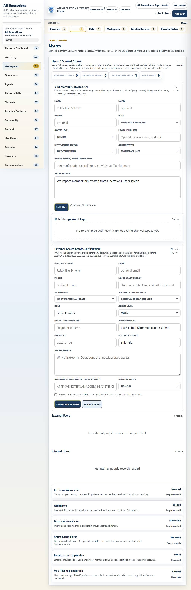

Problems / Observations:
- High visible action count (66) increases decision load.

Optimization Steps:
- Consolidate secondary actions into menus and keep only the page primary action prominent.

Visible actions: 66 buttons, 1 links, 1 disabled buttons.

Action sample:
- Super Admin
- School
- Service Provider
- Family
- All Operations Super Admin / Member Current
- BNA School / Member School
- One Time Mishnah Class Service Provider / Member Service Provider
- Dratler Family Family / Member Family
- Open workspace settings
- Manage workspace directory
- Platform Dashboard PD
- Watchdog WG
- Workspaces WS
- Operations OP
- Agents AG
- Platform Suite PS

## Operations / Communications (desktop-1024)

Rating: 8.5/10 - Strong

Route: `https://bneineviimacademy.org/operations?workspace=rabbi_sheller_provider&view=communications&section=overview`

Screenshot: [screenshots/desktop-1024/operations-communications.jpg](screenshots/desktop-1024/operations-communications.jpg)

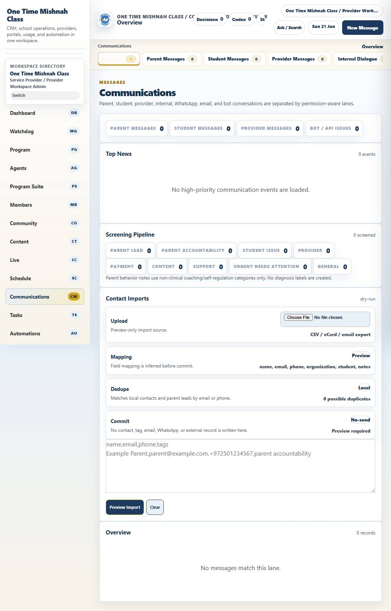

Problems / Observations:
- High visible action count (63) increases decision load.

Optimization Steps:
- Consolidate secondary actions into menus and keep only the page primary action prominent.

Visible actions: 63 buttons, 1 links, 0 disabled buttons.

Action sample:
- Super Admin
- School
- Service Provider
- Family
- All Operations Super Admin / Member Super Admin
- BNA School / Member School
- One Time Mishnah Class Service Provider / Member Current
- Dratler Family Family / Member Family
- Open workspace settings
- Dashboard DB
- Watchdog WG
- Program PG
- Agents AG
- Program Suite PS
- Members MB
- Community CO

## Operations / WhatsApp (desktop-1024)

Rating: 9.2/10 - Strong

Route: `https://bneineviimacademy.org/operations?workspace=rabbi_sheller_provider&view=communications&section=whatsapp`

Screenshot: [screenshots/desktop-1024/operations-whatsapp.jpg](screenshots/desktop-1024/operations-whatsapp.jpg)

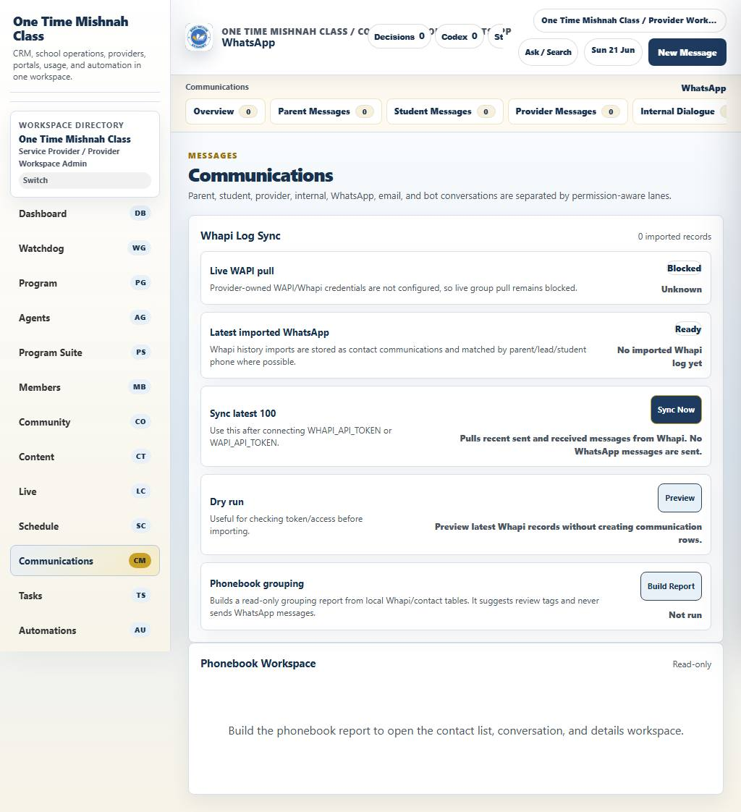

Problems / Observations:
- No major automated layout issue detected in this screenshot.

Optimization Steps:
- Manually review visual density, label clarity, and whether the primary action is obvious.

Visible actions: 51 buttons, 1 links, 0 disabled buttons.

Action sample:
- Super Admin
- School
- Service Provider
- Family
- All Operations Super Admin / Member Super Admin
- BNA School / Member School
- One Time Mishnah Class Service Provider / Member Current
- Dratler Family Family / Member Family
- Open workspace settings
- Dashboard DB
- Watchdog WG
- Program PG
- Agents AG
- Program Suite PS
- Members MB
- Community CO

## Operations / Email (desktop-1024)

Rating: 9.2/10 - Strong

Route: `https://bneineviimacademy.org/operations?workspace=rabbi_sheller_provider&view=communications&section=email`

Screenshot: [screenshots/desktop-1024/operations-email.jpg](screenshots/desktop-1024/operations-email.jpg)

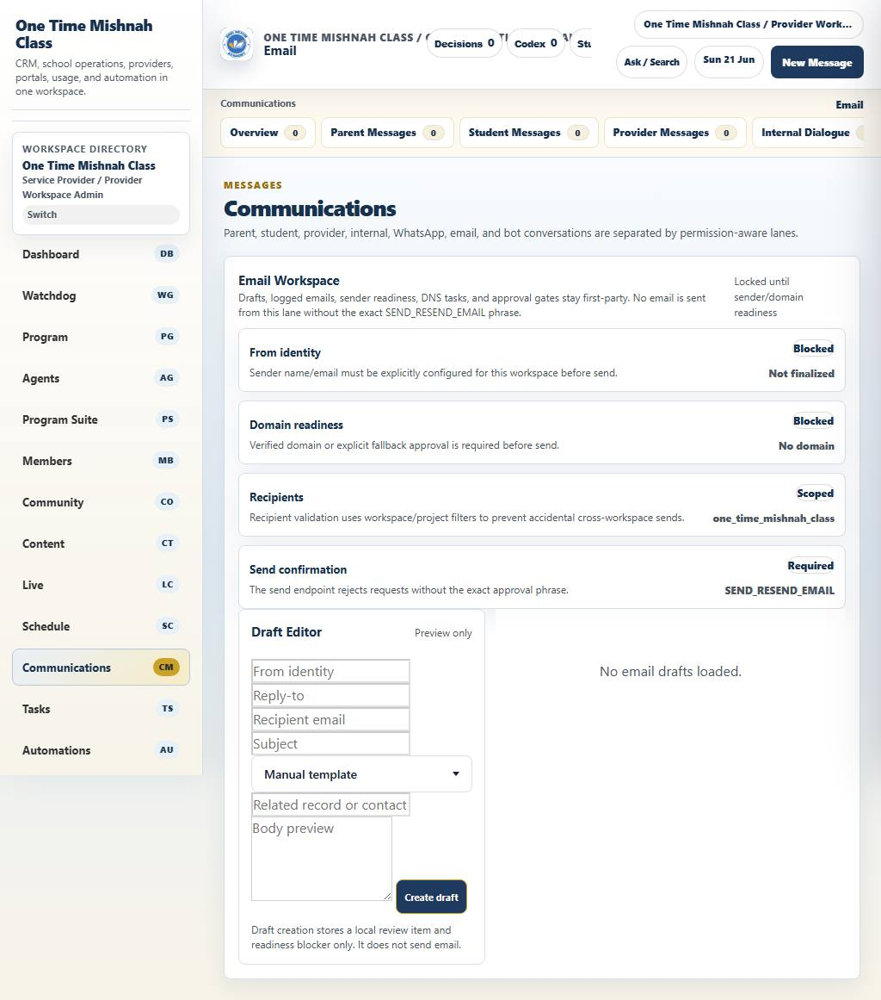

Problems / Observations:
- No major automated layout issue detected in this screenshot.

Optimization Steps:
- Manually review visual density, label clarity, and whether the primary action is obvious.

Visible actions: 50 buttons, 1 links, 0 disabled buttons.

Action sample:
- Super Admin
- School
- Service Provider
- Family
- All Operations Super Admin / Member Super Admin
- BNA School / Member School
- One Time Mishnah Class Service Provider / Member Current
- Dratler Family Family / Member Family
- Open workspace settings
- Dashboard DB
- Watchdog WG
- Program PG
- Agents AG
- Program Suite PS
- Members MB
- Community CO

## Operations / Community (desktop-1024)

Rating: 9.2/10 - Strong

Route: `https://bneineviimacademy.org/operations?workspace=rabbi_sheller_provider&view=community&section=overview`

Screenshot: [screenshots/desktop-1024/operations-community.jpg](screenshots/desktop-1024/operations-community.jpg)

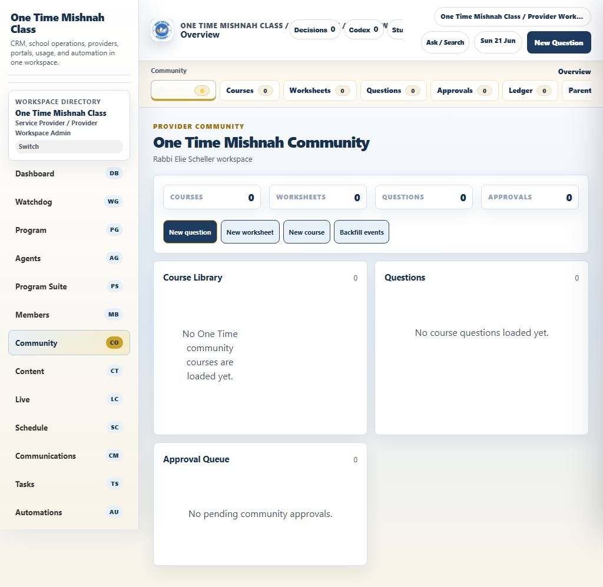

Problems / Observations:
- No major automated layout issue detected in this screenshot.

Optimization Steps:
- Manually review visual density, label clarity, and whether the primary action is obvious.

Visible actions: 51 buttons, 1 links, 0 disabled buttons.

Action sample:
- Super Admin
- School
- Service Provider
- Family
- All Operations Super Admin / Member Super Admin
- BNA School / Member School
- One Time Mishnah Class Service Provider / Member Current
- Dratler Family Family / Member Family
- Open workspace settings
- Dashboard DB
- Watchdog WG
- Program PG
- Agents AG
- Program Suite PS
- Members MB
- Community CO

## Operations / Content (desktop-1024)

Rating: 9.2/10 - Strong

Route: `https://bneineviimacademy.org/operations?workspace=rabbi_sheller_provider&view=content&section=library`

Screenshot: [screenshots/desktop-1024/operations-content.jpg](screenshots/desktop-1024/operations-content.jpg)

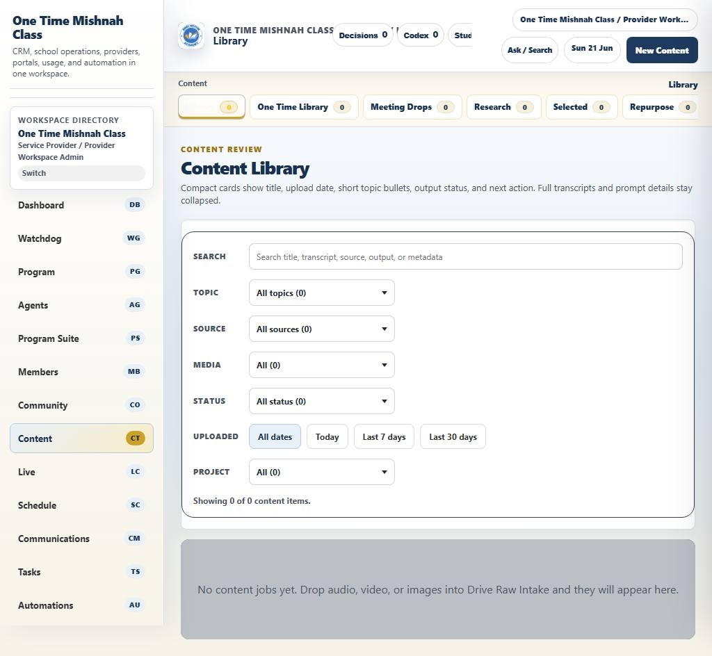

Problems / Observations:
- No major automated layout issue detected in this screenshot.

Optimization Steps:
- Manually review visual density, label clarity, and whether the primary action is obvious.

Visible actions: 54 buttons, 1 links, 0 disabled buttons.

Action sample:
- Super Admin
- School
- Service Provider
- Family
- All Operations Super Admin / Member Super Admin
- BNA School / Member School
- One Time Mishnah Class Service Provider / Member Current
- Dratler Family Family / Member Family
- Open workspace settings
- Dashboard DB
- Watchdog WG
- Program PG
- Agents AG
- Program Suite PS
- Members MB
- Community CO

## Operations / Member Library (desktop-1024)

Rating: 7.9/10 - Good with polish needed

Route: `https://bneineviimacademy.org/operations?workspace=rabbi_sheller_provider&view=content&section=one_time_library`

Screenshot: [screenshots/desktop-1024/operations-member-library.jpg](screenshots/desktop-1024/operations-member-library.jpg)

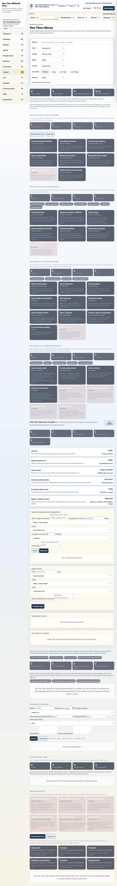

Problems / Observations:
- High visible action count (71) increases decision load.
- High card/panel count (66) can make the UI feel busy.

Optimization Steps:
- Consolidate secondary actions into menus and keep only the page primary action prominent.
- Replace repeated cards with compact lists/tables and reserve cards for real detail surfaces.

Visible actions: 71 buttons, 2 links, 0 disabled buttons.

Action sample:
- Super Admin
- School
- Service Provider
- Family
- All Operations Super Admin / Member Super Admin
- BNA School / Member School
- One Time Mishnah Class Service Provider / Member Current
- Dratler Family Family / Member Family
- Open workspace settings
- Dashboard DB
- Watchdog WG
- Program PG
- Agents AG
- Program Suite PS
- Members MB
- Community CO

## Operations / Classroom (desktop-1024)

Rating: 9.2/10 - Strong

Route: `https://bneineviimacademy.org/operations?workspace=rabbi_sheller_provider&view=content&section=meetings`

Screenshot: [screenshots/desktop-1024/operations-classroom.jpg](screenshots/desktop-1024/operations-classroom.jpg)

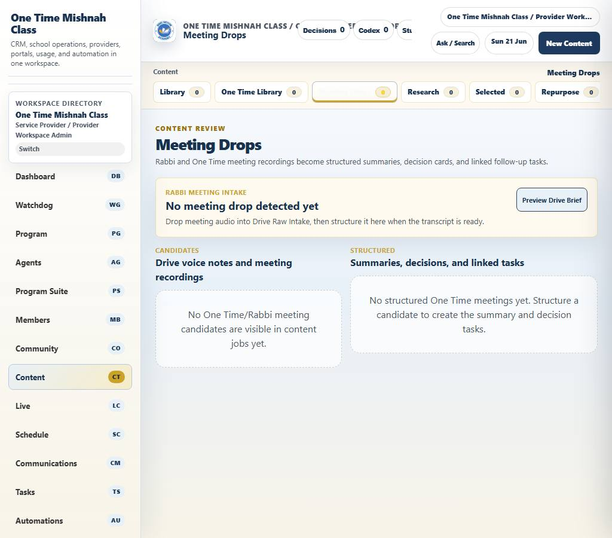

Problems / Observations:
- No major automated layout issue detected in this screenshot.

Optimization Steps:
- Manually review visual density, label clarity, and whether the primary action is obvious.

Visible actions: 46 buttons, 1 links, 0 disabled buttons.

Action sample:
- Super Admin
- School
- Service Provider
- Family
- All Operations Super Admin / Member Super Admin
- BNA School / Member School
- One Time Mishnah Class Service Provider / Member Current
- Dratler Family Family / Member Family
- Open workspace settings
- Dashboard DB
- Watchdog WG
- Program PG
- Agents AG
- Program Suite PS
- Members MB
- Community CO

## Operations / Live Classes (desktop-1024)

Rating: 8.5/10 - Strong

Route: `https://bneineviimacademy.org/operations?workspace=rabbi_sheller_provider&view=live_classes&section=overview`

Screenshot: [screenshots/desktop-1024/operations-live-classes.jpg](screenshots/desktop-1024/operations-live-classes.jpg)

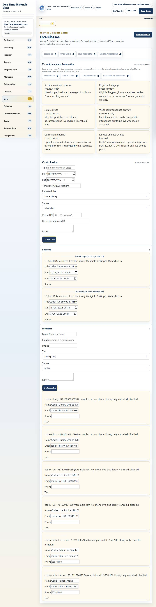

Problems / Observations:
- High visible action count (107) increases decision load.

Optimization Steps:
- Consolidate secondary actions into menus and keep only the page primary action prominent.

Visible actions: 107 buttons, 6 links, 0 disabled buttons.

Action sample:
- Super Admin
- School
- Service Provider
- Family
- All Operations Super Admin / Super Admin / owner Super Admin
- BNA School / School Admin / admin School
- One Time Mishnah Class Service Provider / Provider Owner / owner Current
- Dratler Family Family / Family Owner / owner Family
- Open workspace settings
- Dashboard DB
- Watchdog WG
- Program PG
- Agents AG
- Program Suite PS
- Members MB
- Community CO

## Operations / Schedule (desktop-1024)

Rating: 9.2/10 - Strong

Route: `https://bneineviimacademy.org/operations?workspace=rabbi_sheller_provider&view=service_providers&section=schedule`

Screenshot: [screenshots/desktop-1024/operations-schedule.jpg](screenshots/desktop-1024/operations-schedule.jpg)

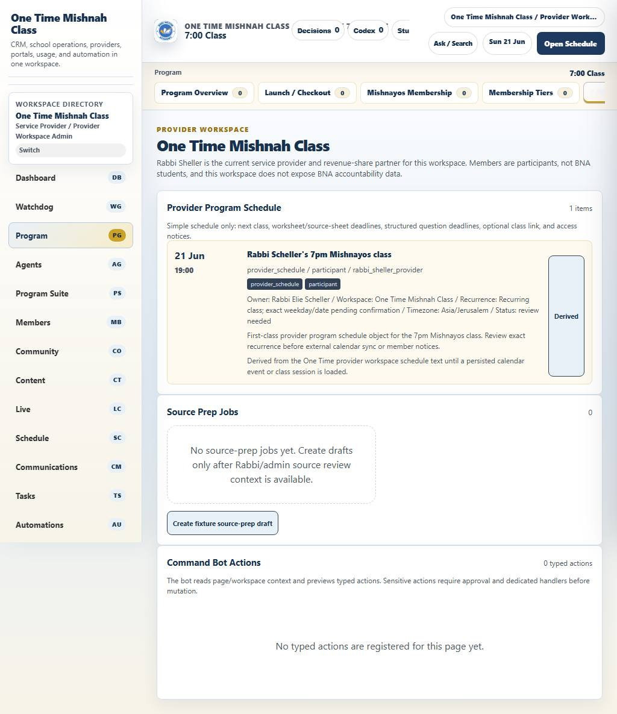

Problems / Observations:
- No major automated layout issue detected in this screenshot.

Optimization Steps:
- Manually review visual density, label clarity, and whether the primary action is obvious.

Visible actions: 47 buttons, 1 links, 1 disabled buttons.

Action sample:
- Super Admin
- School
- Service Provider
- Family
- All Operations Super Admin / Member Super Admin
- BNA School / Member School
- One Time Mishnah Class Service Provider / Member Current
- Dratler Family Family / Member Family
- Open workspace settings
- Dashboard DB
- Watchdog WG
- Program PG
- Agents AG
- Program Suite PS
- Members MB
- Community CO

## Operations / Integrations (desktop-1024)

Rating: 8.5/10 - Strong

Route: `https://bneineviimacademy.org/operations?workspace=rabbi_sheller_provider&view=integrations&section=google`

Screenshot: [screenshots/desktop-1024/operations-integrations.jpg](screenshots/desktop-1024/operations-integrations.jpg)

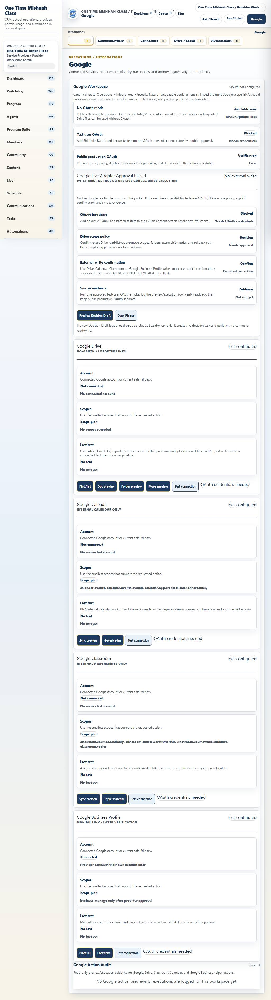

Problems / Observations:
- High visible action count (57) increases decision load.

Optimization Steps:
- Consolidate secondary actions into menus and keep only the page primary action prominent.

Visible actions: 57 buttons, 1 links, 0 disabled buttons.

Action sample:
- Super Admin
- School
- Service Provider
- Family
- All Operations Super Admin / Member Super Admin
- BNA School / Member School
- One Time Mishnah Class Service Provider / Member Current
- Dratler Family Family / Member Family
- Open workspace settings
- Dashboard DB
- Watchdog WG
- Program PG
- Agents AG
- Program Suite PS
- Members MB
- Community CO

## Operations / Settings (desktop-1024)

Rating: 9.2/10 - Strong

Route: `https://bneineviimacademy.org/operations?workspace=rabbi_sheller_provider&view=settings&section=users_access`

Screenshot: [screenshots/desktop-1024/operations-settings.jpg](screenshots/desktop-1024/operations-settings.jpg)

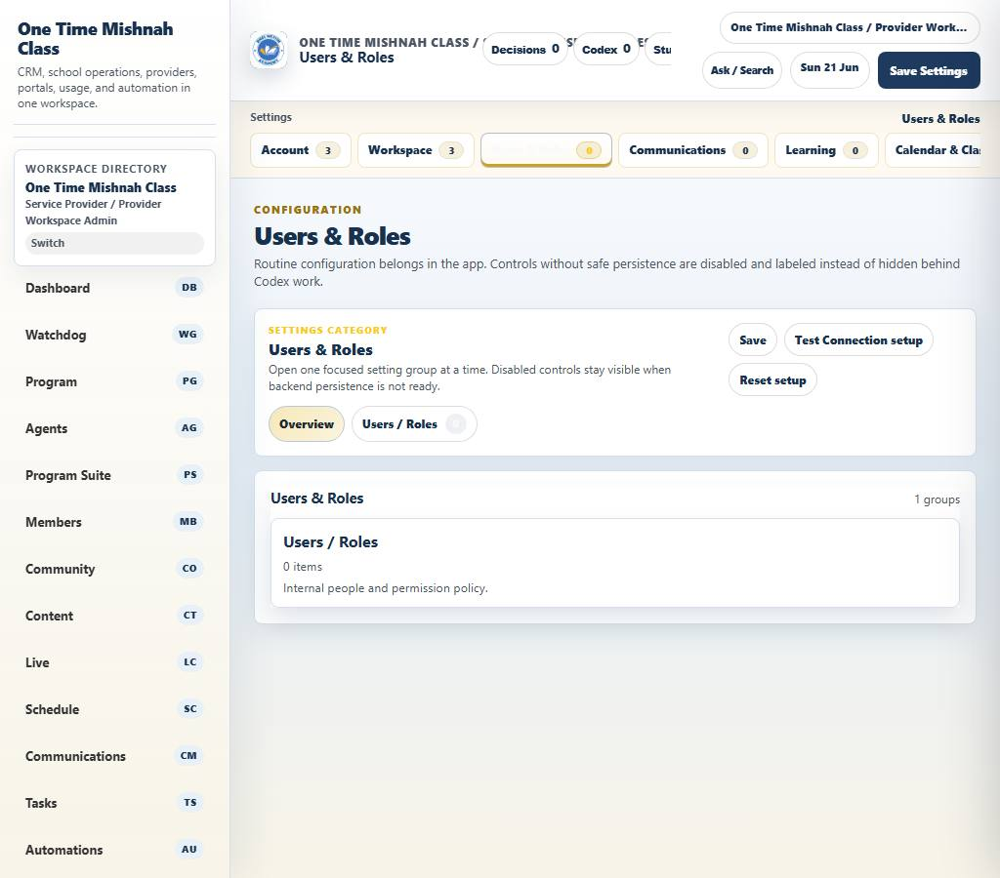

Problems / Observations:
- No major automated layout issue detected in this screenshot.

Optimization Steps:
- Manually review visual density, label clarity, and whether the primary action is obvious.

Visible actions: 53 buttons, 1 links, 0 disabled buttons.

Action sample:
- Super Admin
- School
- Service Provider
- Family
- All Operations Super Admin / Member Super Admin
- BNA School / Member School
- One Time Mishnah Class Service Provider / Member Current
- Dratler Family Family / Member Family
- Open workspace settings
- Dashboard DB
- Watchdog WG
- Program PG
- Agents AG
- Program Suite PS
- Members MB
- Community CO

## Operations / Agents (desktop-1024)

Rating: 9.2/10 - Strong

Route: `https://bneineviimacademy.org/operations?workspace=rabbi_sheller_provider&view=agents&section=ready`

Screenshot: [screenshots/desktop-1024/operations-agents.jpg](screenshots/desktop-1024/operations-agents.jpg)

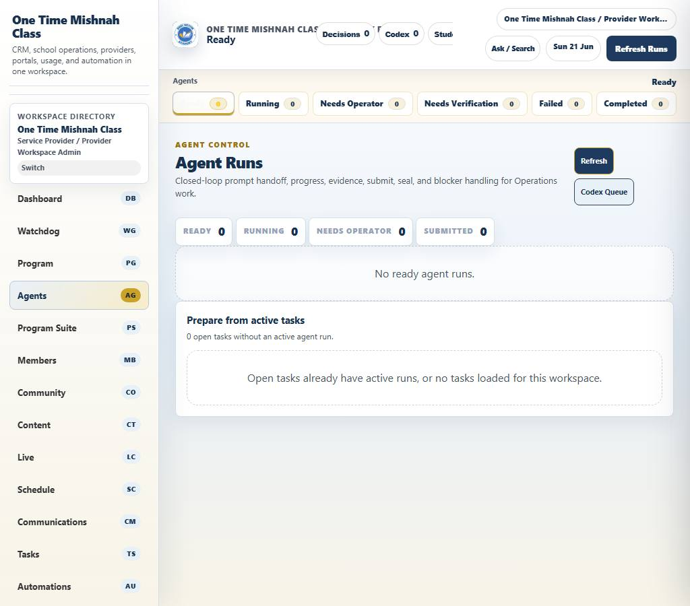

Problems / Observations:
- No major automated layout issue detected in this screenshot.

Optimization Steps:
- Manually review visual density, label clarity, and whether the primary action is obvious.

Visible actions: 49 buttons, 1 links, 0 disabled buttons.

Action sample:
- Super Admin
- School
- Service Provider
- Family
- All Operations Super Admin / Member Super Admin
- BNA School / Member School
- One Time Mishnah Class Service Provider / Member Current
- Dratler Family Family / Member Family
- Open workspace settings
- Dashboard DB
- Watchdog WG
- Program PG
- Agents AG
- Program Suite PS
- Members MB
- Community CO

## Operations / Overview (tablet-768)

Rating: 9.2/10 - Strong

Route: `https://bneineviimacademy.org/operations?workspace=rabbi_sheller_provider&view=dashboard&section=overview`

Screenshot: [screenshots/tablet-768/operations-overview.jpg](screenshots/tablet-768/operations-overview.jpg)

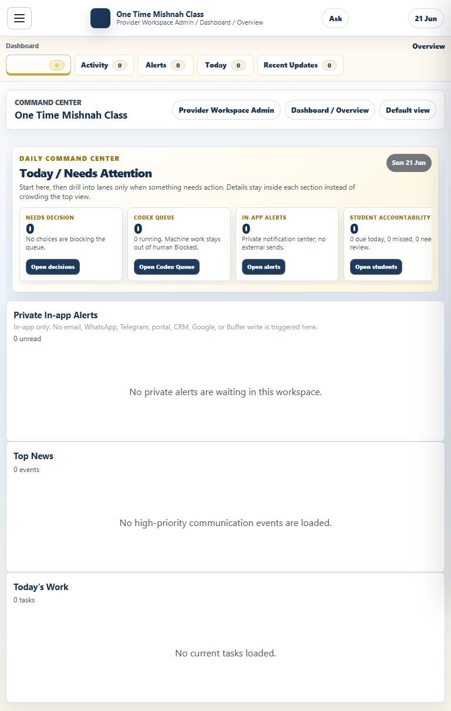

Problems / Observations:
- No major automated layout issue detected in this screenshot.

Optimization Steps:
- Manually review visual density, label clarity, and whether the primary action is obvious.

Visible actions: 17 buttons, 0 links, 0 disabled buttons.

Action sample:
- Open navigation
- Ask
- Overview 0
- Activity 0
- Alerts 0
- Today 0
- Recent Updates 0
- Open decisions
- Open Codex Queue
- Open alerts
- Open students
- Open device view
- Open content
- Open accounting
- x
- Teach helper

## Operations / Tasks (tablet-768)

Rating: 9.2/10 - Strong

Route: `https://bneineviimacademy.org/operations?workspace=rabbi_sheller_provider&view=tasks&section=tasks`

Screenshot: [screenshots/tablet-768/operations-tasks.jpg](screenshots/tablet-768/operations-tasks.jpg)

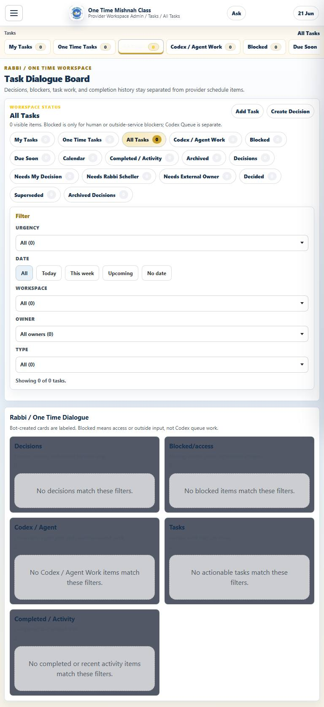

Problems / Observations:
- No major automated layout issue detected in this screenshot.

Optimization Steps:
- Manually review visual density, label clarity, and whether the primary action is obvious.

Visible actions: 48 buttons, 0 links, 0 disabled buttons.

Action sample:
- Open navigation
- Ask
- My Tasks 0
- One Time Tasks 0
- All Tasks 0
- Codex / Agent Work 0
- Blocked 0
- Due Soon 0
- Calendar 0
- Completed / Activity 0
- Archived 0
- Decisions 0
- Needs My Decision 0
- Needs Rabbi Scheller 0
- Needs External Owner 0
- Decided 0

## Operations / Decisions (tablet-768)

Rating: 9.2/10 - Strong

Route: `https://bneineviimacademy.org/operations?workspace=rabbi_sheller_provider&view=tasks&section=decisions`

Screenshot: [screenshots/tablet-768/operations-decisions.jpg](screenshots/tablet-768/operations-decisions.jpg)

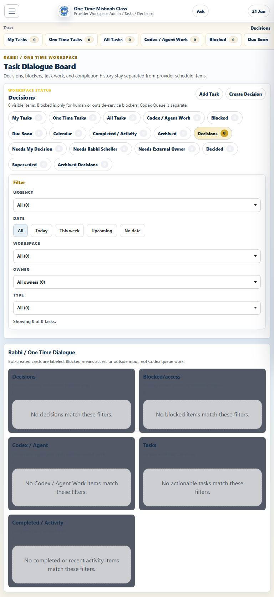

Problems / Observations:
- No major automated layout issue detected in this screenshot.

Optimization Steps:
- Manually review visual density, label clarity, and whether the primary action is obvious.

Visible actions: 48 buttons, 0 links, 0 disabled buttons.

Action sample:
- Open navigation
- Ask
- My Tasks 0
- One Time Tasks 0
- All Tasks 0
- Codex / Agent Work 0
- Blocked 0
- Due Soon 0
- Calendar 0
- Completed / Activity 0
- Archived 0
- Decisions 0
- Needs My Decision 0
- Needs Rabbi Scheller 0
- Needs External Owner 0
- Decided 0

## Operations / Contacts and Members (tablet-768)

Rating: 9.2/10 - Strong

Route: `https://bneineviimacademy.org/operations?workspace=rabbi_sheller_provider&view=contacts&section=participants`

Screenshot: [screenshots/tablet-768/operations-contacts-members.jpg](screenshots/tablet-768/operations-contacts-members.jpg)

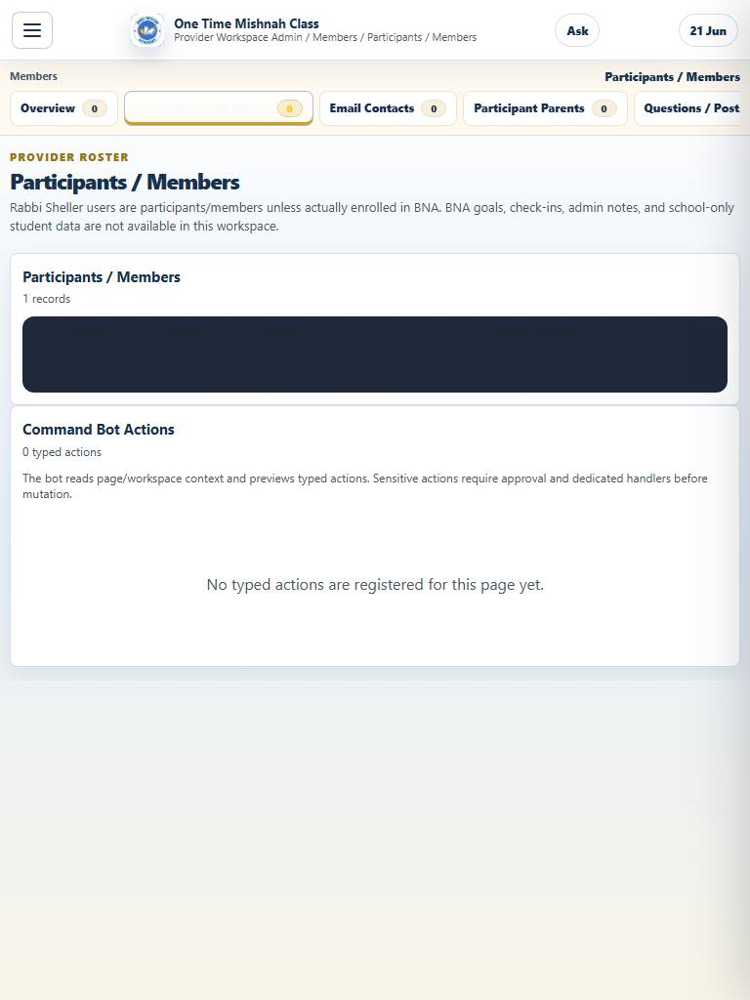

Problems / Observations:
- No major automated layout issue detected in this screenshot.

Optimization Steps:
- Manually review visual density, label clarity, and whether the primary action is obvious.

Visible actions: 12 buttons, 0 links, 0 disabled buttons.

Action sample:
- Open navigation
- Ask
- Overview 0
- Participants / Members 0
- Email Contacts 0
- Participant Parents 0
- Questions / Posts 0
- Payment / Access 0
- Messages / Help 0
- x
- Teach helper
- Send

## Operations / Users (tablet-768)

Rating: 9.2/10 - Strong

Route: `https://bneineviimacademy.org/operations?workspace=platform&view=admin&section=users`

Screenshot: [screenshots/tablet-768/operations-users.jpg](screenshots/tablet-768/operations-users.jpg)

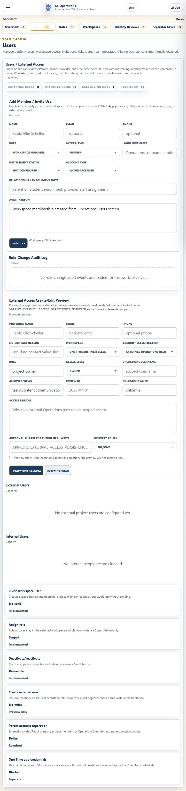

Problems / Observations:
- No major automated layout issue detected in this screenshot.

Optimization Steps:
- Manually review visual density, label clarity, and whether the primary action is obvious.

Visible actions: 30 buttons, 0 links, 1 disabled buttons.

Action sample:
- Open navigation
- Ask
- Overview 0
- Users 0
- Roles 3
- Workspaces 4
- Identity Reviews 0
- Operator Setup 0
- Invitations 0
- Tickets 0
- Messages 0
- Settings 0
- EXTERNAL USERS 0
- INTERNAL USERS 0
- ACCESS LINK GATE 1
- ROLE AUDIT 0

## Operations / Communications (tablet-768)

Rating: 9.2/10 - Strong

Route: `https://bneineviimacademy.org/operations?workspace=rabbi_sheller_provider&view=communications&section=overview`

Screenshot: [screenshots/tablet-768/operations-communications.jpg](screenshots/tablet-768/operations-communications.jpg)

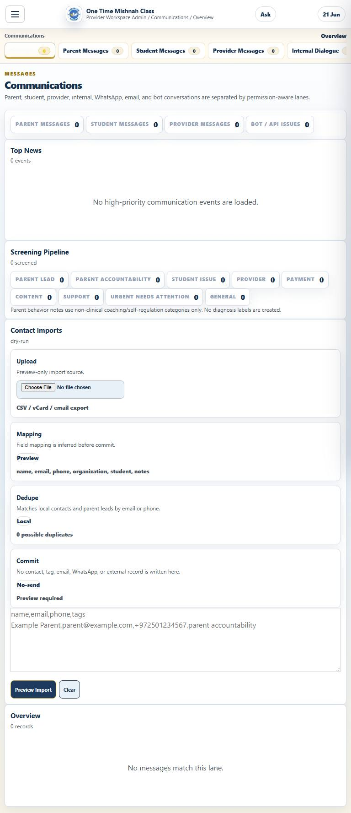

Problems / Observations:
- No major automated layout issue detected in this screenshot.

Optimization Steps:
- Manually review visual density, label clarity, and whether the primary action is obvious.

Visible actions: 32 buttons, 0 links, 0 disabled buttons.

Action sample:
- Open navigation
- Ask
- Overview 0
- Parent Messages 0
- Student Messages 0
- Provider Messages 0
- Internal Dialogue 0
- WhatsApp 0
- Email 0
- Bot Conversations 0
- Announcements 0
- Templates 0
- Support Threads 0
- Settings 0
- PARENT MESSAGES 0
- STUDENT MESSAGES 0

## Operations / WhatsApp (tablet-768)

Rating: 9.2/10 - Strong

Route: `https://bneineviimacademy.org/operations?workspace=rabbi_sheller_provider&view=communications&section=whatsapp`

Screenshot: [screenshots/tablet-768/operations-whatsapp.jpg](screenshots/tablet-768/operations-whatsapp.jpg)

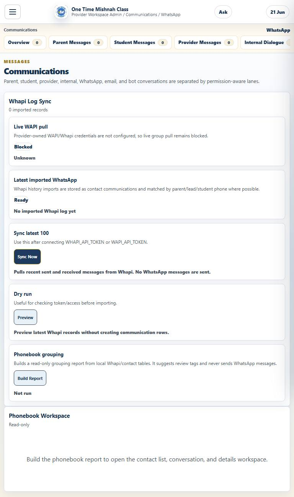

Problems / Observations:
- No major automated layout issue detected in this screenshot.

Optimization Steps:
- Manually review visual density, label clarity, and whether the primary action is obvious.

Visible actions: 20 buttons, 0 links, 0 disabled buttons.

Action sample:
- Open navigation
- Ask
- Overview 0
- Parent Messages 0
- Student Messages 0
- Provider Messages 0
- Internal Dialogue 0
- WhatsApp 0
- Email 0
- Bot Conversations 0
- Announcements 0
- Templates 0
- Support Threads 0
- Settings 0
- Sync Now
- Preview

## Operations / Email (tablet-768)

Rating: 9.2/10 - Strong

Route: `https://bneineviimacademy.org/operations?workspace=rabbi_sheller_provider&view=communications&section=email`

Screenshot: [screenshots/tablet-768/operations-email.jpg](screenshots/tablet-768/operations-email.jpg)

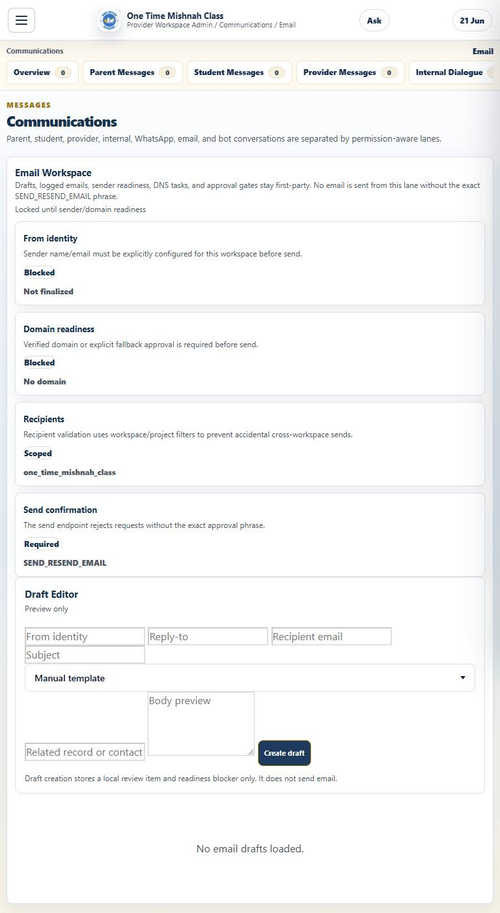

Problems / Observations:
- No major automated layout issue detected in this screenshot.

Optimization Steps:
- Manually review visual density, label clarity, and whether the primary action is obvious.

Visible actions: 19 buttons, 0 links, 0 disabled buttons.

Action sample:
- Open navigation
- Ask
- Overview 0
- Parent Messages 0
- Student Messages 0
- Provider Messages 0
- Internal Dialogue 0
- WhatsApp 0
- Email 0
- Bot Conversations 0
- Announcements 0
- Templates 0
- Support Threads 0
- Settings 0
- Manual template
- Create draft

## Operations / Community (tablet-768)

Rating: 9.2/10 - Strong

Route: `https://bneineviimacademy.org/operations?workspace=rabbi_sheller_provider&view=community&section=overview`

Screenshot: [screenshots/tablet-768/operations-community.jpg](screenshots/tablet-768/operations-community.jpg)

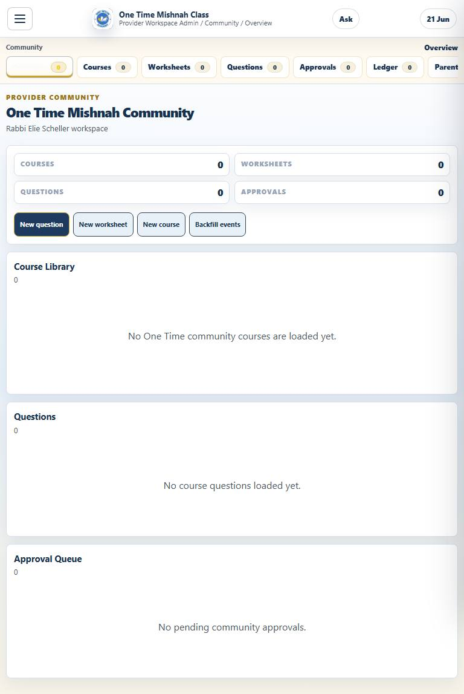

Problems / Observations:
- No major automated layout issue detected in this screenshot.

Optimization Steps:
- Manually review visual density, label clarity, and whether the primary action is obvious.

Visible actions: 20 buttons, 0 links, 0 disabled buttons.

Action sample:
- Open navigation
- Ask
- Overview 0
- Courses 0
- Worksheets 0
- Questions 0
- Approvals 0
- Ledger 0
- Parent Preview 0
- COURSES 0
- WORKSHEETS 0
- QUESTIONS 0
- APPROVALS 0
- New question
- New worksheet
- New course

## Operations / Content (tablet-768)

Rating: 9.2/10 - Strong

Route: `https://bneineviimacademy.org/operations?workspace=rabbi_sheller_provider&view=content&section=library`

Screenshot: [screenshots/tablet-768/operations-content.jpg](screenshots/tablet-768/operations-content.jpg)

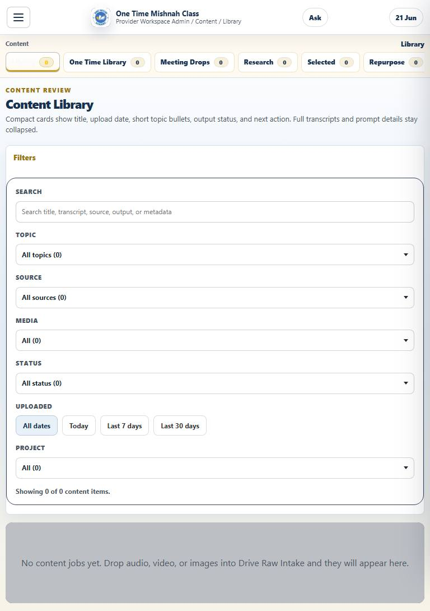

Problems / Observations:
- No major automated layout issue detected in this screenshot.

Optimization Steps:
- Manually review visual density, label clarity, and whether the primary action is obvious.

Visible actions: 23 buttons, 0 links, 0 disabled buttons.

Action sample:
- Open navigation
- Ask
- Library 0
- One Time Library 0
- Meeting Drops 0
- Research 0
- Selected 0
- Repurpose 0
- Newsletter 0
- Prompts 11
- Bundles 0
- All topics (0)
- All sources (0)
- All (0)
- All status (0)
- All dates

## Operations / Member Library (tablet-768)

Rating: 8.6/10 - Strong

Route: `https://bneineviimacademy.org/operations?workspace=rabbi_sheller_provider&view=content&section=one_time_library`

Screenshot: [screenshots/tablet-768/operations-member-library.jpg](screenshots/tablet-768/operations-member-library.jpg)

Problems / Observations:
- High card/panel count (66) can make the UI feel busy.

Optimization Steps:
- Replace repeated cards with compact lists/tables and reserve cards for real detail surfaces.

Visible actions: 40 buttons, 1 links, 0 disabled buttons.

Action sample:
- Open navigation
- Ask
- Library 0
- One Time Library 0
- Meeting Drops 0
- Research 0
- Selected 0
- Repurpose 0
- Newsletter 0
- Prompts 11
- Bundles 0
- All topics (0)
- All sources (0)
- All (0)
- All status (0)
- All dates

## Operations / Classroom (tablet-768)

Rating: 9.2/10 - Strong

Route: `https://bneineviimacademy.org/operations?workspace=rabbi_sheller_provider&view=content&section=meetings`

Screenshot: [screenshots/tablet-768/operations-classroom.jpg](screenshots/tablet-768/operations-classroom.jpg)

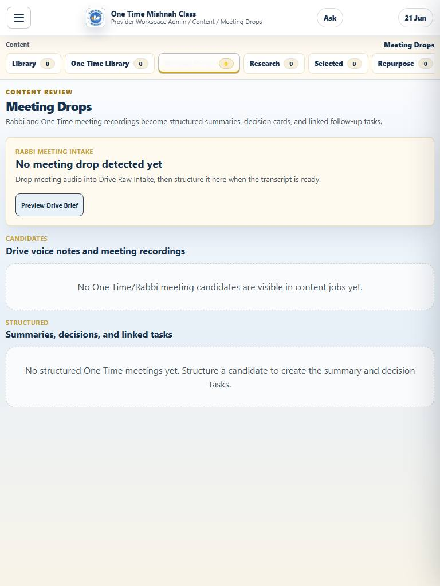

Problems / Observations:
- No major automated layout issue detected in this screenshot.

Optimization Steps:
- Manually review visual density, label clarity, and whether the primary action is obvious.

Visible actions: 15 buttons, 0 links, 0 disabled buttons.

Action sample:
- Open navigation
- Ask
- Library 0
- One Time Library 0
- Meeting Drops 0
- Research 0
- Selected 0
- Repurpose 0
- Newsletter 0
- Prompts 11
- Bundles 0
- Preview Drive Brief
- x
- Teach helper
- Send

## Operations / Live Classes (tablet-768)

Rating: 8.5/10 - Strong

Route: `https://bneineviimacademy.org/operations?workspace=rabbi_sheller_provider&view=live_classes&section=overview`

Screenshot: [screenshots/tablet-768/operations-live-classes.jpg](screenshots/tablet-768/operations-live-classes.jpg)

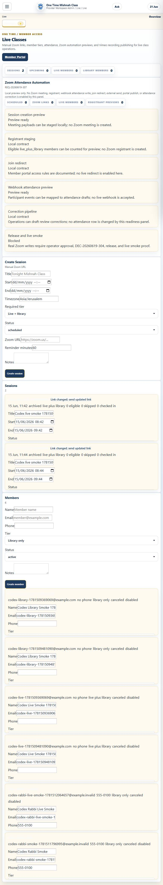

Problems / Observations:
- High visible action count (76) increases decision load.

Optimization Steps:
- Consolidate secondary actions into menus and keep only the page primary action prominent.

Visible actions: 76 buttons, 5 links, 0 disabled buttons.

Action sample:
- Open navigation
- Ask
- Overview 0
- SESSIONS 2
- UPCOMING 0
- LIVE MEMBERS 0
- LIBRARY MEMBERS 0
- SCHEDULED 0
- ZOOM LINKS 0
- LIVE MEMBERS 0
- REGISTRANT PREVIEWS 0
- Live + library
- scheduled
- Create session
- archived
- Live + library

## Operations / Schedule (tablet-768)

Rating: 9.2/10 - Strong

Route: `https://bneineviimacademy.org/operations?workspace=rabbi_sheller_provider&view=service_providers&section=schedule`

Screenshot: [screenshots/tablet-768/operations-schedule.jpg](screenshots/tablet-768/operations-schedule.jpg)

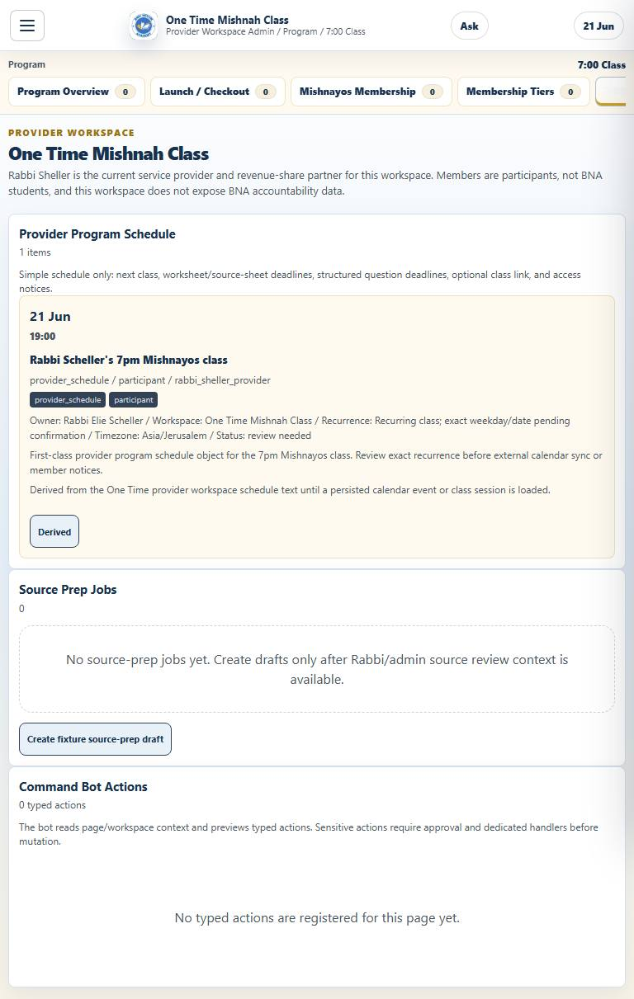

Problems / Observations:
- No major automated layout issue detected in this screenshot.

Optimization Steps:
- Manually review visual density, label clarity, and whether the primary action is obvious.

Visible actions: 16 buttons, 0 links, 1 disabled buttons.

Action sample:
- Open navigation
- Ask
- Program Overview 0
- Launch / Checkout 0
- Mishnayos Membership 0
- Membership Tiers 0
- 7:00 Class 0
- Worksheets / Source Sheets 0
- Questions / Posts 0
- Payment / Access 0
- Provider Settings 0
- [disabled] Derived
- Create fixture source-prep draft
- x
- Teach helper
- Send

## Operations / Integrations (tablet-768)

Rating: 9.2/10 - Strong

Route: `https://bneineviimacademy.org/operations?workspace=rabbi_sheller_provider&view=integrations&section=google`

Screenshot: [screenshots/tablet-768/operations-integrations.jpg](screenshots/tablet-768/operations-integrations.jpg)

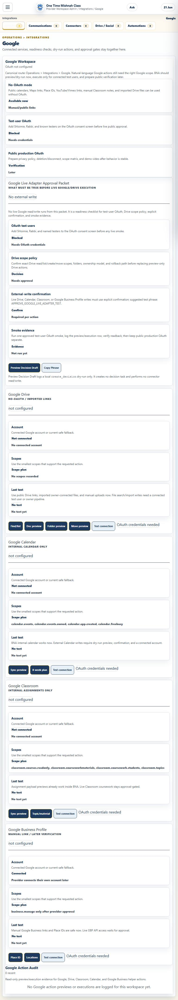

Problems / Observations:
- No major automated layout issue detected in this screenshot.

Optimization Steps:
- Manually review visual density, label clarity, and whether the primary action is obvious.

Visible actions: 26 buttons, 0 links, 0 disabled buttons.

Action sample:
- Open navigation
- Ask
- Google 4
- Communications 0
- Connectors 0
- Drive / Social 0
- Automations 8
- Preview Decision Draft
- Copy Phrase
- Find/list
- Doc preview
- Folder preview
- Move preview
- Test connection
- Sync preview
- 8-week plan

## Operations / Settings (tablet-768)

Rating: 9.2/10 - Strong

Route: `https://bneineviimacademy.org/operations?workspace=rabbi_sheller_provider&view=settings&section=users_access`

Screenshot: [screenshots/tablet-768/operations-settings.jpg](screenshots/tablet-768/operations-settings.jpg)

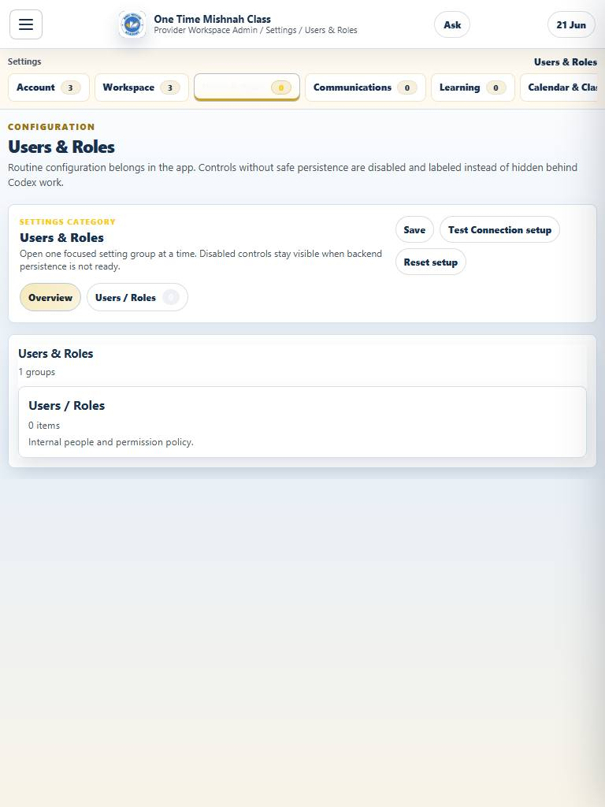

Problems / Observations:
- No major automated layout issue detected in this screenshot.

Optimization Steps:
- Manually review visual density, label clarity, and whether the primary action is obvious.

Visible actions: 22 buttons, 0 links, 0 disabled buttons.

Action sample:
- Open navigation
- Ask
- Account 3
- Workspace 3
- Users & Roles 0
- Communications 0
- Learning 0
- Calendar & Classroom 4
- Bots & AI 0
- Provider Index 8
- Billing & Payments 0
- Integrations 8
- Advanced 8
- Save
- Test Connection setup
- Reset setup

## Operations / Agents (tablet-768)

Rating: 9.2/10 - Strong

Route: `https://bneineviimacademy.org/operations?workspace=rabbi_sheller_provider&view=agents&section=ready`

Screenshot: [screenshots/tablet-768/operations-agents.jpg](screenshots/tablet-768/operations-agents.jpg)

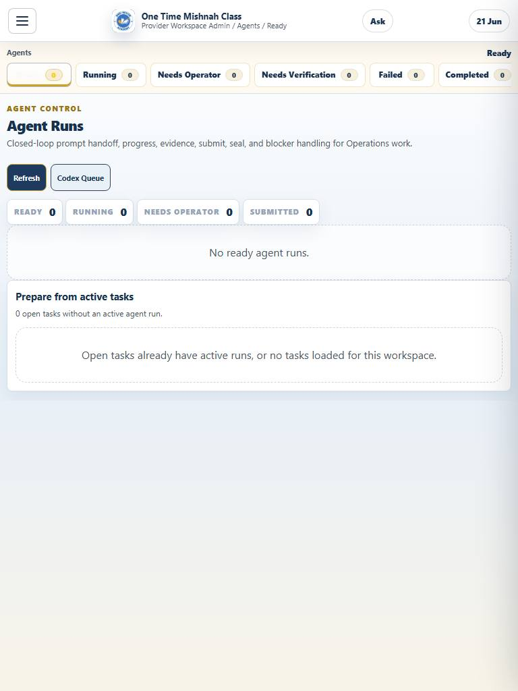

Problems / Observations:
- No major automated layout issue detected in this screenshot.

Optimization Steps:
- Manually review visual density, label clarity, and whether the primary action is obvious.

Visible actions: 18 buttons, 0 links, 0 disabled buttons.

Action sample:
- Open navigation
- Ask
- Ready 0
- Running 0
- Needs Operator 0
- Needs Verification 0
- Failed 0
- Completed 0
- All 0
- Refresh
- Codex Queue
- READY 0
- RUNNING 0
- NEEDS OPERATOR 0
- SUBMITTED 0
- x

## Operations / Overview (mobile-430)

Rating: 9.2/10 - Strong

Route: `https://bneineviimacademy.org/operations?workspace=rabbi_sheller_provider&view=dashboard&section=overview`

Screenshot: [screenshots/mobile-430/operations-overview.jpg](screenshots/mobile-430/operations-overview.jpg)

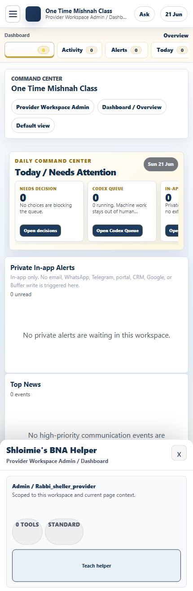

Problems / Observations:
- No major automated layout issue detected in this screenshot.

Optimization Steps:
- Manually review visual density, label clarity, and whether the primary action is obvious.

Visible actions: 17 buttons, 0 links, 0 disabled buttons.

Action sample:
- Open navigation
- Ask
- Overview 0
- Activity 0
- Alerts 0
- Today 0
- Recent Updates 0
- Open decisions
- Open Codex Queue
- Open alerts
- Open students
- Open device view
- Open content
- Open accounting
- x
- Teach helper

## Operations / Tasks (mobile-430)

Rating: 9.2/10 - Strong

Route: `https://bneineviimacademy.org/operations?workspace=rabbi_sheller_provider&view=tasks&section=tasks`

Screenshot: [screenshots/mobile-430/operations-tasks.jpg](screenshots/mobile-430/operations-tasks.jpg)

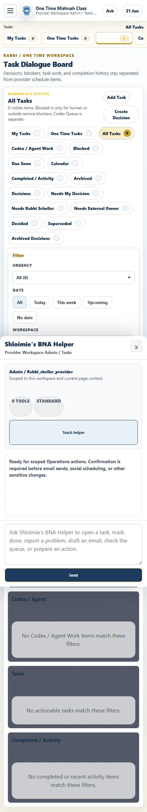

Problems / Observations:
- No major automated layout issue detected in this screenshot.

Optimization Steps:
- Manually review visual density, label clarity, and whether the primary action is obvious.

Visible actions: 48 buttons, 0 links, 0 disabled buttons.

Action sample:
- Open navigation
- Ask
- My Tasks 0
- One Time Tasks 0
- All Tasks 0
- Codex / Agent Work 0
- Blocked 0
- Due Soon 0
- Calendar 0
- Completed / Activity 0
- Archived 0
- Decisions 0
- Needs My Decision 0
- Needs Rabbi Scheller 0
- Needs External Owner 0
- Decided 0

## Operations / Decisions (mobile-430)

Rating: 9.2/10 - Strong

Route: `https://bneineviimacademy.org/operations?workspace=rabbi_sheller_provider&view=tasks&section=decisions`

Screenshot: [screenshots/mobile-430/operations-decisions.jpg](screenshots/mobile-430/operations-decisions.jpg)

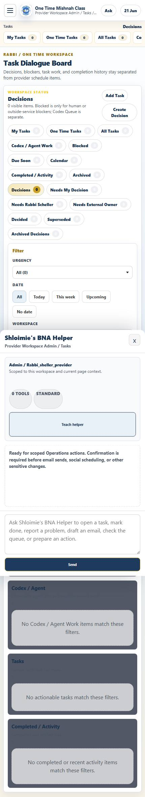

Problems / Observations:
- No major automated layout issue detected in this screenshot.

Optimization Steps:
- Manually review visual density, label clarity, and whether the primary action is obvious.

Visible actions: 48 buttons, 0 links, 0 disabled buttons.

Action sample:
- Open navigation
- Ask
- My Tasks 0
- One Time Tasks 0
- All Tasks 0
- Codex / Agent Work 0
- Blocked 0
- Due Soon 0
- Calendar 0
- Completed / Activity 0
- Archived 0
- Decisions 0
- Needs My Decision 0
- Needs Rabbi Scheller 0
- Needs External Owner 0
- Decided 0

## Operations / Contacts and Members (mobile-430)

Rating: 9.2/10 - Strong

Route: `https://bneineviimacademy.org/operations?workspace=rabbi_sheller_provider&view=contacts&section=participants`

Screenshot: [screenshots/mobile-430/operations-contacts-members.jpg](screenshots/mobile-430/operations-contacts-members.jpg)

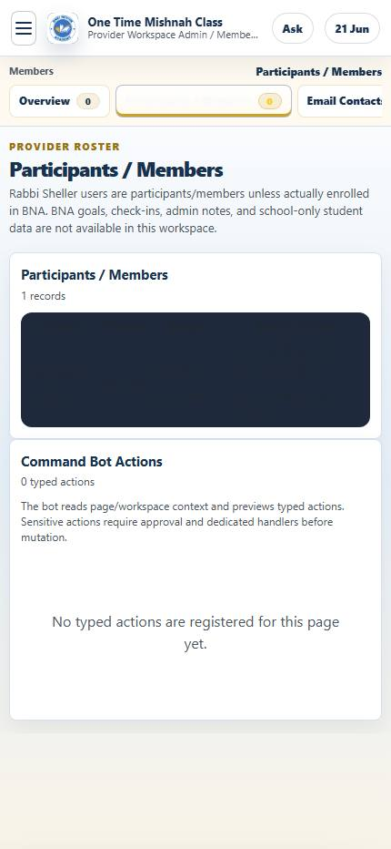

Problems / Observations:
- No major automated layout issue detected in this screenshot.

Optimization Steps:
- Manually review visual density, label clarity, and whether the primary action is obvious.

Visible actions: 12 buttons, 0 links, 0 disabled buttons.

Action sample:
- Open navigation
- Ask
- Overview 0
- Participants / Members 0
- Email Contacts 0
- Participant Parents 0
- Questions / Posts 0
- Payment / Access 0
- Messages / Help 0
- x
- Teach helper
- Send

## Operations / Users (mobile-430)

Rating: 9.2/10 - Strong

Route: `https://bneineviimacademy.org/operations?workspace=platform&view=admin&section=users`

Screenshot: [screenshots/mobile-430/operations-users.jpg](screenshots/mobile-430/operations-users.jpg)

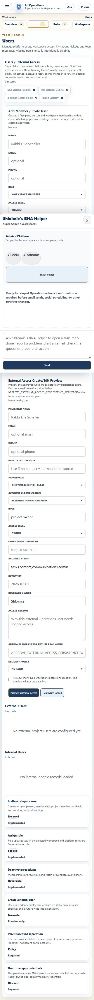

Problems / Observations:
- No major automated layout issue detected in this screenshot.

Optimization Steps:
- Manually review visual density, label clarity, and whether the primary action is obvious.

Visible actions: 30 buttons, 0 links, 1 disabled buttons.

Action sample:
- Open navigation
- Ask
- Overview 0
- Users 0
- Roles 3
- Workspaces 4
- Identity Reviews 0
- Operator Setup 0
- Invitations 0
- Tickets 0
- Messages 0
- Settings 0
- EXTERNAL USERS 0
- INTERNAL USERS 0
- ACCESS LINK GATE 1
- ROLE AUDIT 0

## Operations / Communications (mobile-430)

Rating: 9.2/10 - Strong

Route: `https://bneineviimacademy.org/operations?workspace=rabbi_sheller_provider&view=communications&section=overview`

Screenshot: [screenshots/mobile-430/operations-communications.jpg](screenshots/mobile-430/operations-communications.jpg)

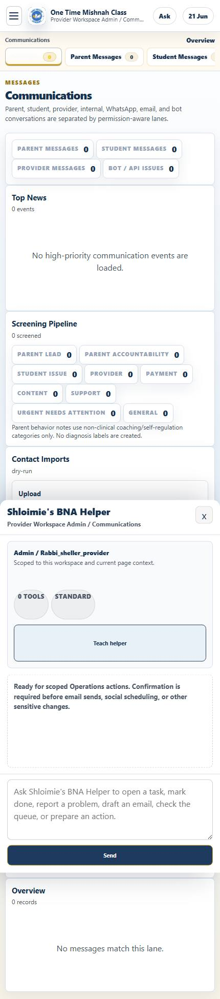

Problems / Observations:
- No major automated layout issue detected in this screenshot.

Optimization Steps:
- Manually review visual density, label clarity, and whether the primary action is obvious.

Visible actions: 32 buttons, 0 links, 0 disabled buttons.

Action sample:
- Open navigation
- Ask
- Overview 0
- Parent Messages 0
- Student Messages 0
- Provider Messages 0
- Internal Dialogue 0
- WhatsApp 0
- Email 0
- Bot Conversations 0
- Announcements 0
- Templates 0
- Support Threads 0
- Settings 0
- PARENT MESSAGES 0
- STUDENT MESSAGES 0

## Operations / WhatsApp (mobile-430)

Rating: 9.2/10 - Strong

Route: `https://bneineviimacademy.org/operations?workspace=rabbi_sheller_provider&view=communications&section=whatsapp`

Screenshot: [screenshots/mobile-430/operations-whatsapp.jpg](screenshots/mobile-430/operations-whatsapp.jpg)

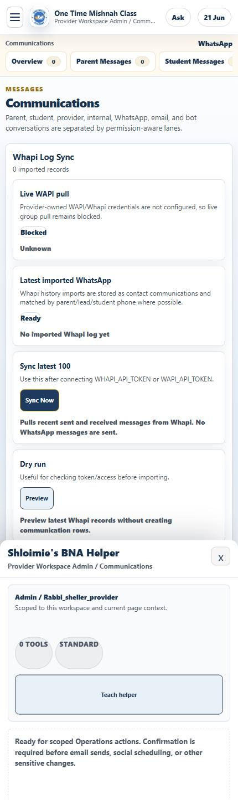

Problems / Observations:
- No major automated layout issue detected in this screenshot.

Optimization Steps:
- Manually review visual density, label clarity, and whether the primary action is obvious.

Visible actions: 20 buttons, 0 links, 0 disabled buttons.

Action sample:
- Open navigation
- Ask
- Overview 0
- Parent Messages 0
- Student Messages 0
- Provider Messages 0
- Internal Dialogue 0
- WhatsApp 0
- Email 0
- Bot Conversations 0
- Announcements 0
- Templates 0
- Support Threads 0
- Settings 0
- Sync Now
- Preview

## Operations / Email (mobile-430)

Rating: 9.2/10 - Strong

Route: `https://bneineviimacademy.org/operations?workspace=rabbi_sheller_provider&view=communications&section=email`

Screenshot: [screenshots/mobile-430/operations-email.jpg](screenshots/mobile-430/operations-email.jpg)

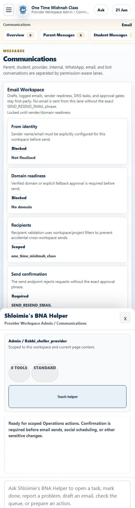

Problems / Observations:
- No major automated layout issue detected in this screenshot.

Optimization Steps:
- Manually review visual density, label clarity, and whether the primary action is obvious.

Visible actions: 19 buttons, 0 links, 0 disabled buttons.

Action sample:
- Open navigation
- Ask
- Overview 0
- Parent Messages 0
- Student Messages 0
- Provider Messages 0
- Internal Dialogue 0
- WhatsApp 0
- Email 0
- Bot Conversations 0
- Announcements 0
- Templates 0
- Support Threads 0
- Settings 0
- Manual template
- Create draft

## Operations / Community (mobile-430)

Rating: 9.2/10 - Strong

Route: `https://bneineviimacademy.org/operations?workspace=rabbi_sheller_provider&view=community&section=overview`

Screenshot: [screenshots/mobile-430/operations-community.jpg](screenshots/mobile-430/operations-community.jpg)

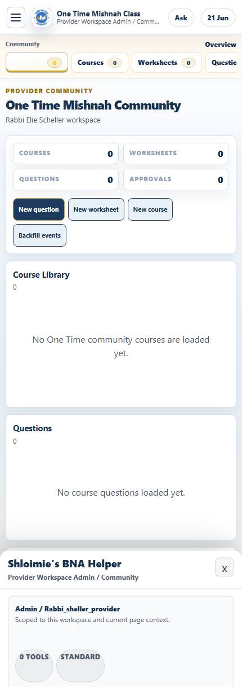

Problems / Observations:
- No major automated layout issue detected in this screenshot.

Optimization Steps:
- Manually review visual density, label clarity, and whether the primary action is obvious.

Visible actions: 20 buttons, 0 links, 0 disabled buttons.

Action sample:
- Open navigation
- Ask
- Overview 0
- Courses 0
- Worksheets 0
- Questions 0
- Approvals 0
- Ledger 0
- Parent Preview 0
- COURSES 0
- WORKSHEETS 0
- QUESTIONS 0
- APPROVALS 0
- New question
- New worksheet
- New course

## Operations / Content (mobile-430)

Rating: 9.2/10 - Strong

Route: `https://bneineviimacademy.org/operations?workspace=rabbi_sheller_provider&view=content&section=library`

Screenshot: [screenshots/mobile-430/operations-content.jpg](screenshots/mobile-430/operations-content.jpg)

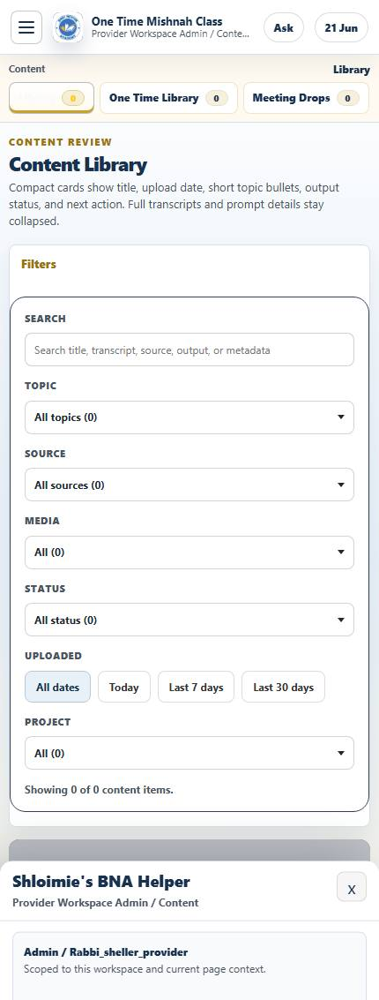

Problems / Observations:
- No major automated layout issue detected in this screenshot.

Optimization Steps:
- Manually review visual density, label clarity, and whether the primary action is obvious.

Visible actions: 23 buttons, 0 links, 0 disabled buttons.

Action sample:
- Open navigation
- Ask
- Library 0
- One Time Library 0
- Meeting Drops 0
- Research 0
- Selected 0
- Repurpose 0
- Newsletter 0
- Prompts 11
- Bundles 0
- All topics (0)
- All sources (0)
- All (0)
- All status (0)
- All dates

## Operations / Member Library (mobile-430)

Rating: 8.6/10 - Strong

Route: `https://bneineviimacademy.org/operations?workspace=rabbi_sheller_provider&view=content&section=one_time_library`

Screenshot: [screenshots/mobile-430/operations-member-library.jpg](screenshots/mobile-430/operations-member-library.jpg)

Problems / Observations:
- High card/panel count (66) can make the UI feel busy.

Optimization Steps:
- Replace repeated cards with compact lists/tables and reserve cards for real detail surfaces.

Visible actions: 40 buttons, 1 links, 0 disabled buttons.

Action sample:
- Open navigation
- Ask
- Library 0
- One Time Library 0
- Meeting Drops 0
- Research 0
- Selected 0
- Repurpose 0
- Newsletter 0
- Prompts 11
- Bundles 0
- All topics (0)
- All sources (0)
- All (0)
- All status (0)
- All dates

## Operations / Classroom (mobile-430)

Rating: 9.2/10 - Strong

Route: `https://bneineviimacademy.org/operations?workspace=rabbi_sheller_provider&view=content&section=meetings`

Screenshot: [screenshots/mobile-430/operations-classroom.jpg](screenshots/mobile-430/operations-classroom.jpg)

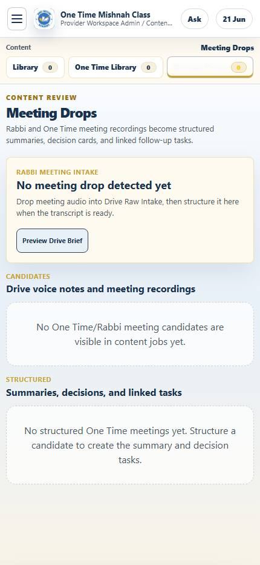

Problems / Observations:
- No major automated layout issue detected in this screenshot.

Optimization Steps:
- Manually review visual density, label clarity, and whether the primary action is obvious.

Visible actions: 15 buttons, 0 links, 0 disabled buttons.

Action sample:
- Open navigation
- Ask
- Library 0
- One Time Library 0
- Meeting Drops 0
- Research 0
- Selected 0
- Repurpose 0
- Newsletter 0
- Prompts 11
- Bundles 0
- Preview Drive Brief
- x
- Teach helper
- Send

## Operations / Live Classes (mobile-430)

Rating: 8.5/10 - Strong

Route: `https://bneineviimacademy.org/operations?workspace=rabbi_sheller_provider&view=live_classes&section=overview`

Screenshot: [screenshots/mobile-430/operations-live-classes.jpg](screenshots/mobile-430/operations-live-classes.jpg)

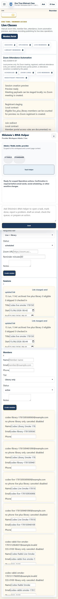

Problems / Observations:
- High visible action count (76) increases decision load.

Optimization Steps:
- Consolidate secondary actions into menus and keep only the page primary action prominent.

Visible actions: 76 buttons, 5 links, 0 disabled buttons.

Action sample:
- Open navigation
- Ask
- Overview 0
- SESSIONS 2
- UPCOMING 0
- LIVE MEMBERS 0
- LIBRARY MEMBERS 0
- SCHEDULED 0
- ZOOM LINKS 0
- LIVE MEMBERS 0
- REGISTRANT PREVIEWS 0
- Live + library
- scheduled
- Create session
- archived
- Live + library

## Operations / Schedule (mobile-430)

Rating: 9.2/10 - Strong

Route: `https://bneineviimacademy.org/operations?workspace=rabbi_sheller_provider&view=service_providers&section=schedule`

Screenshot: [screenshots/mobile-430/operations-schedule.jpg](screenshots/mobile-430/operations-schedule.jpg)

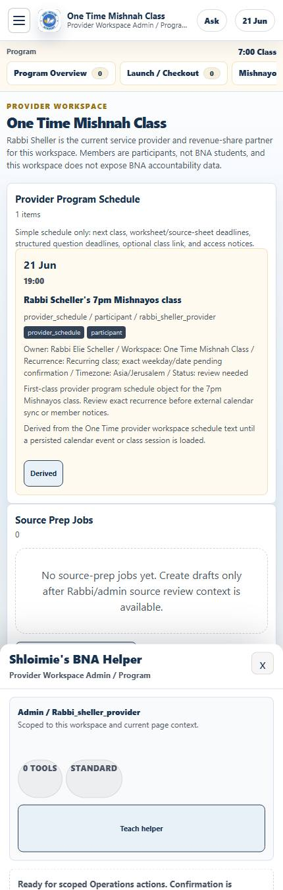

Problems / Observations:
- No major automated layout issue detected in this screenshot.

Optimization Steps:
- Manually review visual density, label clarity, and whether the primary action is obvious.

Visible actions: 16 buttons, 0 links, 1 disabled buttons.

Action sample:
- Open navigation
- Ask
- Program Overview 0
- Launch / Checkout 0
- Mishnayos Membership 0
- Membership Tiers 0
- 7:00 Class 0
- Worksheets / Source Sheets 0
- Questions / Posts 0
- Payment / Access 0
- Provider Settings 0
- [disabled] Derived
- Create fixture source-prep draft
- x
- Teach helper
- Send

## Operations / Integrations (mobile-430)

Rating: 9.2/10 - Strong

Route: `https://bneineviimacademy.org/operations?workspace=rabbi_sheller_provider&view=integrations&section=google`

Screenshot: [screenshots/mobile-430/operations-integrations.jpg](screenshots/mobile-430/operations-integrations.jpg)

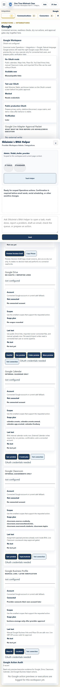

Problems / Observations:
- No major automated layout issue detected in this screenshot.

Optimization Steps:
- Manually review visual density, label clarity, and whether the primary action is obvious.

Visible actions: 26 buttons, 0 links, 0 disabled buttons.

Action sample:
- Open navigation
- Ask
- Google 4
- Communications 0
- Connectors 0
- Drive / Social 0
- Automations 8
- Preview Decision Draft
- Copy Phrase
- Find/list
- Doc preview
- Folder preview
- Move preview
- Test connection
- Sync preview
- 8-week plan

## Operations / Settings (mobile-430)

Rating: 9.2/10 - Strong

Route: `https://bneineviimacademy.org/operations?workspace=rabbi_sheller_provider&view=settings&section=users_access`

Screenshot: [screenshots/mobile-430/operations-settings.jpg](screenshots/mobile-430/operations-settings.jpg)

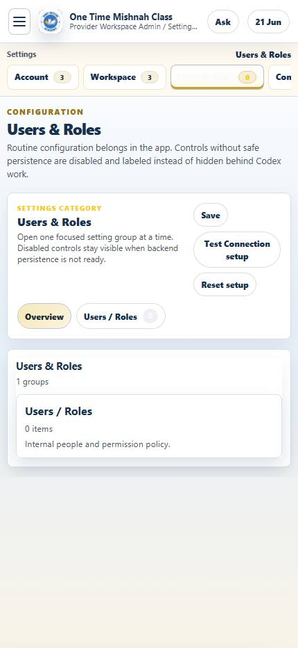

Problems / Observations:
- No major automated layout issue detected in this screenshot.

Optimization Steps:
- Manually review visual density, label clarity, and whether the primary action is obvious.

Visible actions: 22 buttons, 0 links, 0 disabled buttons.

Action sample:
- Open navigation
- Ask
- Account 3
- Workspace 3
- Users & Roles 0
- Communications 0
- Learning 0
- Calendar & Classroom 4
- Bots & AI 0
- Provider Index 8
- Billing & Payments 0
- Integrations 8
- Advanced 8
- Save
- Test Connection setup
- Reset setup

## Operations / Agents (mobile-430)

Rating: 9.2/10 - Strong

Route: `https://bneineviimacademy.org/operations?workspace=rabbi_sheller_provider&view=agents&section=ready`

Screenshot: [screenshots/mobile-430/operations-agents.jpg](screenshots/mobile-430/operations-agents.jpg)

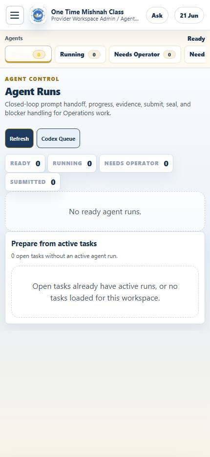

Problems / Observations:
- No major automated layout issue detected in this screenshot.

Optimization Steps:
- Manually review visual density, label clarity, and whether the primary action is obvious.

Visible actions: 18 buttons, 0 links, 0 disabled buttons.

Action sample:
- Open navigation
- Ask
- Ready 0
- Running 0
- Needs Operator 0
- Needs Verification 0
- Failed 0
- Completed 0
- All 0
- Refresh
- Codex Queue
- READY 0
- RUNNING 0
- NEEDS OPERATOR 0
- SUBMITTED 0
- x

## Operations / Mobile Navigation Drawer Open (mobile-430)

Rating: 8.2/10 - Good with polish needed

Route: `https://bneineviimacademy.org/operations?workspace=rabbi_sheller_provider&view=dashboard&section=overview`

Screenshot: [screenshots/mobile-430/operations-mobile-nav-open.jpg](screenshots/mobile-430/operations-mobile-nav-open.jpg)

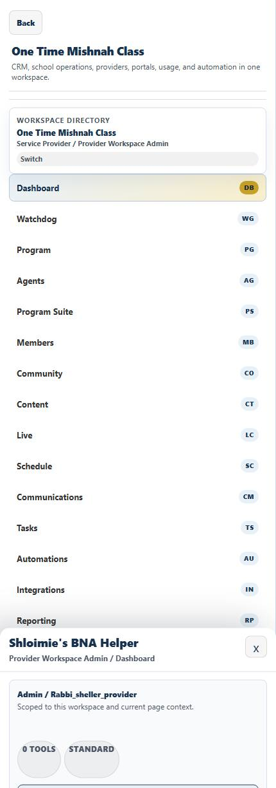

Problems / Observations:
- No strong heading was detected in the app state.

Optimization Steps:
- Ensure every route has a clear page heading and section title.

Visible actions: 31 buttons, 1 links, 0 disabled buttons.

Action sample:
- Back
- Super Admin
- School
- Service Provider
- Family
- All Operations Super Admin / Member Super Admin
- BNA School / Member School
- One Time Mishnah Class Service Provider / Member Current
- Dratler Family Family / Member Family
- Open workspace settings
- Dashboard DB
- Watchdog WG
- Program PG
- Agents AG
- Program Suite PS
- Members MB

## Operations / Overview (mobile-390)

Rating: 9.2/10 - Strong

Route: `https://bneineviimacademy.org/operations?workspace=rabbi_sheller_provider&view=dashboard&section=overview`

Screenshot: [screenshots/mobile-390/operations-overview.jpg](screenshots/mobile-390/operations-overview.jpg)

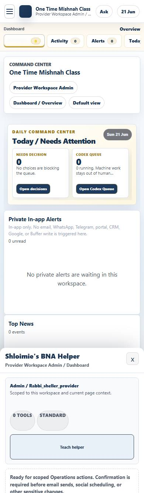

Problems / Observations:
- No major automated layout issue detected in this screenshot.

Optimization Steps:
- Manually review visual density, label clarity, and whether the primary action is obvious.

Visible actions: 17 buttons, 0 links, 0 disabled buttons.

Action sample:
- Open navigation
- Ask
- Overview 0
- Activity 0
- Alerts 0
- Today 0
- Recent Updates 0
- Open decisions
- Open Codex Queue
- Open alerts
- Open students
- Open device view
- Open content
- Open accounting
- x
- Teach helper

## Operations / Tasks (mobile-390)

Rating: 9.2/10 - Strong

Route: `https://bneineviimacademy.org/operations?workspace=rabbi_sheller_provider&view=tasks&section=tasks`

Screenshot: [screenshots/mobile-390/operations-tasks.jpg](screenshots/mobile-390/operations-tasks.jpg)

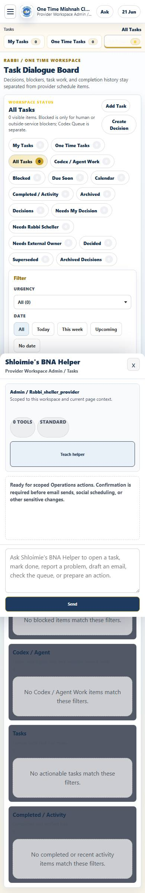

Problems / Observations:
- No major automated layout issue detected in this screenshot.

Optimization Steps:
- Manually review visual density, label clarity, and whether the primary action is obvious.

Visible actions: 48 buttons, 0 links, 0 disabled buttons.

Action sample:
- Open navigation
- Ask
- My Tasks 0
- One Time Tasks 0
- All Tasks 0
- Codex / Agent Work 0
- Blocked 0
- Due Soon 0
- Calendar 0
- Completed / Activity 0
- Archived 0
- Decisions 0
- Needs My Decision 0
- Needs Rabbi Scheller 0
- Needs External Owner 0
- Decided 0

## Operations / Decisions (mobile-390)

Rating: 9.2/10 - Strong

Route: `https://bneineviimacademy.org/operations?workspace=rabbi_sheller_provider&view=tasks&section=decisions`

Screenshot: [screenshots/mobile-390/operations-decisions.jpg](screenshots/mobile-390/operations-decisions.jpg)

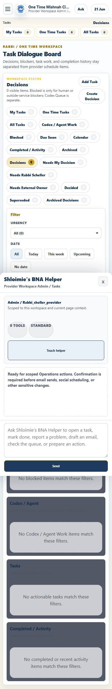

Problems / Observations:
- No major automated layout issue detected in this screenshot.

Optimization Steps:
- Manually review visual density, label clarity, and whether the primary action is obvious.

Visible actions: 48 buttons, 0 links, 0 disabled buttons.

Action sample:
- Open navigation
- Ask
- My Tasks 0
- One Time Tasks 0
- All Tasks 0
- Codex / Agent Work 0
- Blocked 0
- Due Soon 0
- Calendar 0
- Completed / Activity 0
- Archived 0
- Decisions 0
- Needs My Decision 0
- Needs Rabbi Scheller 0
- Needs External Owner 0
- Decided 0

## Operations / Contacts and Members (mobile-390)

Rating: 9.2/10 - Strong

Route: `https://bneineviimacademy.org/operations?workspace=rabbi_sheller_provider&view=contacts&section=participants`

Screenshot: [screenshots/mobile-390/operations-contacts-members.jpg](screenshots/mobile-390/operations-contacts-members.jpg)

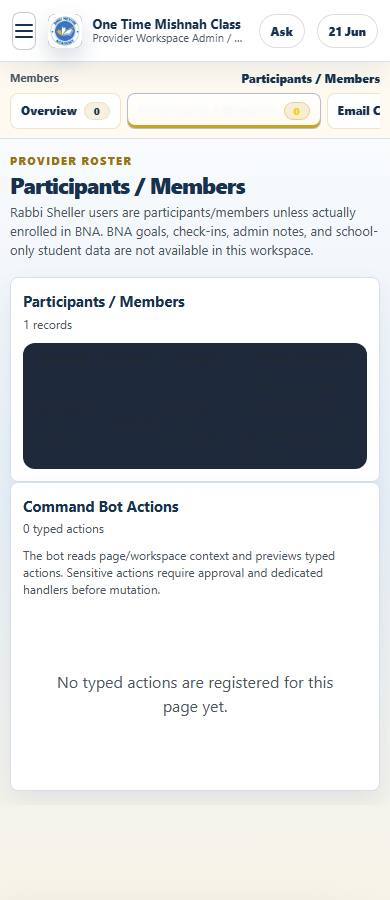

Problems / Observations:
- No major automated layout issue detected in this screenshot.

Optimization Steps:
- Manually review visual density, label clarity, and whether the primary action is obvious.

Visible actions: 12 buttons, 0 links, 0 disabled buttons.

Action sample:
- Open navigation
- Ask
- Overview 0
- Participants / Members 0
- Email Contacts 0
- Participant Parents 0
- Questions / Posts 0
- Payment / Access 0
- Messages / Help 0
- x
- Teach helper
- Send

## Operations / Users (mobile-390)

Rating: 9.2/10 - Strong

Route: `https://bneineviimacademy.org/operations?workspace=platform&view=admin&section=users`

Screenshot: [screenshots/mobile-390/operations-users.jpg](screenshots/mobile-390/operations-users.jpg)

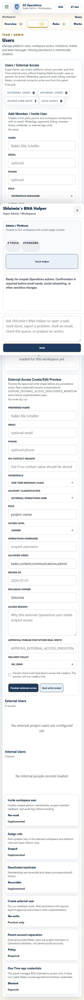

Problems / Observations:
- No major automated layout issue detected in this screenshot.

Optimization Steps:
- Manually review visual density, label clarity, and whether the primary action is obvious.

Visible actions: 30 buttons, 0 links, 1 disabled buttons.

Action sample:
- Open navigation
- Ask
- Overview 0
- Users 0
- Roles 3
- Workspaces 4
- Identity Reviews 0
- Operator Setup 0
- Invitations 0
- Tickets 0
- Messages 0
- Settings 0
- EXTERNAL USERS 0
- INTERNAL USERS 0
- ACCESS LINK GATE 1
- ROLE AUDIT 0

## Operations / Communications (mobile-390)

Rating: 9.2/10 - Strong

Route: `https://bneineviimacademy.org/operations?workspace=rabbi_sheller_provider&view=communications&section=overview`

Screenshot: [screenshots/mobile-390/operations-communications.jpg](screenshots/mobile-390/operations-communications.jpg)

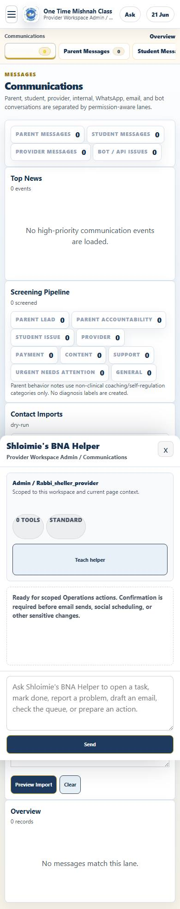

Problems / Observations:
- No major automated layout issue detected in this screenshot.

Optimization Steps:
- Manually review visual density, label clarity, and whether the primary action is obvious.

Visible actions: 32 buttons, 0 links, 0 disabled buttons.

Action sample:
- Open navigation
- Ask
- Overview 0
- Parent Messages 0
- Student Messages 0
- Provider Messages 0
- Internal Dialogue 0
- WhatsApp 0
- Email 0
- Bot Conversations 0
- Announcements 0
- Templates 0
- Support Threads 0
- Settings 0
- PARENT MESSAGES 0
- STUDENT MESSAGES 0

## Operations / WhatsApp (mobile-390)

Rating: 9.2/10 - Strong

Route: `https://bneineviimacademy.org/operations?workspace=rabbi_sheller_provider&view=communications&section=whatsapp`

Screenshot: [screenshots/mobile-390/operations-whatsapp.jpg](screenshots/mobile-390/operations-whatsapp.jpg)

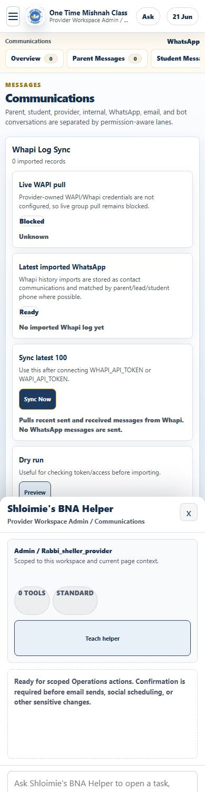

Problems / Observations:
- No major automated layout issue detected in this screenshot.

Optimization Steps:
- Manually review visual density, label clarity, and whether the primary action is obvious.

Visible actions: 20 buttons, 0 links, 0 disabled buttons.

Action sample:
- Open navigation
- Ask
- Overview 0
- Parent Messages 0
- Student Messages 0
- Provider Messages 0
- Internal Dialogue 0
- WhatsApp 0
- Email 0
- Bot Conversations 0
- Announcements 0
- Templates 0
- Support Threads 0
- Settings 0
- Sync Now
- Preview

## Operations / Email (mobile-390)

Rating: 9.2/10 - Strong

Route: `https://bneineviimacademy.org/operations?workspace=rabbi_sheller_provider&view=communications&section=email`

Screenshot: [screenshots/mobile-390/operations-email.jpg](screenshots/mobile-390/operations-email.jpg)

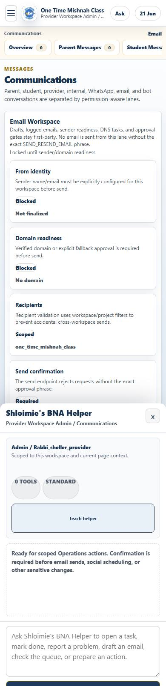

Problems / Observations:
- No major automated layout issue detected in this screenshot.

Optimization Steps:
- Manually review visual density, label clarity, and whether the primary action is obvious.

Visible actions: 19 buttons, 0 links, 0 disabled buttons.

Action sample:
- Open navigation
- Ask
- Overview 0
- Parent Messages 0
- Student Messages 0
- Provider Messages 0
- Internal Dialogue 0
- WhatsApp 0
- Email 0
- Bot Conversations 0
- Announcements 0
- Templates 0
- Support Threads 0
- Settings 0
- Manual template
- Create draft

## Operations / Community (mobile-390)

Rating: 9.2/10 - Strong

Route: `https://bneineviimacademy.org/operations?workspace=rabbi_sheller_provider&view=community&section=overview`

Screenshot: [screenshots/mobile-390/operations-community.jpg](screenshots/mobile-390/operations-community.jpg)

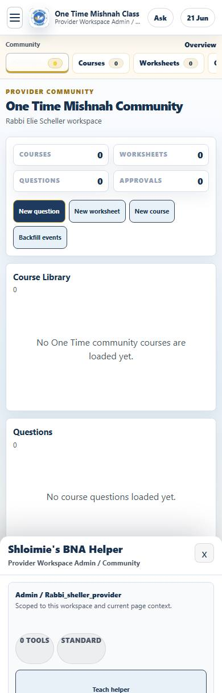

Problems / Observations:
- No major automated layout issue detected in this screenshot.

Optimization Steps:
- Manually review visual density, label clarity, and whether the primary action is obvious.

Visible actions: 20 buttons, 0 links, 0 disabled buttons.

Action sample:
- Open navigation
- Ask
- Overview 0
- Courses 0
- Worksheets 0
- Questions 0
- Approvals 0
- Ledger 0
- Parent Preview 0
- COURSES 0
- WORKSHEETS 0
- QUESTIONS 0
- APPROVALS 0
- New question
- New worksheet
- New course

## Operations / Content (mobile-390)

Rating: 9.2/10 - Strong

Route: `https://bneineviimacademy.org/operations?workspace=rabbi_sheller_provider&view=content&section=library`

Screenshot: [screenshots/mobile-390/operations-content.jpg](screenshots/mobile-390/operations-content.jpg)

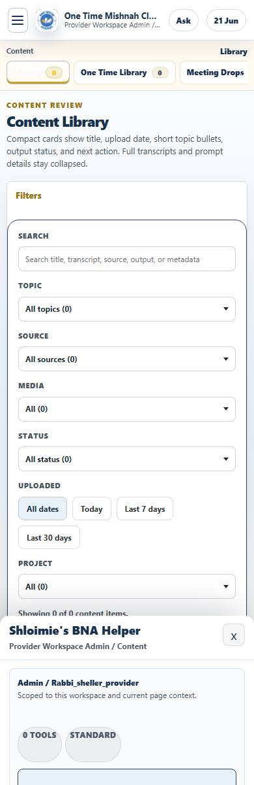

Problems / Observations:
- No major automated layout issue detected in this screenshot.

Optimization Steps:
- Manually review visual density, label clarity, and whether the primary action is obvious.

Visible actions: 23 buttons, 0 links, 0 disabled buttons.

Action sample:
- Open navigation
- Ask
- Library 0
- One Time Library 0
- Meeting Drops 0
- Research 0
- Selected 0
- Repurpose 0
- Newsletter 0
- Prompts 11
- Bundles 0
- All topics (0)
- All sources (0)
- All (0)
- All status (0)
- All dates

## Operations / Member Library (mobile-390)

Rating: 8.6/10 - Strong

Route: `https://bneineviimacademy.org/operations?workspace=rabbi_sheller_provider&view=content&section=one_time_library`

Screenshot: [screenshots/mobile-390/operations-member-library.jpg](screenshots/mobile-390/operations-member-library.jpg)

Problems / Observations:
- High card/panel count (66) can make the UI feel busy.

Optimization Steps:
- Replace repeated cards with compact lists/tables and reserve cards for real detail surfaces.

Visible actions: 40 buttons, 1 links, 0 disabled buttons.

Action sample:
- Open navigation
- Ask
- Library 0
- One Time Library 0
- Meeting Drops 0
- Research 0
- Selected 0
- Repurpose 0
- Newsletter 0
- Prompts 11
- Bundles 0
- All topics (0)
- All sources (0)
- All (0)
- All status (0)
- All dates

## Operations / Classroom (mobile-390)

Rating: 9.2/10 - Strong

Route: `https://bneineviimacademy.org/operations?workspace=rabbi_sheller_provider&view=content&section=meetings`

Screenshot: [screenshots/mobile-390/operations-classroom.jpg](screenshots/mobile-390/operations-classroom.jpg)

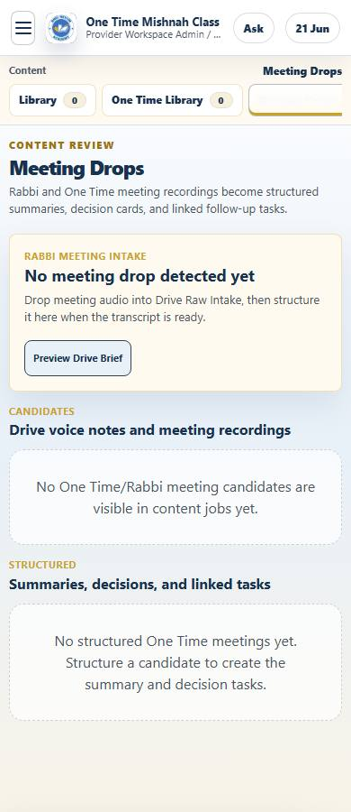

Problems / Observations:
- No major automated layout issue detected in this screenshot.

Optimization Steps:
- Manually review visual density, label clarity, and whether the primary action is obvious.

Visible actions: 15 buttons, 0 links, 0 disabled buttons.

Action sample:
- Open navigation
- Ask
- Library 0
- One Time Library 0
- Meeting Drops 0
- Research 0
- Selected 0
- Repurpose 0
- Newsletter 0
- Prompts 11
- Bundles 0
- Preview Drive Brief
- x
- Teach helper
- Send

## Operations / Live Classes (mobile-390)

Rating: 8.5/10 - Strong

Route: `https://bneineviimacademy.org/operations?workspace=rabbi_sheller_provider&view=live_classes&section=overview`

Screenshot: [screenshots/mobile-390/operations-live-classes.jpg](screenshots/mobile-390/operations-live-classes.jpg)

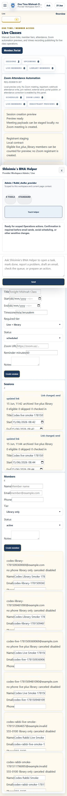

Problems / Observations:
- High visible action count (76) increases decision load.

Optimization Steps:
- Consolidate secondary actions into menus and keep only the page primary action prominent.

Visible actions: 76 buttons, 5 links, 0 disabled buttons.

Action sample:
- Open navigation
- Ask
- Overview 0
- SESSIONS 2
- UPCOMING 0
- LIVE MEMBERS 0
- LIBRARY MEMBERS 0
- SCHEDULED 0
- ZOOM LINKS 0
- LIVE MEMBERS 0
- REGISTRANT PREVIEWS 0
- Live + library
- scheduled
- Create session
- archived
- Live + library

## Operations / Schedule (mobile-390)

Rating: 9.2/10 - Strong

Route: `https://bneineviimacademy.org/operations?workspace=rabbi_sheller_provider&view=service_providers&section=schedule`

Screenshot: [screenshots/mobile-390/operations-schedule.jpg](screenshots/mobile-390/operations-schedule.jpg)

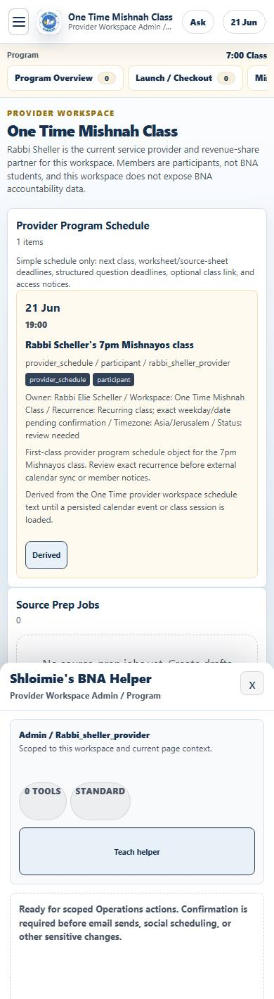

Problems / Observations:
- No major automated layout issue detected in this screenshot.

Optimization Steps:
- Manually review visual density, label clarity, and whether the primary action is obvious.

Visible actions: 16 buttons, 0 links, 1 disabled buttons.

Action sample:
- Open navigation
- Ask
- Program Overview 0
- Launch / Checkout 0
- Mishnayos Membership 0
- Membership Tiers 0
- 7:00 Class 0
- Worksheets / Source Sheets 0
- Questions / Posts 0
- Payment / Access 0
- Provider Settings 0
- [disabled] Derived
- Create fixture source-prep draft
- x
- Teach helper
- Send

## Operations / Integrations (mobile-390)

Rating: 9.2/10 - Strong

Route: `https://bneineviimacademy.org/operations?workspace=rabbi_sheller_provider&view=integrations&section=google`

Screenshot: [screenshots/mobile-390/operations-integrations.jpg](screenshots/mobile-390/operations-integrations.jpg)

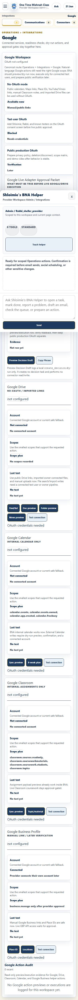

Problems / Observations:
- No major automated layout issue detected in this screenshot.

Optimization Steps:
- Manually review visual density, label clarity, and whether the primary action is obvious.

Visible actions: 26 buttons, 0 links, 0 disabled buttons.

Action sample:
- Open navigation
- Ask
- Google 4
- Communications 0
- Connectors 0
- Drive / Social 0
- Automations 8
- Preview Decision Draft
- Copy Phrase
- Find/list
- Doc preview
- Folder preview
- Move preview
- Test connection
- Sync preview
- 8-week plan

## Operations / Settings (mobile-390)

Rating: 9.2/10 - Strong

Route: `https://bneineviimacademy.org/operations?workspace=rabbi_sheller_provider&view=settings&section=users_access`

Screenshot: [screenshots/mobile-390/operations-settings.jpg](screenshots/mobile-390/operations-settings.jpg)

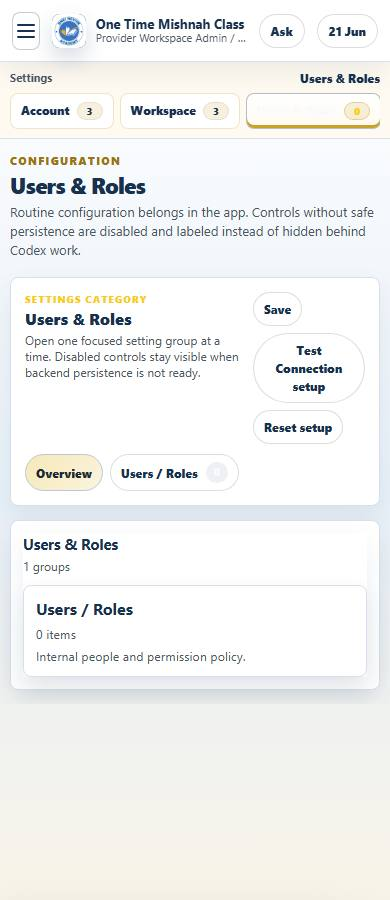

Problems / Observations:
- No major automated layout issue detected in this screenshot.

Optimization Steps:
- Manually review visual density, label clarity, and whether the primary action is obvious.

Visible actions: 22 buttons, 0 links, 0 disabled buttons.

Action sample:
- Open navigation
- Ask
- Account 3
- Workspace 3
- Users & Roles 0
- Communications 0
- Learning 0
- Calendar & Classroom 4
- Bots & AI 0
- Provider Index 8
- Billing & Payments 0
- Integrations 8
- Advanced 8
- Save
- Test Connection setup
- Reset setup

## Operations / Agents (mobile-390)

Rating: 9.2/10 - Strong

Route: `https://bneineviimacademy.org/operations?workspace=rabbi_sheller_provider&view=agents&section=ready`

Screenshot: [screenshots/mobile-390/operations-agents.jpg](screenshots/mobile-390/operations-agents.jpg)

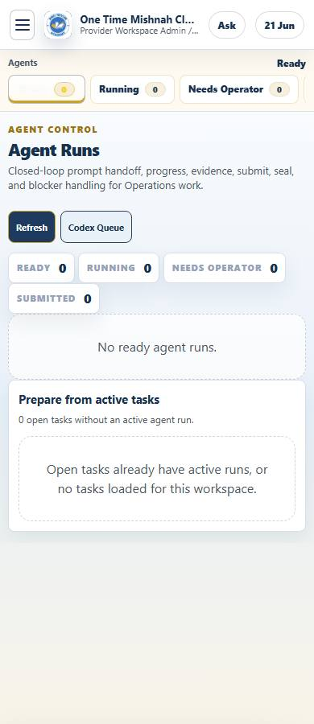

Problems / Observations:
- No major automated layout issue detected in this screenshot.

Optimization Steps:
- Manually review visual density, label clarity, and whether the primary action is obvious.

Visible actions: 18 buttons, 0 links, 0 disabled buttons.

Action sample:
- Open navigation
- Ask
- Ready 0
- Running 0
- Needs Operator 0
- Needs Verification 0
- Failed 0
- Completed 0
- All 0
- Refresh
- Codex Queue
- READY 0
- RUNNING 0
- NEEDS OPERATOR 0
- SUBMITTED 0
- x

## Operations / Mobile Navigation Drawer Open (mobile-390)

Rating: 8.2/10 - Good with polish needed

Route: `https://bneineviimacademy.org/operations?workspace=rabbi_sheller_provider&view=dashboard&section=overview`

Screenshot: [screenshots/mobile-390/operations-mobile-nav-open.jpg](screenshots/mobile-390/operations-mobile-nav-open.jpg)

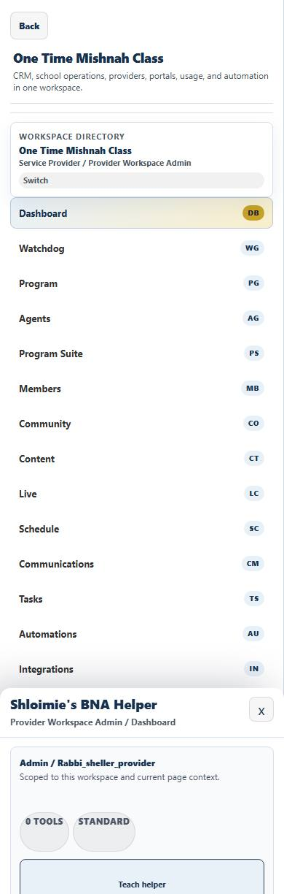

Problems / Observations:
- No strong heading was detected in the app state.

Optimization Steps:
- Ensure every route has a clear page heading and section title.

Visible actions: 31 buttons, 1 links, 0 disabled buttons.

Action sample:
- Back
- Super Admin
- School
- Service Provider
- Family
- All Operations Super Admin / Member Super Admin
- BNA School / Member School
- One Time Mishnah Class Service Provider / Member Current
- Dratler Family Family / Member Family
- Open workspace settings
- Dashboard DB
- Watchdog WG
- Program PG
- Agents AG
- Program Suite PS
- Members MB

## Operations / Overview (mobile-360)

Rating: 9.2/10 - Strong

Route: `https://bneineviimacademy.org/operations?workspace=rabbi_sheller_provider&view=dashboard&section=overview`

Screenshot: [screenshots/mobile-360/operations-overview.jpg](screenshots/mobile-360/operations-overview.jpg)

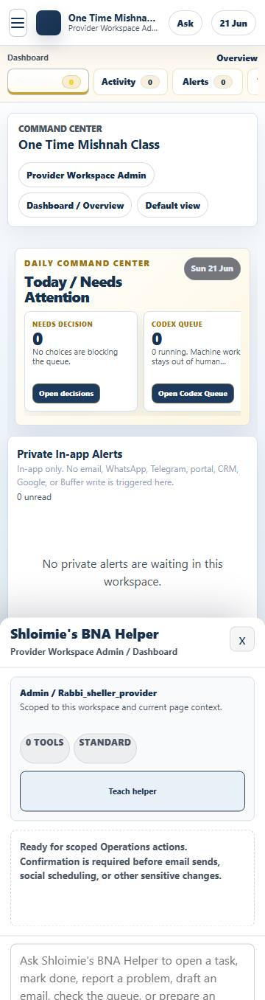

Problems / Observations:
- No major automated layout issue detected in this screenshot.

Optimization Steps:
- Manually review visual density, label clarity, and whether the primary action is obvious.

Visible actions: 17 buttons, 0 links, 0 disabled buttons.

Action sample:
- Open navigation
- Ask
- Overview 0
- Activity 0
- Alerts 0
- Today 0
- Recent Updates 0
- Open decisions
- Open Codex Queue
- Open alerts
- Open students
- Open device view
- Open content
- Open accounting
- x
- Teach helper

## Operations / Tasks (mobile-360)

Rating: 9.2/10 - Strong

Route: `https://bneineviimacademy.org/operations?workspace=rabbi_sheller_provider&view=tasks&section=tasks`

Screenshot: [screenshots/mobile-360/operations-tasks.jpg](screenshots/mobile-360/operations-tasks.jpg)

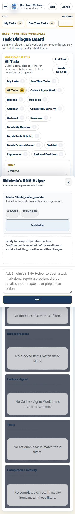

Problems / Observations:
- No major automated layout issue detected in this screenshot.

Optimization Steps:
- Manually review visual density, label clarity, and whether the primary action is obvious.

Visible actions: 48 buttons, 0 links, 0 disabled buttons.

Action sample:
- Open navigation
- Ask
- My Tasks 0
- One Time Tasks 0
- All Tasks 0
- Codex / Agent Work 0
- Blocked 0
- Due Soon 0
- Calendar 0
- Completed / Activity 0
- Archived 0
- Decisions 0
- Needs My Decision 0
- Needs Rabbi Scheller 0
- Needs External Owner 0
- Decided 0

## Operations / Decisions (mobile-360)

Rating: 9.2/10 - Strong

Route: `https://bneineviimacademy.org/operations?workspace=rabbi_sheller_provider&view=tasks&section=decisions`

Screenshot: [screenshots/mobile-360/operations-decisions.jpg](screenshots/mobile-360/operations-decisions.jpg)

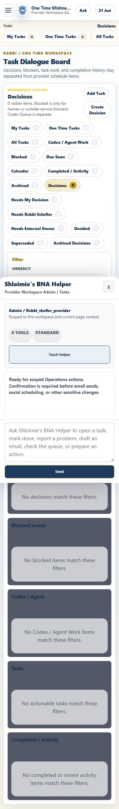

Problems / Observations:
- No major automated layout issue detected in this screenshot.

Optimization Steps:
- Manually review visual density, label clarity, and whether the primary action is obvious.

Visible actions: 48 buttons, 0 links, 0 disabled buttons.

Action sample:
- Open navigation
- Ask
- My Tasks 0
- One Time Tasks 0
- All Tasks 0
- Codex / Agent Work 0
- Blocked 0
- Due Soon 0
- Calendar 0
- Completed / Activity 0
- Archived 0
- Decisions 0
- Needs My Decision 0
- Needs Rabbi Scheller 0
- Needs External Owner 0
- Decided 0

## Operations / Contacts and Members (mobile-360)

Rating: 9.2/10 - Strong

Route: `https://bneineviimacademy.org/operations?workspace=rabbi_sheller_provider&view=contacts&section=participants`

Screenshot: [screenshots/mobile-360/operations-contacts-members.jpg](screenshots/mobile-360/operations-contacts-members.jpg)

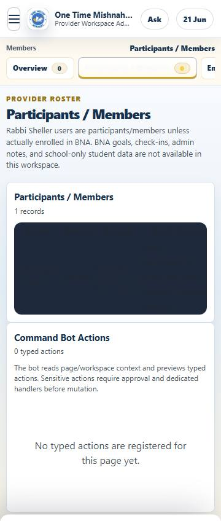

Problems / Observations:
- No major automated layout issue detected in this screenshot.

Optimization Steps:
- Manually review visual density, label clarity, and whether the primary action is obvious.

Visible actions: 12 buttons, 0 links, 0 disabled buttons.

Action sample:
- Open navigation
- Ask
- Overview 0
- Participants / Members 0
- Email Contacts 0
- Participant Parents 0
- Questions / Posts 0
- Payment / Access 0
- Messages / Help 0
- x
- Teach helper
- Send

## Operations / Users (mobile-360)

Rating: 9.2/10 - Strong

Route: `https://bneineviimacademy.org/operations?workspace=platform&view=admin&section=users`

Screenshot: [screenshots/mobile-360/operations-users.jpg](screenshots/mobile-360/operations-users.jpg)

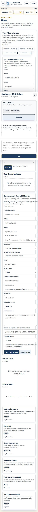

Problems / Observations:
- No major automated layout issue detected in this screenshot.

Optimization Steps:
- Manually review visual density, label clarity, and whether the primary action is obvious.

Visible actions: 30 buttons, 0 links, 1 disabled buttons.

Action sample:
- Open navigation
- Ask
- Overview 0
- Users 0
- Roles 3
- Workspaces 4
- Identity Reviews 0
- Operator Setup 0
- Invitations 0
- Tickets 0
- Messages 0
- Settings 0
- EXTERNAL USERS 0
- INTERNAL USERS 0
- ACCESS LINK GATE 1
- ROLE AUDIT 0

## Operations / Communications (mobile-360)

Rating: 9.2/10 - Strong

Route: `https://bneineviimacademy.org/operations?workspace=rabbi_sheller_provider&view=communications&section=overview`

Screenshot: [screenshots/mobile-360/operations-communications.jpg](screenshots/mobile-360/operations-communications.jpg)

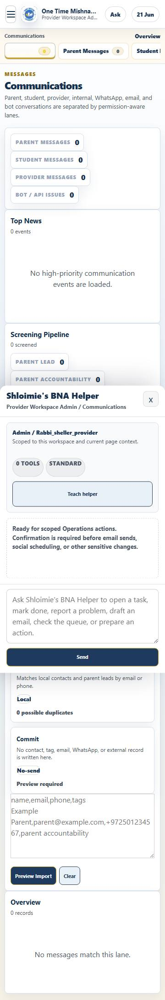

Problems / Observations:
- No major automated layout issue detected in this screenshot.

Optimization Steps:
- Manually review visual density, label clarity, and whether the primary action is obvious.

Visible actions: 32 buttons, 0 links, 0 disabled buttons.

Action sample:
- Open navigation
- Ask
- Overview 0
- Parent Messages 0
- Student Messages 0
- Provider Messages 0
- Internal Dialogue 0
- WhatsApp 0
- Email 0
- Bot Conversations 0
- Announcements 0
- Templates 0
- Support Threads 0
- Settings 0
- PARENT MESSAGES 0
- STUDENT MESSAGES 0

## Operations / WhatsApp (mobile-360)

Rating: 9.2/10 - Strong

Route: `https://bneineviimacademy.org/operations?workspace=rabbi_sheller_provider&view=communications&section=whatsapp`

Screenshot: [screenshots/mobile-360/operations-whatsapp.jpg](screenshots/mobile-360/operations-whatsapp.jpg)

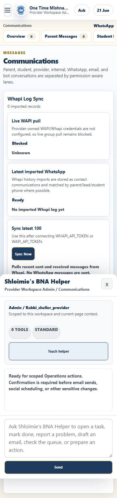

Problems / Observations:
- No major automated layout issue detected in this screenshot.

Optimization Steps:
- Manually review visual density, label clarity, and whether the primary action is obvious.

Visible actions: 20 buttons, 0 links, 0 disabled buttons.

Action sample:
- Open navigation
- Ask
- Overview 0
- Parent Messages 0
- Student Messages 0
- Provider Messages 0
- Internal Dialogue 0
- WhatsApp 0
- Email 0
- Bot Conversations 0
- Announcements 0
- Templates 0
- Support Threads 0
- Settings 0
- Sync Now
- Preview

## Operations / Email (mobile-360)

Rating: 9.2/10 - Strong

Route: `https://bneineviimacademy.org/operations?workspace=rabbi_sheller_provider&view=communications&section=email`

Screenshot: [screenshots/mobile-360/operations-email.jpg](screenshots/mobile-360/operations-email.jpg)

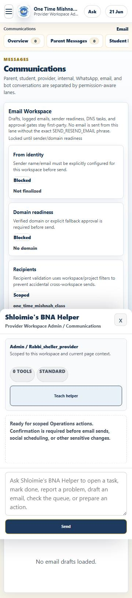

Problems / Observations:
- No major automated layout issue detected in this screenshot.

Optimization Steps:
- Manually review visual density, label clarity, and whether the primary action is obvious.

Visible actions: 19 buttons, 0 links, 0 disabled buttons.

Action sample:
- Open navigation
- Ask
- Overview 0
- Parent Messages 0
- Student Messages 0
- Provider Messages 0
- Internal Dialogue 0
- WhatsApp 0
- Email 0
- Bot Conversations 0
- Announcements 0
- Templates 0
- Support Threads 0
- Settings 0
- Manual template
- Create draft

## Operations / Community (mobile-360)

Rating: 9.2/10 - Strong

Route: `https://bneineviimacademy.org/operations?workspace=rabbi_sheller_provider&view=community&section=overview`

Screenshot: [screenshots/mobile-360/operations-community.jpg](screenshots/mobile-360/operations-community.jpg)

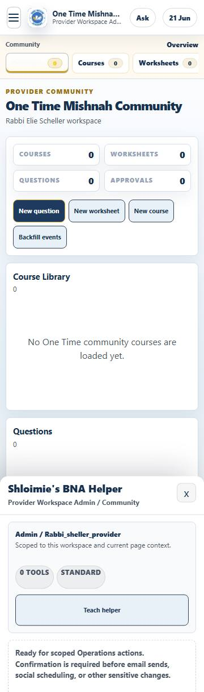

Problems / Observations:
- No major automated layout issue detected in this screenshot.

Optimization Steps:
- Manually review visual density, label clarity, and whether the primary action is obvious.

Visible actions: 20 buttons, 0 links, 0 disabled buttons.

Action sample:
- Open navigation
- Ask
- Overview 0
- Courses 0
- Worksheets 0
- Questions 0
- Approvals 0
- Ledger 0
- Parent Preview 0
- COURSES 0
- WORKSHEETS 0
- QUESTIONS 0
- APPROVALS 0
- New question
- New worksheet
- New course

## Operations / Content (mobile-360)

Rating: 9.2/10 - Strong

Route: `https://bneineviimacademy.org/operations?workspace=rabbi_sheller_provider&view=content&section=library`

Screenshot: [screenshots/mobile-360/operations-content.jpg](screenshots/mobile-360/operations-content.jpg)

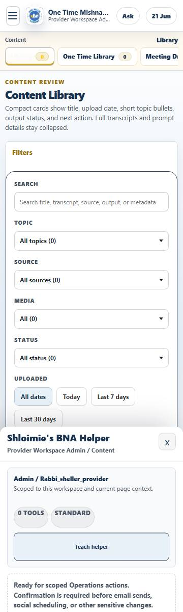

Problems / Observations:
- No major automated layout issue detected in this screenshot.

Optimization Steps:
- Manually review visual density, label clarity, and whether the primary action is obvious.

Visible actions: 23 buttons, 0 links, 0 disabled buttons.

Action sample:
- Open navigation
- Ask
- Library 0
- One Time Library 0
- Meeting Drops 0
- Research 0
- Selected 0
- Repurpose 0
- Newsletter 0
- Prompts 11
- Bundles 0
- All topics (0)
- All sources (0)
- All (0)
- All status (0)
- All dates

## Operations / Member Library (mobile-360)

Rating: 8.6/10 - Strong

Route: `https://bneineviimacademy.org/operations?workspace=rabbi_sheller_provider&view=content&section=one_time_library`

Screenshot: [screenshots/mobile-360/operations-member-library.jpg](screenshots/mobile-360/operations-member-library.jpg)

Problems / Observations:
- High card/panel count (66) can make the UI feel busy.

Optimization Steps:
- Replace repeated cards with compact lists/tables and reserve cards for real detail surfaces.

Visible actions: 40 buttons, 1 links, 0 disabled buttons.

Action sample:
- Open navigation
- Ask
- Library 0
- One Time Library 0
- Meeting Drops 0
- Research 0
- Selected 0
- Repurpose 0
- Newsletter 0
- Prompts 11
- Bundles 0
- All topics (0)
- All sources (0)
- All (0)
- All status (0)
- All dates

## Operations / Classroom (mobile-360)

Rating: 9.2/10 - Strong

Route: `https://bneineviimacademy.org/operations?workspace=rabbi_sheller_provider&view=content&section=meetings`

Screenshot: [screenshots/mobile-360/operations-classroom.jpg](screenshots/mobile-360/operations-classroom.jpg)

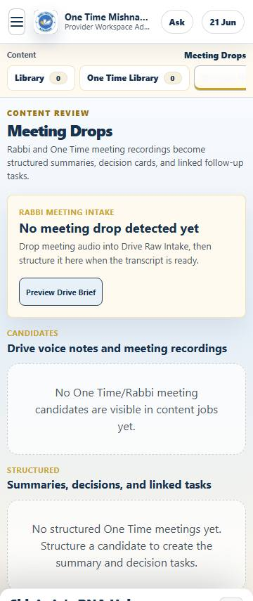

Problems / Observations:
- No major automated layout issue detected in this screenshot.

Optimization Steps:
- Manually review visual density, label clarity, and whether the primary action is obvious.

Visible actions: 15 buttons, 0 links, 0 disabled buttons.

Action sample:
- Open navigation
- Ask
- Library 0
- One Time Library 0
- Meeting Drops 0
- Research 0
- Selected 0
- Repurpose 0
- Newsletter 0
- Prompts 11
- Bundles 0
- Preview Drive Brief
- x
- Teach helper
- Send

## Operations / Live Classes (mobile-360)

Rating: 8.5/10 - Strong

Route: `https://bneineviimacademy.org/operations?workspace=rabbi_sheller_provider&view=live_classes&section=overview`

Screenshot: [screenshots/mobile-360/operations-live-classes.jpg](screenshots/mobile-360/operations-live-classes.jpg)

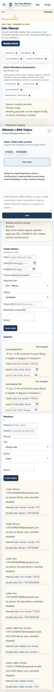

Problems / Observations:
- High visible action count (76) increases decision load.

Optimization Steps:
- Consolidate secondary actions into menus and keep only the page primary action prominent.

Visible actions: 76 buttons, 5 links, 0 disabled buttons.

Action sample:
- Open navigation
- Ask
- Overview 0
- SESSIONS 2
- UPCOMING 0
- LIVE MEMBERS 0
- LIBRARY MEMBERS 0
- SCHEDULED 0
- ZOOM LINKS 0
- LIVE MEMBERS 0
- REGISTRANT PREVIEWS 0
- Live + library
- scheduled
- Create session
- archived
- Live + library

## Operations / Schedule (mobile-360)

Rating: 9.2/10 - Strong

Route: `https://bneineviimacademy.org/operations?workspace=rabbi_sheller_provider&view=service_providers&section=schedule`

Screenshot: [screenshots/mobile-360/operations-schedule.jpg](screenshots/mobile-360/operations-schedule.jpg)

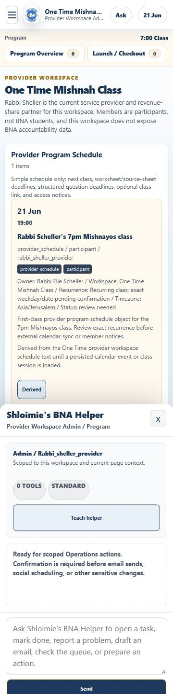

Problems / Observations:
- No major automated layout issue detected in this screenshot.

Optimization Steps:
- Manually review visual density, label clarity, and whether the primary action is obvious.

Visible actions: 16 buttons, 0 links, 1 disabled buttons.

Action sample:
- Open navigation
- Ask
- Program Overview 0
- Launch / Checkout 0
- Mishnayos Membership 0
- Membership Tiers 0
- 7:00 Class 0
- Worksheets / Source Sheets 0
- Questions / Posts 0
- Payment / Access 0
- Provider Settings 0
- [disabled] Derived
- Create fixture source-prep draft
- x
- Teach helper
- Send

## Operations / Integrations (mobile-360)

Rating: 9.2/10 - Strong

Route: `https://bneineviimacademy.org/operations?workspace=rabbi_sheller_provider&view=integrations&section=google`

Screenshot: [screenshots/mobile-360/operations-integrations.jpg](screenshots/mobile-360/operations-integrations.jpg)

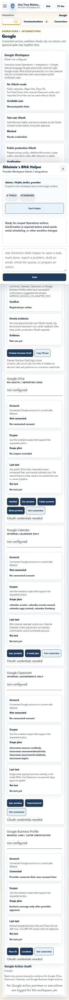

Problems / Observations:
- No major automated layout issue detected in this screenshot.

Optimization Steps:
- Manually review visual density, label clarity, and whether the primary action is obvious.

Visible actions: 26 buttons, 0 links, 0 disabled buttons.

Action sample:
- Open navigation
- Ask
- Google 4
- Communications 0
- Connectors 0
- Drive / Social 0
- Automations 8
- Preview Decision Draft
- Copy Phrase
- Find/list
- Doc preview
- Folder preview
- Move preview
- Test connection
- Sync preview
- 8-week plan

## Operations / Settings (mobile-360)

Rating: 9.2/10 - Strong

Route: `https://bneineviimacademy.org/operations?workspace=rabbi_sheller_provider&view=settings&section=users_access`

Screenshot: [screenshots/mobile-360/operations-settings.jpg](screenshots/mobile-360/operations-settings.jpg)

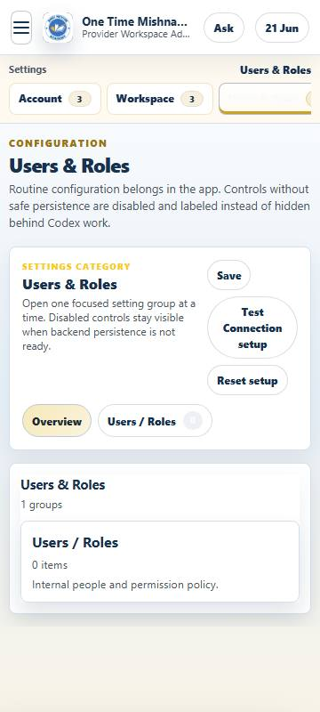

Problems / Observations:
- No major automated layout issue detected in this screenshot.

Optimization Steps:
- Manually review visual density, label clarity, and whether the primary action is obvious.

Visible actions: 22 buttons, 0 links, 0 disabled buttons.

Action sample:
- Open navigation
- Ask
- Account 3
- Workspace 3
- Users & Roles 0
- Communications 0
- Learning 0
- Calendar & Classroom 4
- Bots & AI 0
- Provider Index 8
- Billing & Payments 0
- Integrations 8
- Advanced 8
- Save
- Test Connection setup
- Reset setup

## Operations / Agents (mobile-360)

Rating: 9.2/10 - Strong

Route: `https://bneineviimacademy.org/operations?workspace=rabbi_sheller_provider&view=agents&section=ready`

Screenshot: [screenshots/mobile-360/operations-agents.jpg](screenshots/mobile-360/operations-agents.jpg)

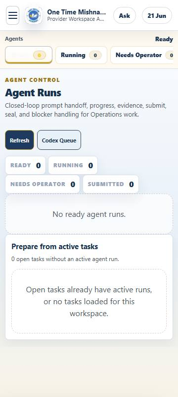

Problems / Observations:
- No major automated layout issue detected in this screenshot.

Optimization Steps:
- Manually review visual density, label clarity, and whether the primary action is obvious.

Visible actions: 18 buttons, 0 links, 0 disabled buttons.

Action sample:
- Open navigation
- Ask
- Ready 0
- Running 0
- Needs Operator 0
- Needs Verification 0
- Failed 0
- Completed 0
- All 0
- Refresh
- Codex Queue
- READY 0
- RUNNING 0
- NEEDS OPERATOR 0
- SUBMITTED 0
- x

## Operations / Mobile Navigation Drawer Open (mobile-360)

Rating: 8.2/10 - Good with polish needed

Route: `https://bneineviimacademy.org/operations?workspace=rabbi_sheller_provider&view=dashboard&section=overview`

Screenshot: [screenshots/mobile-360/operations-mobile-nav-open.jpg](screenshots/mobile-360/operations-mobile-nav-open.jpg)

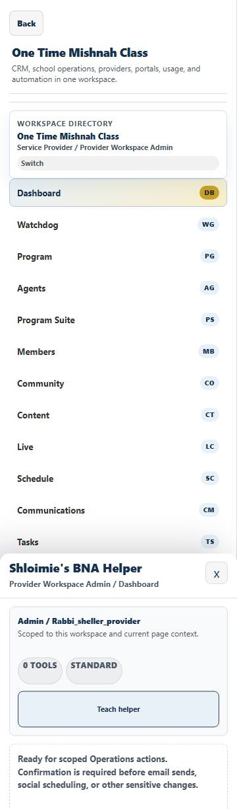

Problems / Observations:
- No strong heading was detected in the app state.

Optimization Steps:
- Ensure every route has a clear page heading and section title.

Visible actions: 31 buttons, 1 links, 0 disabled buttons.

Action sample:
- Back
- Super Admin
- School
- Service Provider
- Family
- All Operations Super Admin / Member Super Admin
- BNA School / Member School
- One Time Mishnah Class Service Provider / Member Current
- Dratler Family Family / Member Family
- Open workspace settings
- Dashboard DB
- Watchdog WG
- Program PG
- Agents AG
- Program Suite PS
- Members MB

