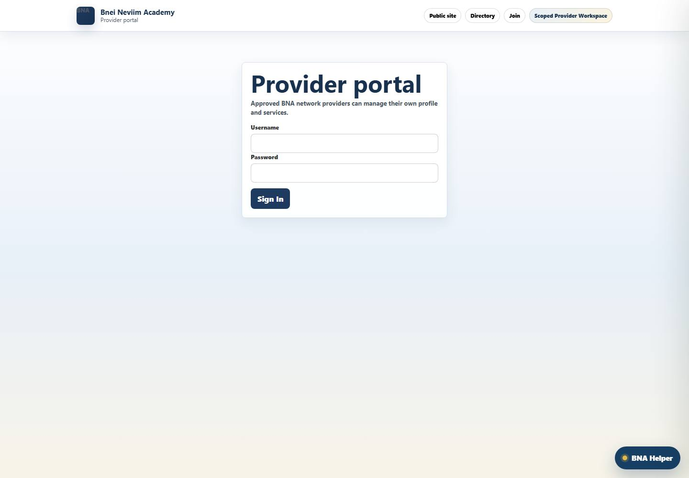
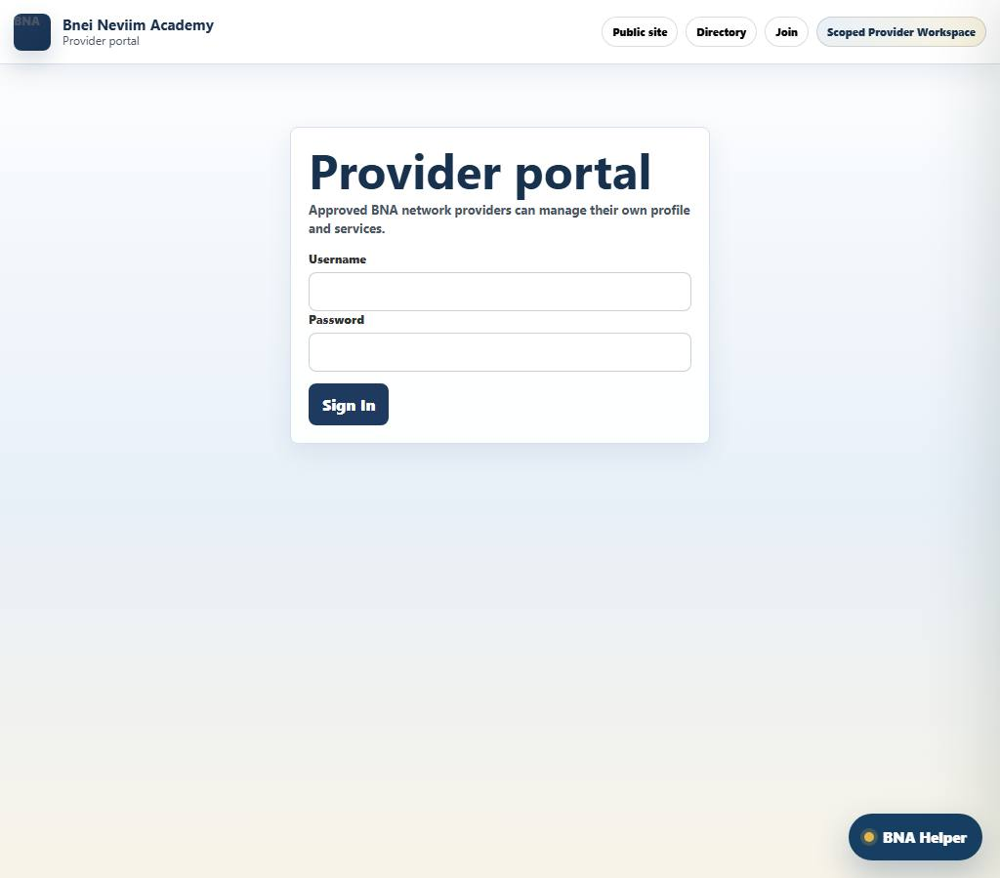
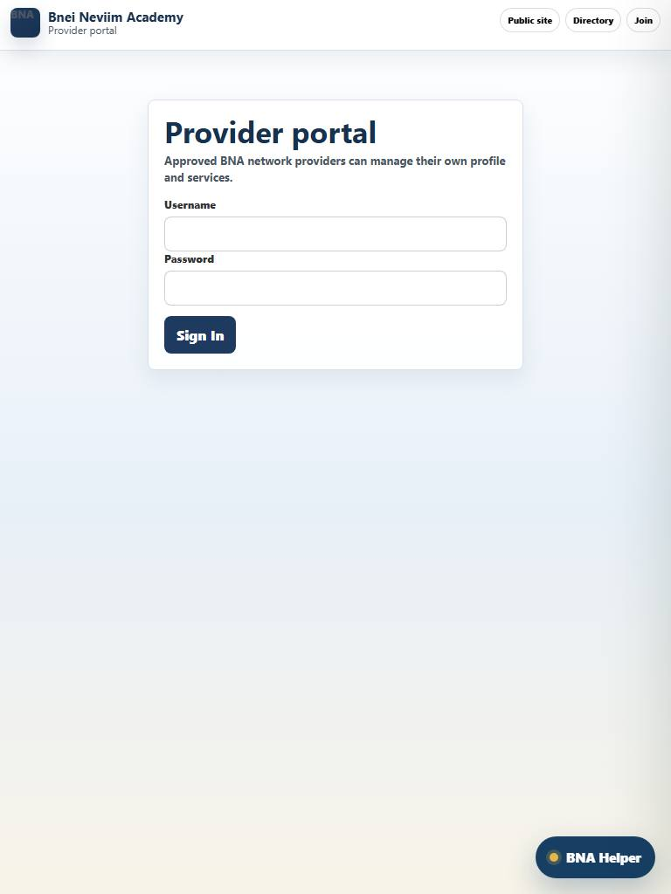
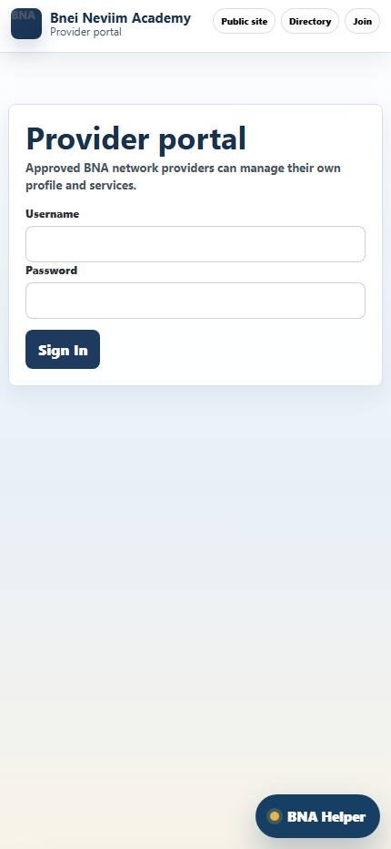
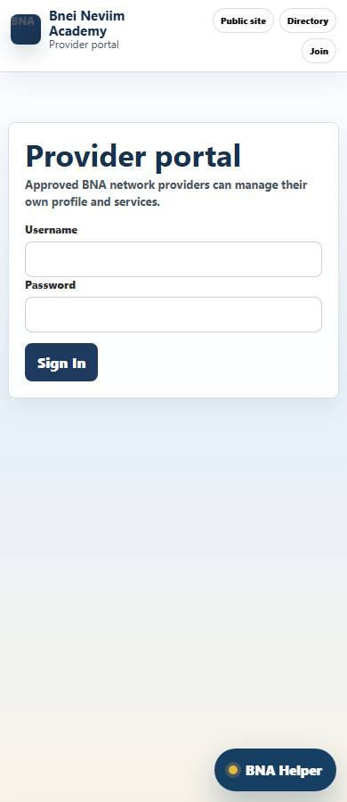
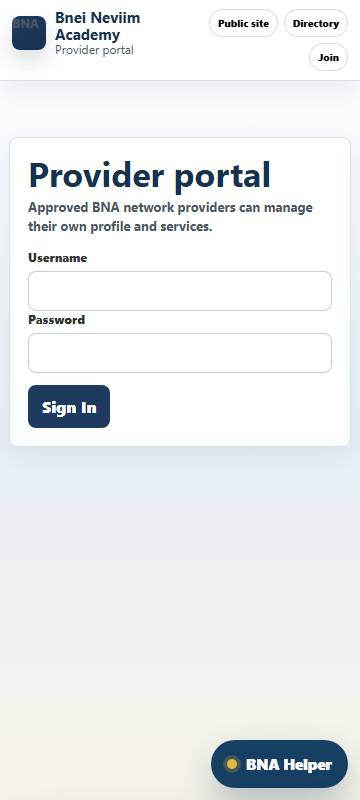

# Provider Portal UI Audit

Screenshots: 6

## Provider Portal (desktop-1440)

Rating: 9.2/10 - Strong

Route: `https://bneineviimacademy.org/provider`

Screenshot: [screenshots/desktop-1440/provider-portal.jpg](screenshots/desktop-1440/provider-portal.jpg)

Problems / Observations:
- No major automated layout issue detected in this screenshot.

Optimization Steps:
- Manually review visual density, label clarity, and whether the primary action is obvious.

Visible actions: 5 buttons, 3 links, 0 disabled buttons.

Action sample:
- Sign In
- BNA Helper
- Chat history
- x
- Send

## Provider Portal (desktop-1024)

Rating: 9.2/10 - Strong

Route: `https://bneineviimacademy.org/provider`

Screenshot: [screenshots/desktop-1024/provider-portal.jpg](screenshots/desktop-1024/provider-portal.jpg)

Problems / Observations:
- No major automated layout issue detected in this screenshot.

Optimization Steps:
- Manually review visual density, label clarity, and whether the primary action is obvious.

Visible actions: 5 buttons, 3 links, 0 disabled buttons.

Action sample:
- Sign In
- BNA Helper
- Chat history
- x
- Send

## Provider Portal (tablet-768)

Rating: 9.2/10 - Strong

Route: `https://bneineviimacademy.org/provider`

Screenshot: [screenshots/tablet-768/provider-portal.jpg](screenshots/tablet-768/provider-portal.jpg)

Problems / Observations:
- No major automated layout issue detected in this screenshot.

Optimization Steps:
- Manually review visual density, label clarity, and whether the primary action is obvious.

Visible actions: 5 buttons, 3 links, 0 disabled buttons.

Action sample:
- Sign In
- BNA Helper
- Chat history
- x
- Send

## Provider Portal (mobile-430)

Rating: 9.2/10 - Strong

Route: `https://bneineviimacademy.org/provider`

Screenshot: [screenshots/mobile-430/provider-portal.jpg](screenshots/mobile-430/provider-portal.jpg)

Problems / Observations:
- No major automated layout issue detected in this screenshot.

Optimization Steps:
- Manually review visual density, label clarity, and whether the primary action is obvious.

Visible actions: 5 buttons, 3 links, 0 disabled buttons.

Action sample:
- Sign In
- BNA Helper
- Chat history
- x
- Send

## Provider Portal (mobile-390)

Rating: 9.2/10 - Strong

Route: `https://bneineviimacademy.org/provider`

Screenshot: [screenshots/mobile-390/provider-portal.jpg](screenshots/mobile-390/provider-portal.jpg)

Problems / Observations:
- No major automated layout issue detected in this screenshot.

Optimization Steps:
- Manually review visual density, label clarity, and whether the primary action is obvious.

Visible actions: 5 buttons, 3 links, 0 disabled buttons.

Action sample:
- Sign In
- BNA Helper
- Chat history
- x
- Send

## Provider Portal (mobile-360)

Rating: 9.2/10 - Strong

Route: `https://bneineviimacademy.org/provider`

Screenshot: [screenshots/mobile-360/provider-portal.jpg](screenshots/mobile-360/provider-portal.jpg)

Problems / Observations:
- No major automated layout issue detected in this screenshot.

Optimization Steps:
- Manually review visual density, label clarity, and whether the primary action is obvious.

Visible actions: 5 buttons, 3 links, 0 disabled buttons.

Action sample:
- Sign In
- BNA Helper
- Chat history
- x
- Send

