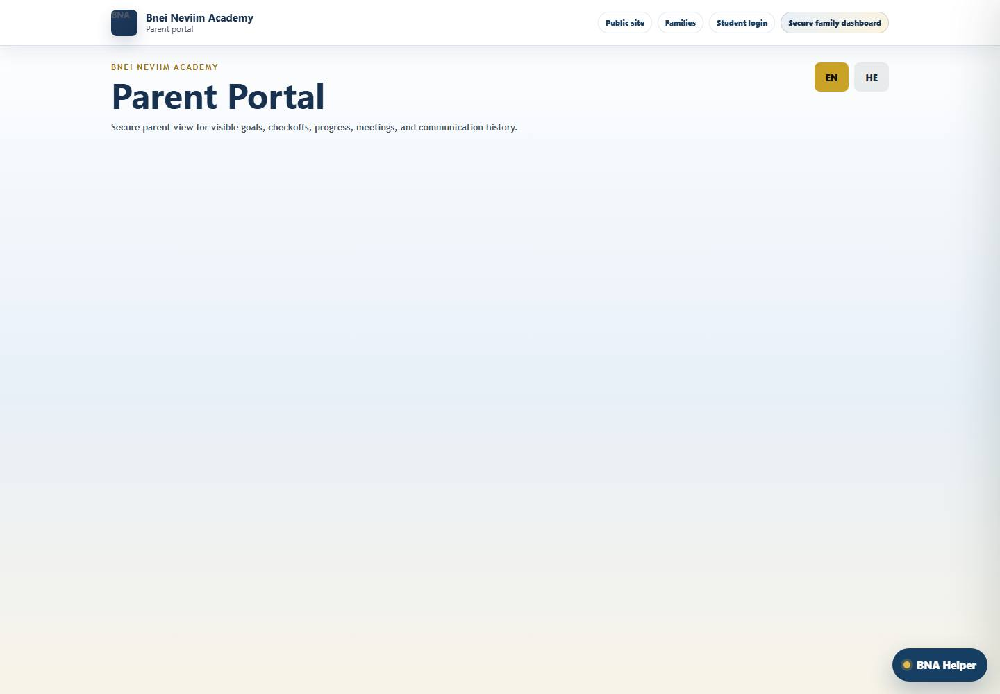
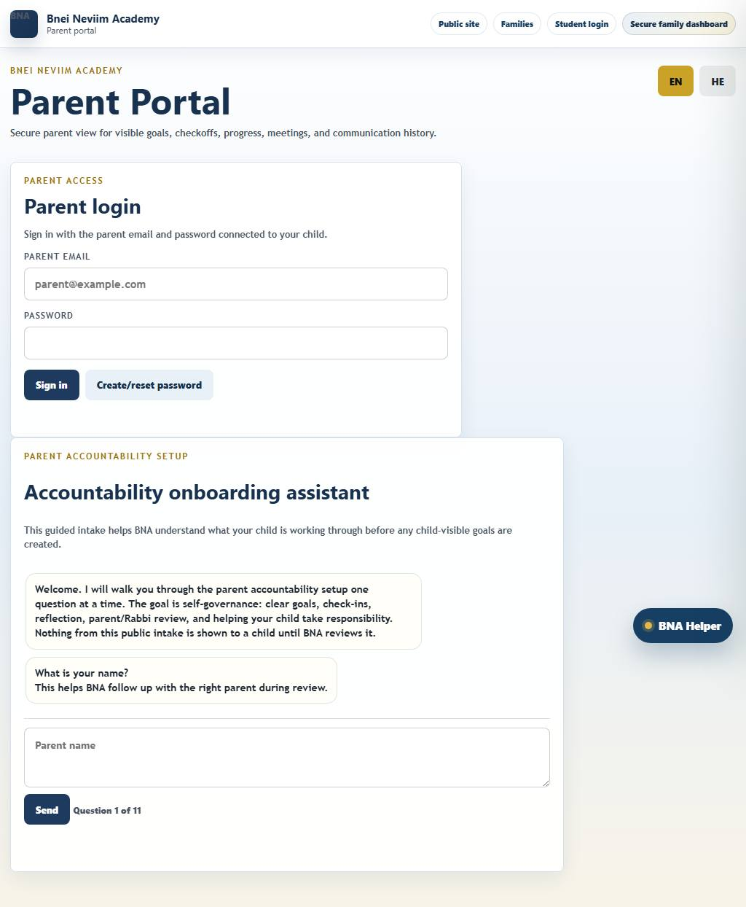
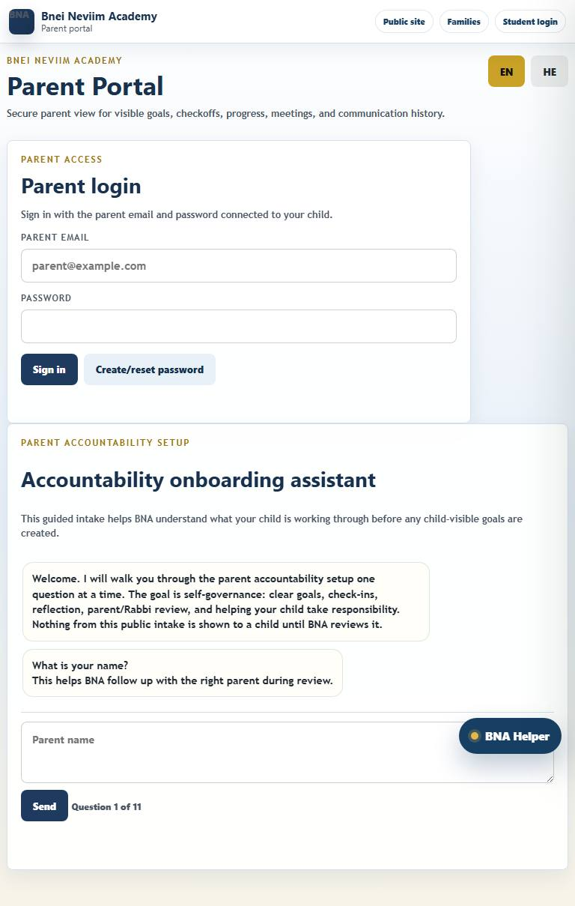
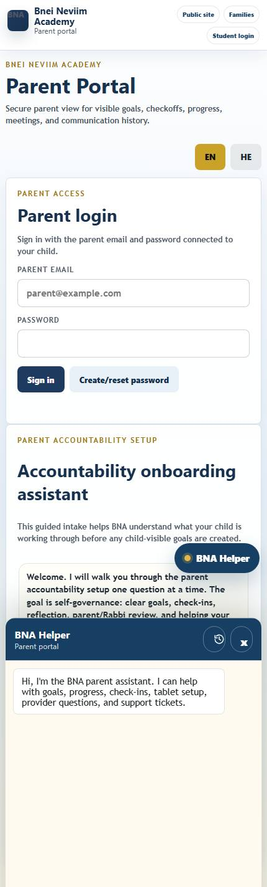
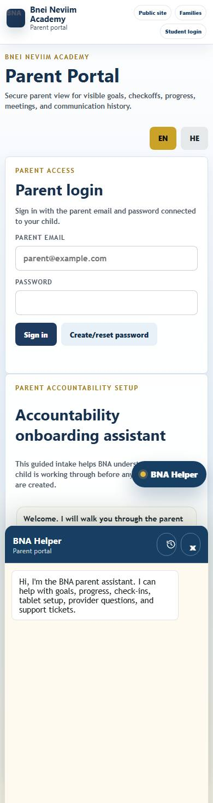
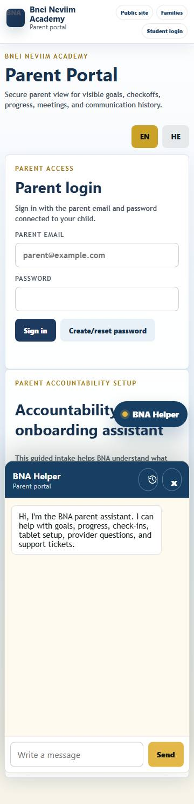

# Parent Portal UI Audit

Screenshots: 6

## Parent Portal (desktop-1440)

Rating: 9.2/10 - Strong

Route: `https://bneineviimacademy.org/parent`

Screenshot: [screenshots/desktop-1440/parent-portal.jpg](screenshots/desktop-1440/parent-portal.jpg)

Problems / Observations:
- No major automated layout issue detected in this screenshot.

Optimization Steps:
- Manually review visual density, label clarity, and whether the primary action is obvious.

Visible actions: 6 buttons, 3 links, 0 disabled buttons.

Action sample:
- EN
- HE
- BNA Helper
- Chat history
- x
- Send

## Parent Portal (desktop-1024)

Rating: 9.2/10 - Strong

Route: `https://bneineviimacademy.org/parent`

Screenshot: [screenshots/desktop-1024/parent-portal.jpg](screenshots/desktop-1024/parent-portal.jpg)

Problems / Observations:
- No major automated layout issue detected in this screenshot.

Optimization Steps:
- Manually review visual density, label clarity, and whether the primary action is obvious.

Visible actions: 9 buttons, 3 links, 0 disabled buttons.

Action sample:
- EN
- HE
- Sign in
- Create/reset password
- Send
- BNA Helper
- Chat history
- x
- Send

## Parent Portal (tablet-768)

Rating: 9.2/10 - Strong

Route: `https://bneineviimacademy.org/parent`

Screenshot: [screenshots/tablet-768/parent-portal.jpg](screenshots/tablet-768/parent-portal.jpg)

Problems / Observations:
- No major automated layout issue detected in this screenshot.

Optimization Steps:
- Manually review visual density, label clarity, and whether the primary action is obvious.

Visible actions: 9 buttons, 3 links, 0 disabled buttons.

Action sample:
- EN
- HE
- Sign in
- Create/reset password
- Send
- BNA Helper
- Chat history
- x
- Send

## Parent Portal (mobile-430)

Rating: 9.2/10 - Strong

Route: `https://bneineviimacademy.org/parent`

Screenshot: [screenshots/mobile-430/parent-portal.jpg](screenshots/mobile-430/parent-portal.jpg)

Problems / Observations:
- No major automated layout issue detected in this screenshot.

Optimization Steps:
- Manually review visual density, label clarity, and whether the primary action is obvious.

Visible actions: 9 buttons, 3 links, 0 disabled buttons.

Action sample:
- EN
- HE
- Sign in
- Create/reset password
- Send
- BNA Helper
- Chat history
- x
- Send

## Parent Portal (mobile-390)

Rating: 9.2/10 - Strong

Route: `https://bneineviimacademy.org/parent`

Screenshot: [screenshots/mobile-390/parent-portal.jpg](screenshots/mobile-390/parent-portal.jpg)

Problems / Observations:
- No major automated layout issue detected in this screenshot.

Optimization Steps:
- Manually review visual density, label clarity, and whether the primary action is obvious.

Visible actions: 9 buttons, 3 links, 0 disabled buttons.

Action sample:
- EN
- HE
- Sign in
- Create/reset password
- Send
- BNA Helper
- Chat history
- x
- Send

## Parent Portal (mobile-360)

Rating: 9.2/10 - Strong

Route: `https://bneineviimacademy.org/parent`

Screenshot: [screenshots/mobile-360/parent-portal.jpg](screenshots/mobile-360/parent-portal.jpg)

Problems / Observations:
- No major automated layout issue detected in this screenshot.

Optimization Steps:
- Manually review visual density, label clarity, and whether the primary action is obvious.

Visible actions: 9 buttons, 3 links, 0 disabled buttons.

Action sample:
- EN
- HE
- Sign in
- Create/reset password
- Send
- BNA Helper
- Chat history
- x
- Send

