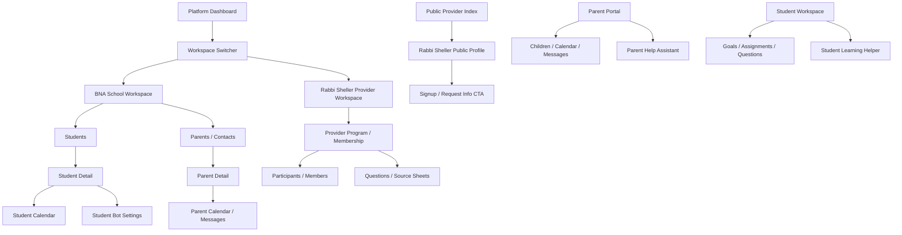

# Navigation Map

## Current Nav Map

- Platform / Super Admin: Dashboard, Pipelines, Tasks, Service Providers, Calendar, Communications, Internal Dialogue, API Usage, Team/Admin, Settings.
- BNA School Workspace: Dashboard, Pipelines, Tasks, Students, Parents/Contacts, Content, Calendar, Communications, Accounting, Service Provider Index, API Usage, Settings.
- Rabbi Sheller Provider Workspace: Dashboard, Pipelines, Tasks, Content, Calendar, Service Providers, Communications, Internal Dialogue, API Usage, Settings.
- Parent Portal: Home, My Children, Messages, Provider Index, Help, Account, Settings when authenticated.
- Student Workspace: Home, Goals, Assignments, Questions, Documents/Links, Bot/Help, Account when authenticated.
- Provider Portal: Overview, Profile/Listing, Services, Commercial Model, Entitlements, Integrations, Access Checklist, Activity, Settings when authenticated.

## Recommended Nav Map

- Keep Platform, BNA School, and Rabbi Sheller Provider as explicit workspace contexts with a compact switcher.
- Keep BNA school student/parent operations separate from provider participants/members.
- Put provider commercial model, access checklist, integration audit, and entitlements under provider admin/provider setup, not inside BNA student operations.
- Parent/student portals need a visible scoped assistant/help entry point without exposing admin notes.
- Provider participant/member portal should be a simpler class/program surface, not the full BNA accountability/student layout.

## Major Flow Graph

## Broken / Mismatched Flow Watchlist

- BOT-PANEL-003: Parent assistant is missing or not obvious (/parent)
- BOT-PANEL-004: Student assistant is missing or not obvious (/student)
- BOT-PANEL-005: Parent assistant is missing or not obvious (/parent)
- BOT-PANEL-006: Parent assistant is missing or not obvious (/parent)
- BOT-PANEL-007: Student assistant is missing or not obvious (/student)
- PROVIDER-SCHOOL-CONFUSION-037: Provider/admin surface may be mixed with BNA school concepts (/operations?workspace=rabbi_sheller_provider&view=students&section=overview)
- PROVIDER-SCHOOL-CONFUSION-038: Provider/admin surface may be mixed with BNA school concepts (/operations?workspace=rabbi_sheller_provider&view=students&section=list)
- PROVIDER-SCHOOL-CONFUSION-039: Provider/admin surface may be mixed with BNA school concepts (/operations?workspace=rabbi_sheller_provider&view=students&section=group_goal)
- PROVIDER-SCHOOL-CONFUSION-040: Provider/admin surface may be mixed with BNA school concepts (/operations?workspace=rabbi_sheller_provider&view=students&section=goal_board)
- PROVIDER-SCHOOL-CONFUSION-041: Provider/admin surface may be mixed with BNA school concepts (/operations?workspace=rabbi_sheller_provider&view=students&section=assignments)
- PROVIDER-SCHOOL-CONFUSION-042: Provider/admin surface may be mixed with BNA school concepts (/operations?workspace=rabbi_sheller_provider&view=students&section=questions)
- PROVIDER-SCHOOL-CONFUSION-043: Provider/admin surface may be mixed with BNA school concepts (/operations?workspace=rabbi_sheller_provider&view=students&section=documents)
- PROVIDER-SCHOOL-CONFUSION-044: Provider/admin surface may be mixed with BNA school concepts (/operations?workspace=rabbi_sheller_provider&view=students&section=portal_links)
- PROVIDER-SCHOOL-CONFUSION-045: Provider/admin surface may be mixed with BNA school concepts (/operations?workspace=rabbi_sheller_provider&view=students&section=tablet_access)
- PROVIDER-SCHOOL-CONFUSION-046: Provider/admin surface may be mixed with BNA school concepts (/operations?workspace=rabbi_sheller_provider&view=students&section=profile)
- PROVIDER-SCHOOL-CONFUSION-047: Provider/admin surface may be mixed with BNA school concepts (/operations?workspace=rabbi_sheller_provider&view=students&section=parent_family)
- PROVIDER-SCHOOL-CONFUSION-048: Provider/admin surface may be mixed with BNA school concepts (/operations?workspace=rabbi_sheller_provider&view=students&section=analysis)
- PROVIDER-SCHOOL-CONFUSION-049: Provider/admin surface may be mixed with BNA school concepts (/operations?workspace=rabbi_sheller_provider&view=students&section=meetings)
- PROVIDER-SCHOOL-CONFUSION-050: Provider/admin surface may be mixed with BNA school concepts (/operations?workspace=rabbi_sheller_provider&view=students&section=bot_settings)
- PROVIDER-SCHOOL-CONFUSION-051: Provider/admin surface may be mixed with BNA school concepts (/operations?workspace=rabbi_sheller_provider&view=students&section=activity)
- PROVIDER-SCHOOL-CONFUSION-052: Provider/admin surface may be mixed with BNA school concepts (/operations?workspace=rabbi_sheller_provider&view=students&section=next_year_login)
- PROVIDER-SCHOOL-CONFUSION-053: Provider/admin surface may be mixed with BNA school concepts (/operations?workspace=rabbi_sheller_provider&view=contacts&section=students)
- PROVIDER-SCHOOL-CONFUSION-060: Provider/admin surface may be mixed with BNA school concepts (/operations?workspace=rabbi_sheller_provider&view=calendar&section=students)
- PROVIDER-SCHOOL-CONFUSION-068: Provider/admin surface may be mixed with BNA school concepts (/operations?workspace=rabbi_sheller_provider&view=communications&section=students)
- PROVIDER-SCHOOL-CONFUSION-070: Provider/admin surface may be mixed with BNA school concepts (/operations?workspace=rabbi_sheller_provider&view=api_usage&section=student)
- PROVIDER-SCHOOL-CONFUSION-071: Provider/admin surface may be mixed with BNA school concepts (/operations?workspace=rabbi_sheller_provider&view=settings&section=student_portal)
- BOT-PANEL-080: Parent assistant is missing or not obvious (/parent)
- BOT-PANEL-082: Student assistant is missing or not obvious (/student)
- BOT-PANEL-083: Parent assistant is missing or not obvious (/parent)
- BOT-PANEL-084: Parent assistant is missing or not obvious (/parent)
- BOT-PANEL-086: Student assistant is missing or not obvious (/student)
- PROVIDER-SCHOOL-CONFUSION-301: Provider/admin surface may be mixed with BNA school concepts (/operations?workspace=rabbi_sheller_provider&view=students&section=overview)
- PROVIDER-SCHOOL-CONFUSION-303: Provider/admin surface may be mixed with BNA school concepts (/operations?workspace=rabbi_sheller_provider&view=students&section=list)
- PROVIDER-SCHOOL-CONFUSION-305: Provider/admin surface may be mixed with BNA school concepts (/operations?workspace=rabbi_sheller_provider&view=students&section=group_goal)
- PROVIDER-SCHOOL-CONFUSION-307: Provider/admin surface may be mixed with BNA school concepts (/operations?workspace=rabbi_sheller_provider&view=students&section=goal_board)
- PROVIDER-SCHOOL-CONFUSION-309: Provider/admin surface may be mixed with BNA school concepts (/operations?workspace=rabbi_sheller_provider&view=students&section=assignments)
- PROVIDER-SCHOOL-CONFUSION-311: Provider/admin surface may be mixed with BNA school concepts (/operations?workspace=rabbi_sheller_provider&view=students&section=questions)
- PROVIDER-SCHOOL-CONFUSION-313: Provider/admin surface may be mixed with BNA school concepts (/operations?workspace=rabbi_sheller_provider&view=students&section=documents)
- PROVIDER-SCHOOL-CONFUSION-315: Provider/admin surface may be mixed with BNA school concepts (/operations?workspace=rabbi_sheller_provider&view=students&section=portal_links)
- PROVIDER-SCHOOL-CONFUSION-317: Provider/admin surface may be mixed with BNA school concepts (/operations?workspace=rabbi_sheller_provider&view=students&section=tablet_access)
